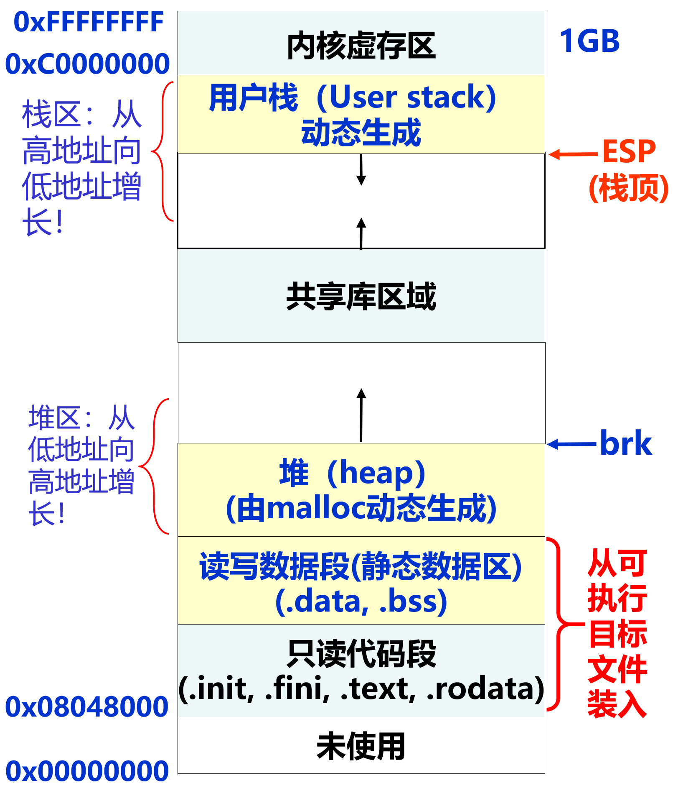
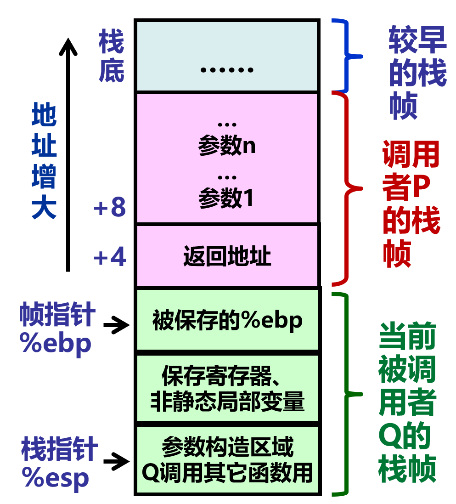
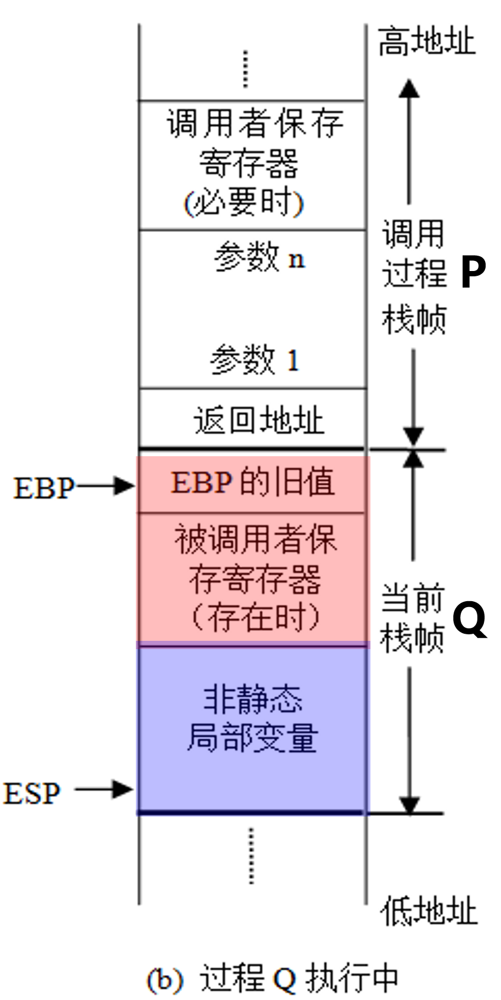

- [第二章](#第二章)
  - [2.1 数值数据的表示](#21-数值数据的表示)
  - [2.3 浮点数的表示](#23-浮点数的表示)
      - [IEEE 754标准的浮点数](#ieee-754标准的浮点数)
  - [2.6 数据的宽度和存储](#26-数据的宽度和存储)
  - [2.7 数据的运算](#27-数据的运算)
      - [移位运算的溢出判断](#移位运算的溢出判断)
    - [4. 整数加减运算](#4-整数加减运算)
      - [标志位](#标志位)
      - [溢出的考虑](#溢出的考虑)
    - [5. 整数的乘运算](#5-整数的乘运算)
      - [整数乘法溢出的判断](#整数乘法溢出的判断)
    - [6. 整数的除运算](#6-整数的除运算)
      - [通过移位进行除法](#通过移位进行除法)
- [第三章](#第三章)
  - [IA-32寻址方式](#ia-32寻址方式)
    - [立即寻址](#立即寻址)
    - [寄存器寻址](#寄存器寻址)
    - [直接寻址](#直接寻址)
    - [寄存器间接寻址](#寄存器间接寻址)
    - [变址寻址](#变址寻址)
    - [基址加变址寻址](#基址加变址寻址)
  - [AT\&T汇编语言格式](#att汇编语言格式)
  - [IA-32指令](#ia-32指令)
      - [PUSH/POP](#pushpop)
      - [地址传送指令](#地址传送指令)
      - [控制转移指令](#控制转移指令)
  - [常用指令详解](#常用指令详解)
    - [数据传送指令](#数据传送指令)
      - [带条件的数据传送指令](#带条件的数据传送指令)
      - [堆栈操作指令](#堆栈操作指令)
      - [地址传送指令](#地址传送指令-1)
      - [必须记住!](#必须记住)
    - [算数运算指令](#算数运算指令)
      - [加法指令](#加法指令)
      - [减法指令](#减法指令)
      - [乘法指令](#乘法指令)
      - [除法指令](#除法指令)
      - [符号扩展指令](#符号扩展指令)
      - [按位运算指令](#按位运算指令)
      - [按位运算与逻辑运算](#按位运算与逻辑运算)
      - [移位指令](#移位指令)
      - [简单条件转移指令](#简单条件转移指令)
      - [无符号条件转移指令](#无符号条件转移指令)
      - [有符号条件转移指令](#有符号条件转移指令)
      - [无条件转移指令](#无条件转移指令)
      - [循环控制指令](#循环控制指令)
  - [C语言程序的机器级表示](#c语言程序的机器级表示)
    - [IA-32中过程调用的存储区：栈](#ia-32中过程调用的存储区栈)
      - [程序运行时的栈](#程序运行时的栈)
      - [IA-32的栈的结构](#ia-32的栈的结构)
        - [与栈相关的关键寄存器](#与栈相关的关键寄存器)
        - [栈的相关操作](#栈的相关操作)
        - [保存现场的IA-32约定](#保存现场的ia-32约定)
      - [过程（函数）对应的机器级代码结构](#过程函数对应的机器级代码结构)
      - [选择语句的机器级表示](#选择语句的机器级表示)
        - [switch语句的机器级表示](#switch语句的机器级表示)
      - [循环结构的机器级表示](#循环结构的机器级表示)
  - [复杂数据类型的分配和访问](#复杂数据类型的分配和访问)
    - [数组的分配和访问](#数组的分配和访问)
      - [静态区的数组](#静态区的数组)
      - [栈区数组的初始化和访问、](#栈区数组的初始化和访问)
    - [结构体数据的分配和访问](#结构体数据的分配和访问)
        - [结构体数据作为入口参数的机器级实现](#结构体数据作为入口参数的机器级实现)
    - [联合体数据的分配和访问](#联合体数据的分配和访问)
    - [数据的对齐](#数据的对齐)
  - [编译器的优化](#编译器的优化)
  - [在C语言中，如何提高程序运行速率](#在c语言中如何提高程序运行速率)
- [第四章 程序的链接](#第四章-程序的链接)
  - [目标文件格式](#目标文件格式)
    - [程序链接的定义、链接的意义与过程](#程序链接的定义链接的意义与过程)
      - [链接操作的步骤](#链接操作的步骤)
    - [目标文件格式、可重定位目标文件格式、可执行目标文件格式](#目标文件格式可重定位目标文件格式可执行目标文件格式)
      - [目标文件的格式](#目标文件的格式)
      - [可重定位目标文件的ELF格式](#可重定位目标文件的elf格式)
      - [可执行目标文件格式](#可执行目标文件格式)
  - [符号解析与重定位](#符号解析与重定位)
    - [符号表、符号解析](#符号表符号解析)
      - [全局符号的解析](#全局符号的解析)
    - [与静态库的链接](#与静态库的链接)
    - [重定位所需信息和重定位过程](#重定位所需信息和重定位过程)
    - [可执行文件的加载](#可执行文件的加载)
  - [动态链接](#动态链接)
    - [动态链接的特性](#动态链接的特性)
    - [程序加载时的动态链接、程序运行时的动态链接](#程序加载时的动态链接程序运行时的动态链接)
    - [位置无关代码](#位置无关代码)
- [第七章 中断和异常](#第七章-中断和异常)
      - [中断描述表（中断矢量表）](#中断描述表中断矢量表)
    - [异常](#异常)
    - [异常/中断相应过程](#异常中断相应过程)


# 第二章
## 2.1 数值数据的表示
+ 带有正负号的数叫做真值
+ 编码后的数值数据都叫机器数
+ 原码方便乘除法
+ 补码方便条件判断指令和带条件跳转指令的执行
+ 移码的还原得到真值的方式$E=[E]_{move}-bias$

## 2.3 浮点数的表示
> + 阶码的位数影响浮点数表示范围
> + 尾数的位数决定有效位数,影响精度
> + 是否规格化也会影响浮点数的精度,非规格化可以让浮点数在靠近0的部分精度更高一点

#### IEEE 754标准的浮点数
s:符号位,Exponent:阶码(8/11),significand:尾数(23/52)
$$ SP:(-1)^S \times (1+significand) \times 2^{(exponent-127)}$$
$$ DP:(-1)^S \times (1+significand) \times 2^{(exponent-1023)}$$
+ +0: 符号位0,阶码0,尾数0
+ -0: 符号位1,阶码0,尾数0
+ 非规范数: 符号位根据真值,阶码0,尾数不为0
+ 无穷大:符号位看正负,阶码全1,尾数全0
+ Nan:符号位无所谓,阶码全1,尾数非0
  + 尾数最高有效位为1,定义不发信号的Nan,不进行一场处理
  + 尾数最高有效位为0,定义为发信号的Nan,因为Nan尾数的剩下位没有被定义,所以可以自定义余位指定具体的一异常事件

## 2.6 数据的宽度和存储
+ 数据的宽度和单位
  + 位:bit,
  + 字节:Byte,最小可寻址单位
  + 字:WORD,一个字等于2个字节,16位
  + 双字:DWORD,一个双字为两个字宽度,4字节,32位
  + 四字:QWORD,一个四字位四个字宽度,8字节,64位
+ “字长”
  + 字长是CPU内部用于整数运算的数据通路的宽度
  + **字**:表示被处理的信息的单位,用来度量各种数据类型的宽度

字和字长可以有不同的大小,如IA-32中字位16位,字长位32位
+ 数据的存储和排列顺序
  + 大端存储
  + 小端存储

## 2.7 数据的运算
#### 移位运算的溢出判断
+ 逻辑移位:若逻辑左移移出的位包含1,则溢出
+ 算数移位:若算数座移后的符号位不同于以前的符号位,则溢出

### 4. 整数加减运算
#### 标志位
+ `ZF`:零标志,如果结果为0,`ZF`置1,否则为0
+ `OF`:溢出标志.只对带符号整数有效,只对“正+正”和“负+负”考虑;否则`OF`=0
+ `SF`:符号标志,只对带符号整数有效  表示带符号整数加减运算结果的符号位,`SF`=结果的最高位
+ `CF`:加减运算时的进/借位标志,只对无符号整数有效.`CF`=1,表示无符号整数加法溢出或减法“不够减”,$CF=C_{out}\oplus Sub$

*思考*:为什么`CF`不能用于带符号数判断溢出:  
因为`CF=1`对有符号数而言可能是期望的溢出以实现模运算,比如$2+-1=1$不溢出!

#### 溢出的考虑
+ 带符号整数加法溢出:
  + 符号相反一定不会溢出
  + 符号相同可能溢出,当结果符号于加数符号不同时溢出
+  带符号整数减法溢出:
   + 符号相同一定不会溢出
   + 符号想法可能溢出.正数-负数发声的溢出成为正溢出

### 5. 整数的乘运算
乘法指令本身不判断溢出,在机器级乘法指令的操作数长度为n时,虽然获得了2n位的乘积结果,但是只有低n位共软件使用,高n位通常作为溢出标志用于溢出判断  
因为硬件不判断溢出,所以如果编译器不生成用于溢出处理的代码(C语言编译器就不生成)

#### 整数乘法溢出的判断
2n位乘积的高n位全0或全1,并且等于低n位的最高位时,不溢出-->  
乘积的高n+1位全0或全1不溢出(带符号整数乘法)  
高位寄存器中的每一位都等于0(无符号整数乘法)

### 6. 整数的除运算
#### 通过移位进行除法
**朝零舍入原则**
+ 对于无符号数或带符号正整数,移出的低位直接丢弃,结果正确
+ 对于带符号负整数,如果需要除以$2^k$,需要先加偏移量$(2^k-1)$,然后再右移k位(除以$2^k$),进行低位截断

**不饿能用右移代替除法的情况**：
$-1 \div 2$  
因为$-1$本身已经全部都是$1_2$了，所以右移后仍然是$-1$，但是理论上应该变成$0$的。

# 第三章
## IA-32寻址方式
### 立即寻址
+ 操作数直接放在指令中,在指令的操作码后
+ 操作数时指令的一部分,位于代码段中
+ 指令中的操作数是8位、16位或32位二进制数

**立即操作数只能作为源操作数**
```asm
mov eax, 12H
```

### 寄存器寻址
使用格式: `[R]`

功能: 寄存器R中的内容即为操作数

说明: 除了个别指令外,R可以为任意寄存器
``` asm
dec bl
```
### 直接寻址
+ 操作数在内存中
+ 操作数的便宜地址EA紧跟在指令操作吗后面

格式:`[地址偏移量]`或者`段寄存器:[n]`

### 寄存器间接寻址
格式: `[R]`

功能:操作数在内存中,操作数的偏移地址在寄存器R中.即`(R)`为操作数的偏移地址
```asm
mov ax, [esi]
```
+ R可以是8个32位通用寄存器中的任意一个
+ 操作数的偏移地址在指令指明的寄存器中
+ 操作数所载的段:
  + 扁平内存管理模式下,`(DS)=(SS)`

### 变址寻址
格式: `V[R * F]`

功能: R中的内容*F+V为操作数的偏移地址
```asm
mov al, 5[ebx*2]
```
+ R可以是8个32位通用寄存器
+ F可以是1,2,4,8

### 基址加变址寻址
格式:`[BR+IR*F+V]`或`V[BR][IR*F]`或`V[IR*F][BR]`或`V[BR+IR*F]`

功能: 操作数的偏移=变址寄存器 IR中的内容*比例因子F+位移量V+基址寄存器BR中的内容  
`EA = (IR)*F+v+(BR)`
```asm
mov eax, -6[edi*2][ebp]
```
+ F可为1,2,4,8
+ 当使用32位寄存器时,可以是8个通用寄存器之一
+ IR可以是除了ESP外的任意32位寄存器
+ 没有携带比例因子的寄存器是BR
+ 当没有比例因子时,写载前面的寄存器就是BR

## AT&T汇编语言格式
+ 长度后缀:b(字节)、w(字)、l(双字)、q(四字)
+ 寄存器操作数: %寄存器名称
+ 存储器操作数: 偏移量(基址寄存器,变址寄存器,比例因子)
+ 汇编指令格式: `op src, dst`,即`dst <- dst op src`
```asm
mov 8(%ebp, %esi, 4), %eax
寻址方式是:
基址(%ebp)+比例变址(4*%esi)+位移(8)
它的存储器操作数的有效地址=%ebp+%esi*4+8
```

## IA-32指令
####  PUSH/POP
入栈/出栈,操作对象都是ESP或SP寄存器指向的栈单元  
`push`先执行`R[esp]<-R[esp]-4`,然后将制定寄存器内容送到ESP寄存器指向的栈单元  
`pop`先将ESP寄存器指向的栈单元送到指定寄存器中,然后再执行`R[esp]<-R[esp]+4`
#### 地址传送指令
lea,加载有效地址,将源操作数作为存储地址送到目的寄存器中
```asm
lea (%edx,%eax), %eax
R[eax]<-R[edx]+R[eax]
对比mov指令!!
mov (%edx, %eax), %eax
R[eax]<-M[R[edx]+R[eax]]
```
#### 控制转移指令
+ 无条件转移指令  
 JMP DST: 无条件调转到目标指令DST处执行
+ 条件转移  
 Jcc DST: cc为条件码,根据标志(条件码)判断是否满足条件,若满足,啧转移到目标指令DST处执行,否则按顺序执行
+ 调用和返回指令  
  CALL DST: 将返回地址(程序计数器EIP到值,也就是CALL指令到吓一跳指令所在的地址)入栈,然后跳转到指定地址DST处执行.显然会修改ESP的值  
  RET: 从栈顶取出返回地址到程序计数器EIP,从而跳转到返回地址继续执行,显然也修改ESP的值

## 常用指令详解
### 数据传送指令
1. 一般数据传送指令  
`mov`,`movsx`,`movzx`
2. 堆栈操作指令  
`push`,`pop`,`pusha`,`pushad`,`popa`,`popad`
3. 标志寄存器传送指令
`pushf`,`popf`,`pushfd`,`popfd`,`lahf`,`sahf`
4. 地址传送指令  
`lea`
5. 带条件的数据传送指令
`cmove`,`cmovne`,`cmova` ...  
#### 带条件的数据传送指令
使用单个标志位判断转移条件是否成立
|cmove/cmovz|cmovc|cmovs|cmovo|cmovp|
|:--|:--|:--|:--|:--|
|ZF=1|CF=1|SF=1|OF=1|PF=1|

|cmovne/cmovnz|cmovnc|cmovns|cmovno|cmovnp|
|:--|:--|:--|:--|:--|
|ZF=0|CF=0|SF=0|OF=0|PF=0|

使用多个标志位组合判断转移条件是否成立:
`cmova`,`cmovb`,`cmovg`,`cmovl`....

#### 堆栈操作指令
1. 进栈指令`push ops`
双字数据入栈:
```asm
(ESP)-4 -> ESP
双字数据 -> [ESP]
```
2. 出栈指令 `pop opd`
字数据出栈
```asm
([ESP]) -> OPD
(ESP)+2 -> ESP
```
双字数据出栈类似,`(ESP)+4 -> ESP`

> 8个16位寄存器入栈 `pusha`  
> 8个16位寄存器出栈 `popa`  
> 8个32位寄存器入栈 `pushad`  
> 8个32位寄存器出栈 `popad`
>
> 32位标志寄存器进栈 `pushfd`  将eflags进(esp)  
> 32位标志寄存器出栈 `popfd`  将栈顶内容弹出送入标志寄存器中  
> 16位标志寄存器进栈 `pushf`  将$eflags_{15-0}$进(esp)  
> 16位标志寄存器出栈 `popf`  将栈顶内容弹出送入标志寄存器中  

#### 地址传送指令
传送偏移地址指令
语句格式:
```asm
lea R32, M32
```
功能: 将`M32`对应的地址送入`R32`中

#### 必须记住!
|类型|指令|操作数类型|
|:--|:--|:--|
|一般传送|mov| opd, ops|
|有符号数传送|movsx|R16/R32, OPS/非立即数|
|无符号数传送|movzx|R16/R32, OPS/非立即数|
|传送偏移地址|lea|R32, M32|
|进栈|push|ops|
出栈|pop|opd|
32位通用寄存器进栈、出栈|pushad, popad| |
|标志寄存器进栈、出栈|pushfd, popfd|

### 算数运算指令
**以下都是intel格式的汇编哦**
#### 加法指令
1. 自增指令`inc opd`: `(opd)+1 -> opd`
2. 加指令`add opd, ops`: `(opd)+(ops) -> opd`
3. 带进位加指令`adc opd, ops`: `(opd)+(ops)+cfg -> opd`
#### 减法指令
**所有的减法指令都是`dst-src`**
```asm
dec opd
neg opd
sub opd, ops
sbb opd, ops
cmp opd, ops
```
**`cmp`指令的本质是`dst-src`**

`dec`对OF,SF,ZF,PF,AF有影响  
其它指令对CF,OF,SF,ZF,PF,AF有影响

1. 自减指令`dec opd`: `(opd)-1` -> `opd`
2. 求补指令`neg opd`: `(opd)求反+1` -> `opd`
3. 减指令`sub opd, ops`: `(opd)-(ops) -> opd`
4. 带借位减指令`sbb opd, ops`: `(opd)-(ops)-cf -> opd`
#### 乘法指令
1. 有符号乘法
   1. 双操作数的有符号乘指令`imul opd, ops`: `(opd)*(ops) -> opd`
   2. 三操作数的有符号乘指令`imul opd, ops, n`: `(ops)*n -> opd`
   3. 单操作数的有符号乘法`imul ops`:  
      根据ops的不同,自动与eax的对应位做乘法
      1. 字节乘法`(al)*(ops) -> ax`
      2. 字乘法`(ax)*(ops) -> dx, ax`
      3. 双字乘法`(eax)*(ops) -> edx, eax`
2. 无符号乘法`mul ops`,同有符号单操作数乘法
#### 除法指令
1. 有符号除法`idiv ops`:
   1. 字节除法`(ax)/(ops) -> al(商), ah(余)`
   2. 字除法`(dx, ax)/(ops) -> ax(商), dx(余)`
   3. 双字除法`(edx, eax)/(ops) -> eax(商), edx(余)`
2. 无符号除法`div ops` 同上

使用除法的时候不仅要注意除数为0的问题,还要注意可能存在的除法溢出的问题!
```asm
(ax)=1234, (bl)=1, 
idiv bl就会出问题!!
```
#### 符号扩展指令
1. 将字节转换成字`cbw`:  
  将al中的符号扩展至ah中
2. 将字转换成双字`cwd`:
  将ax中的符号扩展至dx中
3. 将ax中的有符号数扩展为32位送eax`cwde`
4. 将eax中的有符号数扩展为64位数送edx, eax `cdq`
#### 按位运算指令
1. 求反`not opd`: `~(opd) -> opd`
2. 逻辑与`and opd, ops`: `(opd)&(ops) -> opd`
3. 测试指令`test opd, ops`: `opd&(ops)`
4. 逻辑或`or opd, ops`: `(opd)|(ops) -> opd`
5. 按位加`xor, opd, ops`: `(opd)^(ops) -> opd`
#### 按位运算与逻辑运算
**似乎**没有专门的逻辑运算相关的指令
#### 移位指令
1. 算数左移 `sal`
2. 逻辑左移 `shl`
3. 逻辑右移 `shr`
4. 算数右移 `sar`
#### 简单条件转移指令
|指令|条件|
|:--|:--|
|`jz`/`je`|ZF=1|
|`jnz`/`jne`|ZF=0|
|`js`|SF=1|
|`jns`|SF=0|
|`jo`|OF=1|
|`jno`|OF=0|
|`jc`|CF=1|
|`jnc`|CF=0|
|`JP`/`JPE`|pf=1|
|`jnp`/`jpo`|PF=0|
#### 无符号条件转移指令
|指令|条件|
|:--|:--|
|`ja`/`jnbe`|CF=0 && ZF=0|
|`jae`/`jnb`|CF=0 && ZF=1|
|`jb`/`jnae`|CF=1 && ZF=0|
|`jbe`/`jna`|CF=1 && ZF=1|
#### 有符号条件转移指令
|指令|条件|
|:--|:--|
|`jg`/`jnle`|SF=OF && ZF=0|
|`jge`/`jnl`|SF=OF \|\|ZF=1|
|`jl`/`jnge`|SF!=OF && ZF=0|
|`jle`/`jng`|SF!=OF \|\|ZF=1|
#### 无条件转移指令
|格式|名称|功能|
|:--|:--|:--|
|`jmp`标号|直接|(EIP)+位移量->EIP|
`jmp` opd| 间接|（OPD）-> EIP|
间接转移方式中给，除了立即数寻址方式外，其它方式均可以使用
#### 循环控制指令
1. `loop` 标号：  
(EXC)-1 -> ECX，如果（ECX）不为0，则转标号处执行。  
基本等价`dec ecx; jnz 标号`。*`loop`指令对标志位无影响*。
2. `loope`/`loopz` 标号：  
(ECX)-1 -> ECX，如果(ECX)!=0，且ZF=1，则转移标号处执行。  
等于或为0循环转移指令，对标志位没有影响。
3. `loo pne`/`loopnz` 标号：  
(ECX)-1 -> ECX，若(ECX)!=0,且ZF=0，则转移到标号处执行。
4. `jecxz` 标号：  
若(ECX)==0，则转移到标号处执行。  
先判断，后执行循环体时，使用次语句。标号为循环结束处。
## C语言程序的机器级表示
### IA-32中过程调用的存储区：栈
在x86架构中，采用从高地址向低地址增长方式（栈底地址比栈顶地址大）

由于x86是小端排列，因此数据也是小端排列。`pushw %ax`之后，al的内容在栈顶。即al在低地址，ah在高地址。

#### 程序运行时的栈
+ auto局部变量存储在用户栈中。
+ malloc申请的空间在堆中。
+ static局部变量存放在静态数据区。
+ 全局变量存放在静态数据区。
- 静态数据区的数据在整个程序执行期间都存在
- 栈中数据随着过程返回而清楚
- 堆中数据随着执行空间释放语句而清除。


#### IA-32的栈的结构

##### 与栈相关的关键寄存器
+ EBP: 帧指针寄存器，指向当前栈帧的其实位置（栈底）
+ ESP:  栈指针寄存器，指向当前栈帧的顶部，值浮动
+ 栈帧的范围：ESP~EBP之间的存储区域
##### 栈的相关操作
+ 调用指令`call`  
call指令在跳转到被调用过程执行值钱，先将返回地址（即程序计数器EIP的值，也就是call指令的下一条指令地址）压栈（相当于push操作，回改变ESP的值），然后跳转到被调用过程执行。
+ 返回指令`ret`  
ret指令从栈顶取出返回地址到EIP，以返回调用过程继续执行。
##### 保存现场的IA-32约定
+ 调用者保存寄存器：EAX,ECX,EDX
+ 被调用者保存寄存器： EBX,ESI,EDI
+ 根据以上约定，为减少过程的准备和结束阶段的开销，每个过程应该优先使用EAX,ECX,EDX

在调用者P保存他的参数的时候，将入口参数从右到左一次保存的，这样可以从低地址空间向高地址空间依次访问各参数。

在进入到Q的过程里面以后，Q首先回把P的EBP的值压入自己的栈帧中，然后用当前ESP的值设置自己的EBP，再修改ESP设置自己的栈帧的顶部。
#### 过程（函数）对应的机器级代码结构
+ 准备阶段
  + 形成帧底部：`pushl %ebp`,`movl %esp, %ebp`
  + 生成栈帧、保护现场：修改esp*`sub`指令*，被调用者保护寄存器入栈（mov指令）
+ 过程执行阶段
  + 为欸本过程非静态局部变量再栈中分配空间并赋值
  + 开始具体处理，如果遇到函数调用时
    + 如果需要保存调用者保存寄存器的值，则保存
    + 准备参数：通过`mov`指令将实参送栈帧入口参数处
    + `call`指令：保存返回地址到栈顶，然后跳转被调用函数
  + 过程体执行结束前，如需胡衣服被调用者寄存器的值，则恢复，并通产再EAX中准备返回结果
+ 结束阶段
  + 退栈：`leave`指令或`popl`指令。  
    **`leave`指令等价于先执行`movl %ebp, %esp`，然后再执行`popl %ebp`**
  + 取返回地址返回：`ret`指令

为什么递归的时空效率差：  
1. 每次都需要重复执行自身过程体，直到结束条件满足才停止。
2. 空间开销大，每次调用，都形成一个完整的栈帧，最多会形成n+1个栈帧
3. 时间开销大，为了支持过程递归，每次都需要走一遍准备阶段和结束阶段。增加许多额外指令，特别是内存访问相关的指令。

#### 选择语句的机器级表示
> 当使用cmpl指令比较两个寄存器中存放的地址的时候，条件转移的时候应该是无符号类型的条件转移，因为地址都是无符号整数。

##### switch语句的机器级表示
+ 跳转表是一个数组（hash表），数组每个元素存储对应的开关索引值对应的代码段的首地址。
+ 用开关索引作为跳转表的索引，确定跳转目标
+ 跳转表放在可执行目标文件的只读数据节中，按4字节边界对齐

#### 循环结构的机器级表示
+ 一般来说，可以用分支转移指令来实现循环
+ 专门的循环指令：`loop`,`loope`,`loopne`,`jecxz`
+ 编译优化：
  + 循环展开：确定循环次数的，不大的，直接展开，充分利用流水线。
  + 与寄存器绑定，减少访存操作，减少指令
  + 并行计算，SIMD并行运算等。

## 复杂数据类型的分配和访问
### 数组的分配和访问
#### 静态区的数组
+ 分配在静态区的数组在编译、链接的时候就可以确定数组的地址
+ 机器洁指令可以直接用数组首地址和数组元素的下标访问数组元素
#### 栈区数组的初始化和访问、
auto型数组就是在栈中分配的，因此数组的首地址通过`ebp`定位。

为了能够按照地址递增的方式遍历数组，数组的首地址都会放在最低地址处。即`buf[0]`一般都对应`%ebp-max`

### 结构体数据的分配和访问
+ 结构体的地址是第一个数据项第一字节的地址。
+ 编译器在处理结构数据时，根据每个成员的数据类型计算成员相对于结构体变量基址的相应字节偏移量，然后通过每个成员的字节偏移量来访问结构成员。

##### 结构体数据作为入口参数的机器级实现
+ 按值传递：结构体成员要赋值到栈中参数区。增加时空开销，且更新后的数据无法在调用过程中使用。
+ 按地址传递，在call之前，只需要传递指向结构体的指针。

### 联合体数据的分配和访问
### 数据的对齐

## 编译器的优化
1. 循环展开：将程序执行流程变成一个顺序结构，消除引起循环的跳转指令，让指令流水线利用更充分，避免在指令流水线上产生要被丢弃的“半成品”而浪费事件。
2. 分支语句向无分支语句转换：使用条件传送指令等，可以提高指令流水线的利用率。
3. 调整指令执行顺序：后面的指令用到前面指令的结果，前面的指令结果还未产生，后面的指令就要等待，产生阻塞就会影响指令流水线的速度。调整指令顺序的目的是减少可能的阻塞。
4. 使用执行速度更块的机器指令，比如用移位指令代替乘法、除法指令。
5. 使用串操作指令代替用循环一个数据一个数据的处理（传送、比较、串初始值设定等）。
6. 使用SIMD：一条指令成组操作，解决操作次数。
7. 使用位数更长的寄存器：使用字节数更大的寄存器，一次就可以处理更多的内容，充分利用硬件中已有数据线宽度。
8. 对一个二位数组调整数据处理顺序（行优先）：提高CPU的cache命中率，减少cache与内存之间来回的数据交换，从而节约事件。
9. 变量与寄存器绑定：访问变量变成访问绑定的寄存器，访问寄存器的速度远远宽裕访问内存（包括cache）的速度。
10. 并行优化：利用多线程、多核等特点。

## 在C语言中，如何提高程序运行速率
1. 优化数据的访问顺序：对于二维数组，按照行优先顺序访问
2. 减少重复计算（`for(int i=0;i<strlen(s);i++)`，避免`strlen`的多次计算
3. 调用封装了串操作指令的函数，如`memcpy`,`memset`,`memcmp`等。
4. 变递归为迭代，函数调用传递参数、断点压栈等多种操作，既慢又有栈溢出风险。
5. 用移位实现乘除法。
6. 调整条件语句中组合条件的子条件顺序，可以避免没有必要的判断。因为在C中，`&&`在第一个为`0`的时候就不判断第二个了
7. 使用封装了SIMD指令的函数调用
8. 利用多线程
9. 去除冗余指令。
10. 有一些优化是编译器无法做到的，比如指针相关的数据访问。本来不用指针可能可以让编译器自行优化的。

# 第四章 程序的链接
## 目标文件格式
### 程序链接的定义、链接的意义与过程
链接：  
在将高级语言编译转换成了机器代码之后，将所有关联到的可重定位目标文件（包括用到的标准库函数目标文件），按照某种形式组合在一起，生成一个具有统一地址空间、可被加载到存储器直接执行的可执行目标文件。

链接的好处：
+ 程序可以划分位多个模块，多人进行编辑、编译，缩短开发周期
+ 将常用函数用于构建公共库函数，供不同程序员重用，实现共享
+ 支持增量编译，部分源程序文件修改，只用重新编译被修改的源程序文件，然后重新链接。提高程序修改后的编译效率。

链接过程的本质：  
将设计到的所有可重定位目标文件中相同的节合并，形成具有统一虚拟地址空间编址的可执行目标文件。
#### 链接操作的步骤
1. 符号解析
+ 将每个模块中引用的符号（包括变量和函数）和某个模块中定义符号建立关联。
+ 编译器将定义的符号存放在一个符号表中。  
  + 符号表是一个结构数组
  + 每个表项包含符号名、长度和位置等信息。
+ 链接器将每个符号的引用都与其确定的符号定义建立关联。
2. 重定位
将所有关联的模块合并，并确定运行时每个定义符号在虚拟空间中的地址，然后再定义符号的引用处重定位引用符号的地址。
### 目标文件格式、可重定位目标文件格式、可执行目标文件格式
#### 目标文件的格式
+ 目标文件（Object file）
  + 源代码经过编译或汇编后生成的机器语言代码成为目标代码
  + 存放目标代码的文件称为目标文件。
+ 目标文件主要有两类
  + 可重定位目标文件
    + 代码和数据可以和其它可重定位文件的代码和数据合并位可执行目标文件。其中每个可重定位目标文件的代码和数据的地址都从0开始。
  + 可执行目标文件
    + 包含的代码和数据可以直接复制到内存并被执行，其中代码和数据的地址为统一地址空间中的虚拟地址
+ 目标文件格式：目标文件的结构规范
  + COM, COFF, PE(Winndows)
  + ELF格式linux使用的格式
    + 链接视图：对应“可重定位目标文件”
      + 可重定位目标文件由不同的节组成。
      + 节，section，是ELF文件中具有i昂同特征的最小可处理单位，不同节描述目标文件中不同类型的信息及其特征。
      + `.text`：代码节
      + `.rodata`：只读数据节
      + `.data`：已初始化的数据节
      + `.bss`：未初始化的数据节
    + 执行视图：对应“可执行目标文件”
      + 可执行目标文件的最基本结构单元还是“节”，但是引入逻辑单元“段”
      + 段，segment，是具有某种共同的性质的节的集合。
      + 可读写数据段是映射到一块连续区域的`.data`和`.bss`节的集合
      + 只读代码段是映射到一块连续区域的`.text`和`.rodata`等节的集合

#### 可重定位目标文件的ELF格式
+ ELF头：位于目标文件的起始位置，包含文件结构说明信息
+ `.text`节：编译后的代码部分
+ `.rodata`节：只读数据，如printf格式串，switch跳转表等
+ `.data`节：已初始化的全局变量和静态局部变量
+ `.bss`节：未初始化的全局变量和静态局部变量，仅占位，不占据实际磁盘空间（为了提高空间效率）
+ 节头表：由若干表项组成，每个节都由一个表项与之对应，每个表项描述对应的一个节的

#### 可执行目标文件格式
+ 包含代码、数据
+ 定义的所有变量和函数再统一虚拟地址空间中有确定的地址
+ 符号引用处已被重定位，指向相应的已定义符号再统一虚拟地址空间中的地址
+ 可被CPU直接执行，指令地址和质量你个给出的操作数都是统一虚拟地址空间中的虚拟地址
+ 为了能够被执行，再执行视图中，需要将具有相同访问属性的节合并成段，说明每个段的属性。例如：再可执行缪奥文件中的唯一、大小、在统一虚拟空间中的位置、对齐方式、访问属性等。程序投标就是用来说明这些段信息，也称段头表。

与可重定位目标文件的不同：
+ ELF头中的字段`e_entry`在可执行目标文件中会给出执行程序时第一条指令的地址，而在可重定位文件中，此字段为0
+ 多一个程序头表（段头表），用于说明可执行目标文件的段的组成
+ 多一个`.init`节，其中定义了一个`_init`函数，用于可执行目标文件开始执行时的初始化工作
+ 少了重定位的信息节`.rel.text`和`.rel.data`

程序头表：描述可执行文件中的段与虚拟地址空间的映射关系，每个表项记录一个段的映射等相关信息。
## 符号解析与重定位
### 符号表、符号解析
链接的第一步就是符号解析，这个过程需要知道被定义的所有符号（函数名和变量名）的相关信息。相关信息存储在可重定位目标文件的符号表中。

符号表中的符号：
1. Global Symbol（全局符号）：  
本模块内部定义并且被其它模块引用的符号。包括非static的函数名和非static的全局变量名。
2. Local symbol（本地符号）：  
本模块内部定义并仅由本模块内部引用的符号，包括在本模块内部定义的的带static属性的函数名和带static属性的全局变量名。
3. External symbol（外部符号）：  
由其它模块定义并被本模块引用的符号，例如声明中出现的带extern的函数名和变量名。

#### 全局符号的解析
1. 全局符号的强弱特性：
  + 已定义的函数名和已初始化的全局变量名是强符号
  + 未初始化的全局变量名是弱符号
  + 外部符号和本地符号没有强弱区分，因为没有必要
2. 链接器对多重定义符号的处理规则
   1. 强符号不能多次定义
   2. 若一个符号被说明为一次强符号定义和多次弱符号定义，则按强符号定义为准
   3. 若由多个弱符号定义，则任意选择一个
   4. 就算弱符号的定义和强符号的定义的类型不统一，也不会报错，会自动忽略弱符号定义。但是在执行的时候就会出问题了。

使用全局变量的时候，最好：
1. 尽量使用本地变量
2. 全局变量赋初值

### 与静态库的链接
### 重定位所需信息和重定位过程
1. 合并相同的节：在符号解析的基础上，将所有关联的目标模块中相同的节合并成同一类型的新节
2. 对定义符号进行重定位，确定其地址  
  根据每个定义符号相对于以前所在节的相对位置以及改节在虚拟地址空间中的起始位置，为每个定义符号确定其在统一虚拟地址空间中的存储地址。
3. 对引用符号进行重定位：链接器对合并后新代码节`.text`和数据节`.data`中的引用符号进行重定位，使其指向对应的定义符号在统一虚拟地址空间中的首地址。

链接器根据.o文件中的`.rel.data`和`.rel.text`中保存的重定位信息，才能知道哪些引用符号需要重定位

重定位类型：
1. `R_386_PC32`：指明引用处采用的使相对寻址方式，即`有效地址=PC的内容+重定位后的32位地址（偏移）`
2. `R_386_32`：指明引用处采用绝对地址方式，即`有效地址=重定位后的32位地址`

　
### 可执行文件的加载
## 动态链接
### 动态链接的特性
静态库的缺点：
+ 在link的时候，其目标代码通过静态链接被加入到程序的可执行目标代码中。与i那次库函数的实体被包含在每个运行进程的代码段中，对于并发高的系统，每个进程都有它们的副本，造成极大的主存资源浪费。
+ 库函数（printf）被合并在可执行目标文件中，磁盘上存放着数千个可执行目标文件，每个文件里面包含同样的库函数副本，造成磁盘空间的极大浪费
+ 更新维护困难。新版本出现以后需要重新编译和链接

共享库：
+ 共享库文件也是可重定位目标文件，包含代码和数据。只是代码和数据从程序中分离出来，单独存放，在磁盘和内存中都只有一个备份
+ 值在执行可执行目标文件中引用的这些库函数的地方做好引用标识，通过动态链接技术，将库函数实际加载和链接时刻推迟到可执行目标文件装入或运行时
+ Windows称为动态链接库，`.dll`文件
+ Linux称为动态共享对象，`.so`文件
+ 动态链接可以按照两种方式进行
  + 在第一次加载时进行
    + Linux通常由动态链接器自动处理。（libc.so）就是按照这种方式动态被链接的
  + 在运行时进行
    + 在Linux中，通过调用`dlopen()`等接口实现
+ 特点
  + 在一个共享库目标文件被所有程序共享，节省磁盘空间
  + 在内存中只有一个备份，被所有进程共享，节省内存空间
  + 共享库升级时，被自动加载到内存和程序动态链接，使用方便
  + 共享库可分模块、独立地用不同变成语言进行开发，开发效率高
  + 第三方开发的共享库可作为程序插件，使程序功能易于扩展
### 程序加载时的动态链接、程序运行时的动态链接
### 位置无关代码
gcc中的编译选项`fPIC`


# 第七章 中断和异常
中断和异常：一个进程在执行过程中，正常的逻辑控制流被特殊的事件所打断，CPU转到处理这些事件的内核程序取执行，从而引发一个异常控制流。
+ 中断：
  + 由外部设备出发、与正在执行的指令无关，异步事件
+ 异常：
  + 与正在执行的指令相关的同步事件
  + CPU内部出现的中断，也称为同步中断

一条指令的执行过程中，CPU检测到了某种预先定义条件，产生一个异常信号，进而调用异常处理程序对该异常进行处理。

Intel CPU中的异常：
|类型|后续操作|
|:--|:--|
|故障|重新执行引起异常的指令|
|陷阱|执行引起异常指令之下的指令|
|中止|终止程序运行|

#### 中断描述表（中断矢量表）
中断服务程序和异常处理程序的入口地址构成的一个表，每个表项占8哥字节，存放入口偏移地址以及相应代码段的描述信息；这些表项是按照中断和异常的编号（类型号）顺序排列的。

### 异常 
+ 故障
  + 故障是在引起异常的指令之前或指令执行期间，在检测到故障或者预先定义的条件不能满足时产生
  + 常见故障：
    + 缺页
    + 除法出错（除以0，除法溢出）
    + 数据访问越界（访问一个不准本程序访问的内存单元）
  + 故障通常可以就曾，处理完异常以后，引起故障的指令重新执行
+ 陷阱
  + 在执行引起异常的指令后，把异常情况通知给系统
  + 执行异常处理程序后，回到产生异常信号的指令之下的一条语句
  + **软中断**是一种常见的陷阱。在程序中写了中断指令，执行该语句就会调用中断处理程序，中断处理完后又继续运行下面的程序
  + 软中断调用与调用一般的子程序非常类似。借助软中断，可以调用操作系统提供的服务程序。
+ 中止
  + 中止是在系统出现严重问题时通知系统的一种异常
  + 引起中止的指令是无法确定的
  + 产生中止时，正在执行的程序不能被恢复执行。系统接收终止信号后，处理程序要重新建立各种系统表格，并可能重新启动操作系统
  + 中止的例子包括硬件故障和系统表中出现非法值或不一致的值

### 异常/中断相应过程
CPU的控制逻辑确定检测到中断和异常类型号，从中断描述表中取出对应的表项，计算相应的处理程序的入口地址，保存当前的CS，EIP，EFLASGS等信息，然后转到处理程序的入口地址对应的位置取执行。在中断处理程序中有IRET指令，执行该指令从堆栈中恢复CS，EIP，EFLAGS等，从而回到被中断的位置继续执行。对于三类异常的处理策略有所差异。故障表示能修复，引起故障的指令会被再次执行；陷阱则是执行引发陷阱的下一条指令；中止则是结束程序的运行。

1. 关中断：使CPU处于“禁止中断”状态，防止新中断破坏断点（PC）、程序状态（PSW）和现场（通用寄存器）
2. 保护断点和程序状态：将断点和程序状态保存到栈中或特殊寄存器中
3. 识别中断事件：有软件识别和硬件识别（向量中断）两种方式。  
在IA32中，响应异常时不关中断，值在响应中断时关中断

MIPS采用软件识别方式。IA32采用硬件识别方式，用专门的硬件查询电路按优先级顺序识别中断，得到”中断类型号“，根据此好，到中断向量表中读取对应的中断服务程序的入口地址。  
所有事件都被分配一个”中断类型号”，每个中断都有相应的“中断服务程序”，可根据中断类型号找到中断服务器程序的入口地址。  
中断类型号相当于中断向量表的索引，表中存放中断服务程序首地址。

**要重点注意汇编代码中的数字是十六进制还是十进制！！**

<script type="text/javascript" src="http://cdn.mathjax.org/mathjax/latest/MathJax.js?config=TeX-AMS-MML_HTMLorMML"></script>
<script type="text/x-mathjax-config">
  MathJax.Hub.Config({ tex2jax: {inlineMath: [['$', '$']]}, messageStyle: "none" });
</script>
