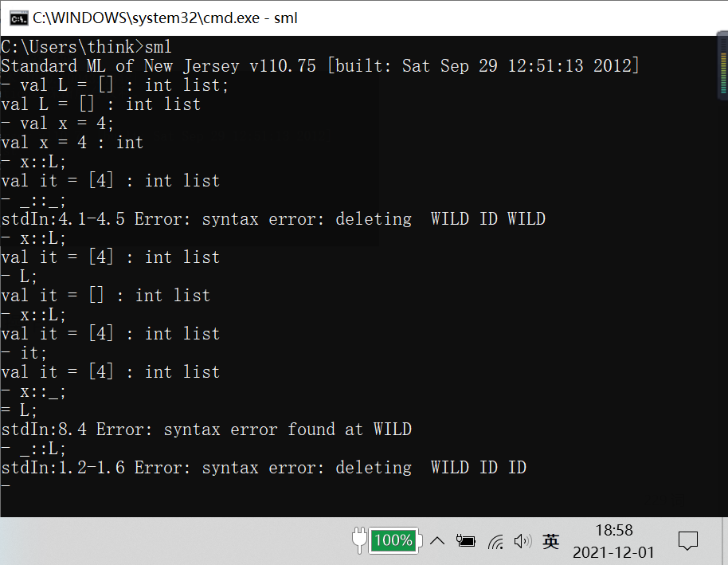
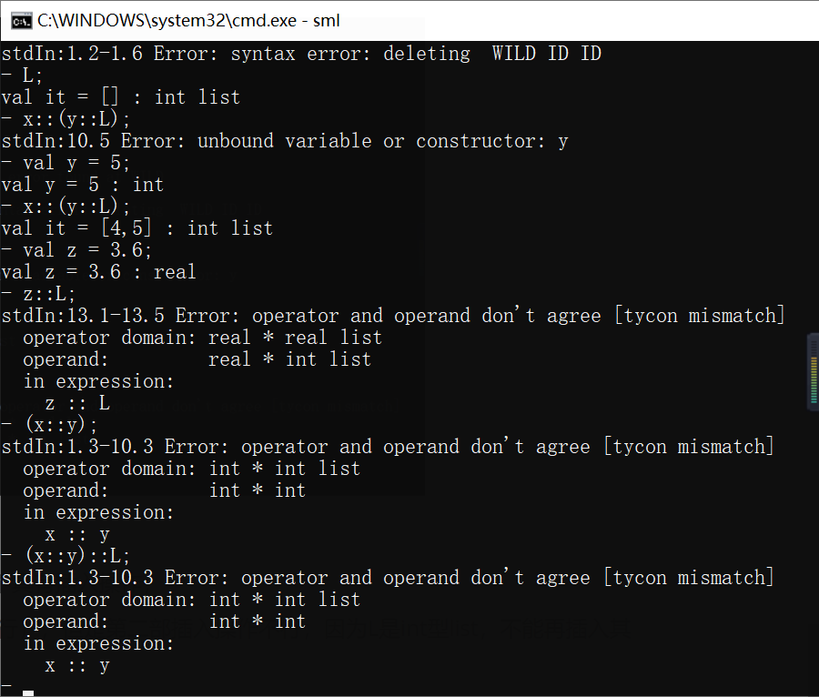
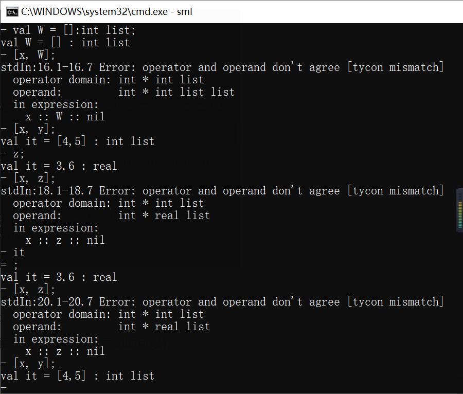
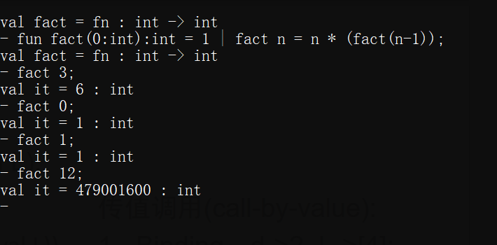
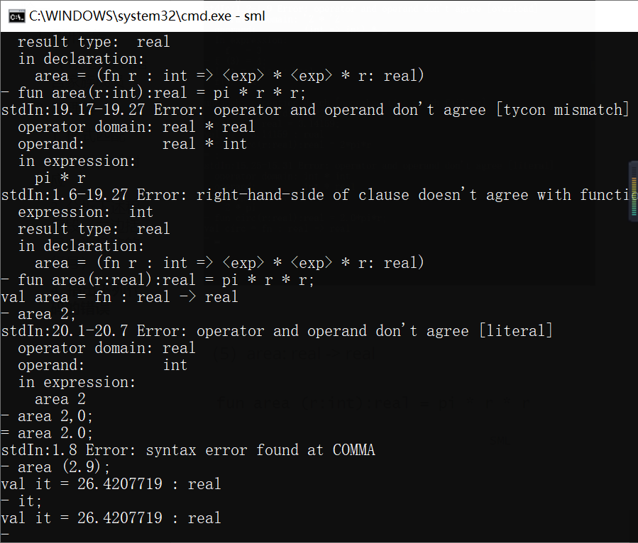
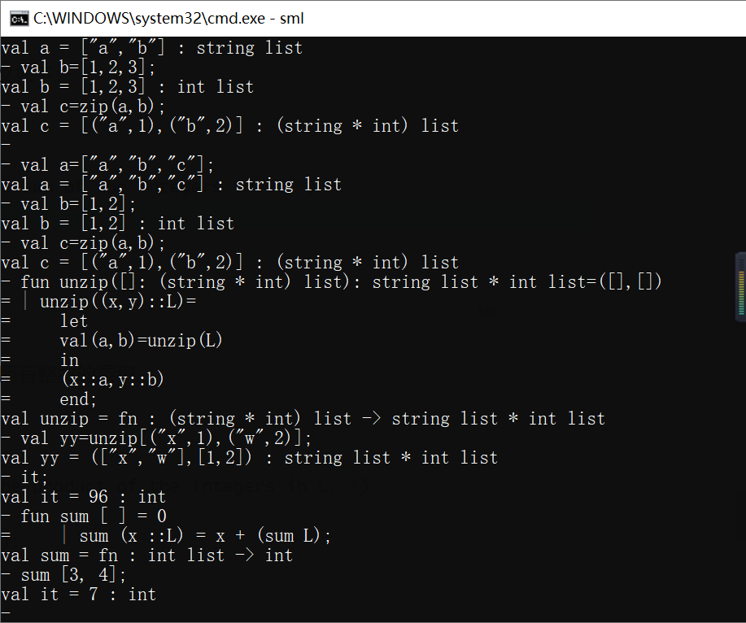
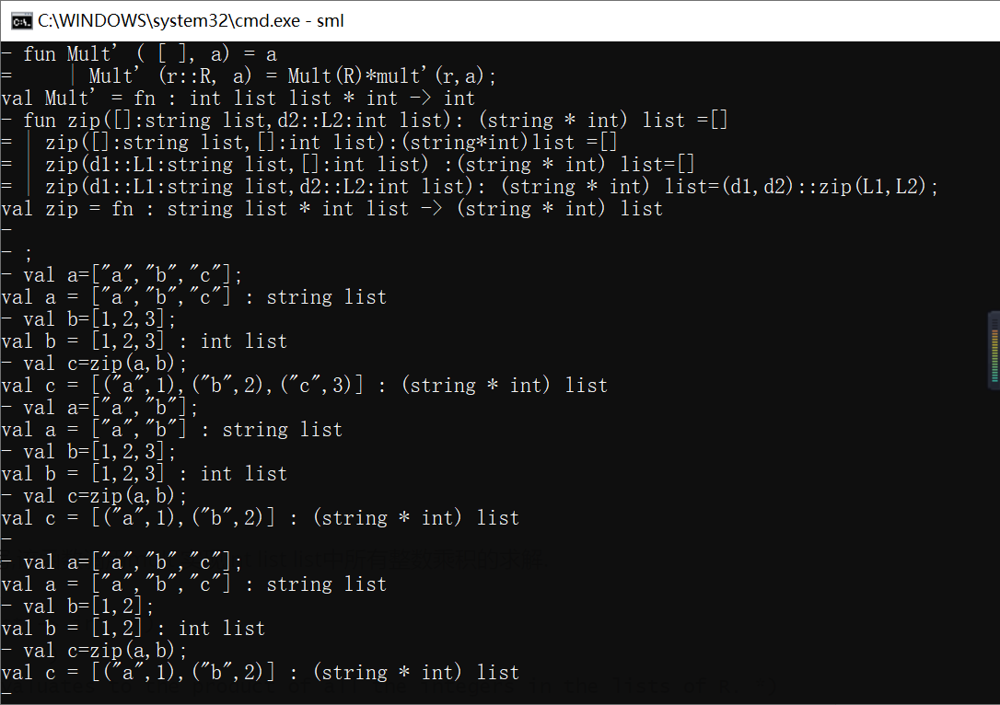
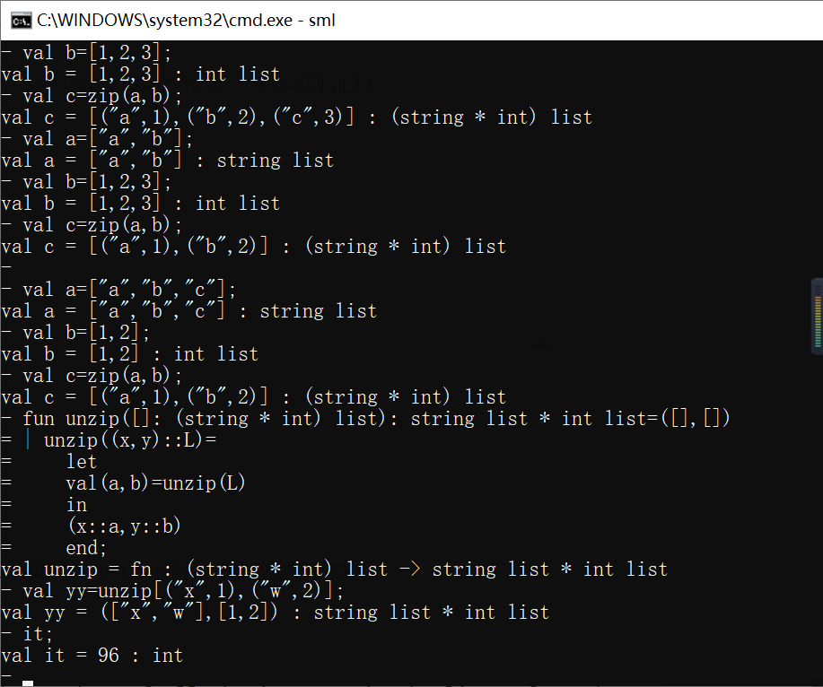
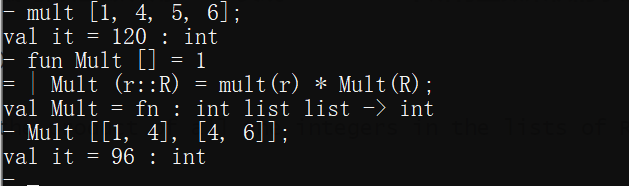
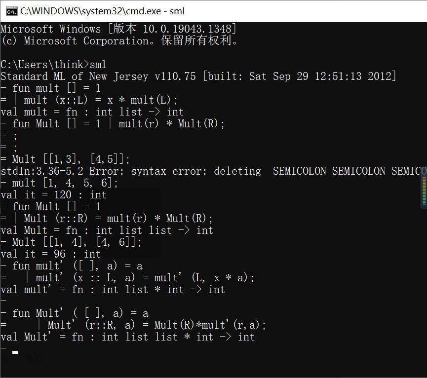

#### 函数式编程原理-实验一


##### 1.调研报告

###### （1）函数式语言家族成员

①ISWIM(If you See What I Mean)(1966年)

> - 以函数式为核心的指令式语言，函数由Sugaredλ 演算组成
> - 没有完全实现**FP**， 在一定程度上奠定了函数式语言设计的基础  

②ML语言(1973年)

> - 具备命令式语言特点的函数式编程语言灵活的函数功能，允
>   许副作用和指令式编程的使用
> - 有并行扩展，可以用来写并行系统  

③Standard ML语言(20世纪90年代)

> • 高阶函数、 I/0机制、参数化的模块系统和完善的类型系统
> • 交互式编译器， SML/NJ最著名


##### 2. FP理解

###### 1. 模式匹配

（1）**x::L**

> 可以，因为x和list L均为int类型，匹配成功；


（2）_ :: _

> 可以，<font color = "red">非空List</font>
>
> 通配符匹配到合适的插入操作；



（3）**x::(y::L)**

> - 当y为int类型时可以，并且由运算顺序可知生成list为 [x, y];
>
> - 当y为非int类型时，不可以，因为L是int类型的，模式不匹配；


（4）**(x::y)::L**

> - 当y为不同数据类型时不可以，因为y不具有插入操作；
> - 当y为int 类型list时可以（其他类型不行），但是第二部插入操作不行；因为L是int型list，不能再插入其他类型的list；



（5）**[x, y]**

> - 当y为int类型时可以，这样生成的为[x, y]的int类型list；
> - 当y为非int类型时，不可以；因为list是包含<font color = "red">相同类型元素</font>的有限序列；
> - 当y为非int类型时，可以考虑生成元组；元组是可以包含<font color = "violet">任意类型数据元素</font>的定长序列；




###### 2. 分析模式对应

（1）list of length 3

> - 长度为3的list；
> - 指的是该list中有3个元素，对元素的类型并没有强制要求；如下实现了4种长度为3的list


（2）lists of length 2 or 3

> **没有模式与之对应**；
>
> - 因为list的长度是固定的，不可能可能为2或者可能为3；
> - 但是可以通过条件限定，令某一个根据指令x，生成长度为2或3的list；

（3）Non-empty lists of pairs

> 可以，非空即可
>
> - 空表也可以作为表的元素；
> - 举例如（4）下

（4）Pairs with both components being non-empty lists

> 可以，举例如下


###### 3. 分析下述程序段

```SML
val x : int = 3;
val temp : int = x + 1;
fun assemble (x:int,y:real):int = 
	let val g:real = let val x:int = 2
			val m:real = 6.2*(real x)
			val x:int = 9001
			val y:real = m*y;
		   in y-m
		   end
		 in
		   x+(trunc g)
		 end
		 
val z = assembel(x, 3.0)
```


试问：第4行中的x、第5行中的m和第6行中的x的声明绑定的类型和值分别为什么？第14行表达式assemble(x, 3.0)计算的结果是什么？

> int; 2
>
> real; 2.0
>
> int; 12.4

**trunc** -- 去除小数部分

> 输出结果：27

> 运行截图 表明分析计算正确


###### 4. 指出下列代码的错误

（1）pi:real

```
val pi:real = 3.14159;
```

（2）fact : int -> int

> fun fact(0:int):int = 1 | fact n = n * (fact(n-1));




（3）f : int -> int

```SML
fun f (3: int) : int = 9
 f _ 4;
```


> 错误，少加上了<font color = "red">|</font>；


（4）circ real -> real

```SML
fun circ(r:real):rela = 2*pi*r
```


> 错误
>
> - 2的推导类型为int，可以改为2.0；


（5）area: real -> real

```SML
fun area (r:int):real = pi * r * r
```


> 错误；r为int类型，无法与real类型的pi直接进行运算
>
> - 可以更改为 real r;



###### 5.输入下列语句 

在提示符下依次输入下列语句，观察并分析每次语句的执行结果.

```SML
3+ 4;val it = 7 : int
3 + 2.0;/int 和real相加,类型不匹配 无法正确执行
it + 6;//val it = 13 : int
val it = “hello”;//val it = "hello" : string
it + “ world”;// 加号没有重载，应用“^”
it  + 5;//int string类型不匹配
val a = 5;//val a = 5 : int
a = 6;//val it = false : bool  因为a不等于6
a + 8; //val it = 13 : int   //a还是等于5
val twice = (fn x => 2 * x);//val twice = fn : int -> int，求二倍
twice a;//val it = 10 : int
let x = 1 in x end;//x前应加关键字val
foo;//未定义unbound variable or constructor: foo
[1, “foo”];//列表的元素必须相同

```


###### 6. 函数sum

用于求解整数列表中所有整数的和，函数定义如下：

```SML
(* sum : int list -> int 		*)
(* REQUIRES: true		*)
(* ENSURES: sum(L) evaluates to the sum of the integers in L. *)
fun sum [ ] = 0
    | sum (x ::L) = x + (sum L);

```



完成函数mult的编写，实现求解整数列表中所有整数的乘积。

```SML
(* mult : int list -> int 		*)
(* REQUIRES: true		*)
(* ENSURES: mult(L) evaluates to the product of the integers in L. *)
fun mult [ ] =  1
    | mult (x ::L) = 	x * mult(L);

```


###### 7. 编写函数

（1）实现下列功能：

```SML
（1）zip: string list * int list -> (string * int) list
```

> 其功能是提取第一个string list中的第i个元素和第二个int list中的第i个元素组成结果list中的第i个二元组。如果两个list的长度不同，则结果的长度为两个参数list长度的最小值。


```SML
fun zip([]:string list,d2::L2:int list): (string * int) list =[]
| zip([]:string list,[]:int list):(string*int)list =[]
| zip(d1::L1:string list,[]:int list) :(string * int) list=[]
| zip(d1::L1:string list,d2::L2:int list): (string * int) list=(d1,d2)::zip(L1,L2);
```

测试代码

```
val a=["n","b","c"];
val b=[1,2,3];
val c=zip(a,b);
val a=["a","b"];
val b=[1,2,3];
val c=zip(a,b);

val a=["a","b","c"];
val b=[1,2];
val c=zip(a,b);
```



（2）实现下列功能

> （2）unzip: (string * int) list -> string list * int list
>
> 其功能是执行zip函数的反向操作，将二元组list中的元素分解成两个list，第一个list中的元素为参数中二元组的第一个元素的list，第二个list中的元素为参数中二元组的第二个元素的list。

```SML
fun unzip([]: (string * int) list): string list * int list=([],[])
| unzip((x,y)::L)=
    let 
    val(a,b)=unzip(L)
    in
    (x::a,y::b)
    end;
val yy=unzip[("x",1),("w",2)];
```


测试结果



> 对所有元素L1: string list和L2: int list，unzip( zip (L1, L2)) = (L1, L2)是否成立？如果成立，试证明之；否则说明原因。

> <font color = "red">不等长时不成立</font>


###### 8. 完成如下函数

Mult: int list list -> int的编写,该函数调用mult 实现int list list中所有整数乘积的求解.

```SML
(* mult : int list list -> int 	*)
(* REQUIRES: true		*)
(* ENSURES: mult(R) evaluates to the product of all the integers in the lists of R. *)
 
fun Mult [ ] = 	(* FILL IN *)
    | Mult (r :: R) = 	(* FILL IN *)
```


```SML
fun mult [ ] =  1
    | mult (x ::L) = 	x * mult(L);
    
fun Mult [] = 1
 | Mult (r::R) = mult(r) * Mult(R);
```




###### 9. 函数mult’

```SML
fun mult' ([ ], a) = a
	  | mult' (x :: L, a) = mult' (L, x * a);

fun Mult' ( [ ], a) = 	a
    | Mult' (r::R, a) = Mult(R)*mult'(r,a);
```




###### 10. 递归函数square

```SML
fun double (0 : int) : int = 0
    | double n = 2 + double (n - 1);

fun square(0:int):int =0
| square(x) = square(x-1)+double(x-1)+1;
```


