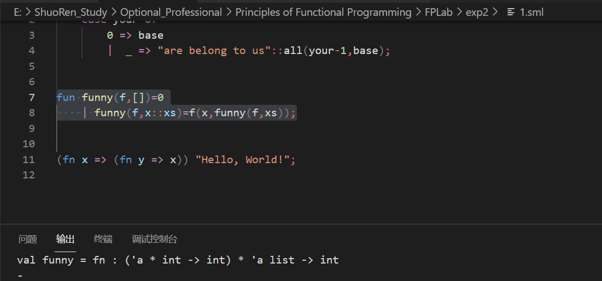
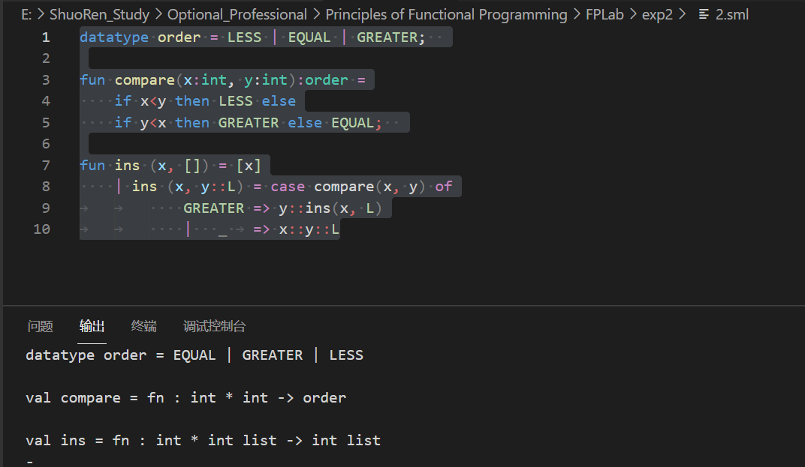
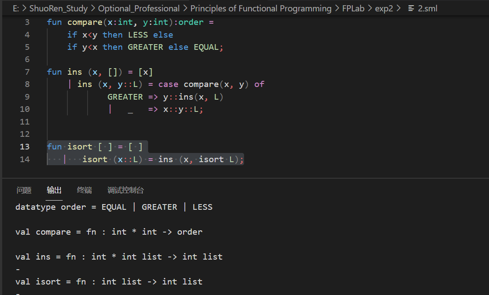
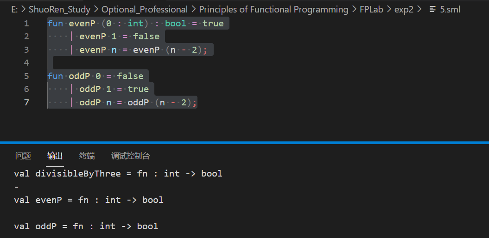
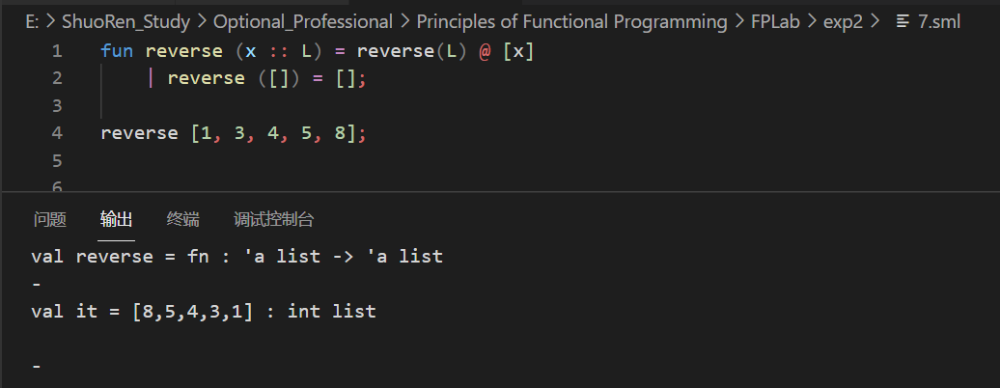
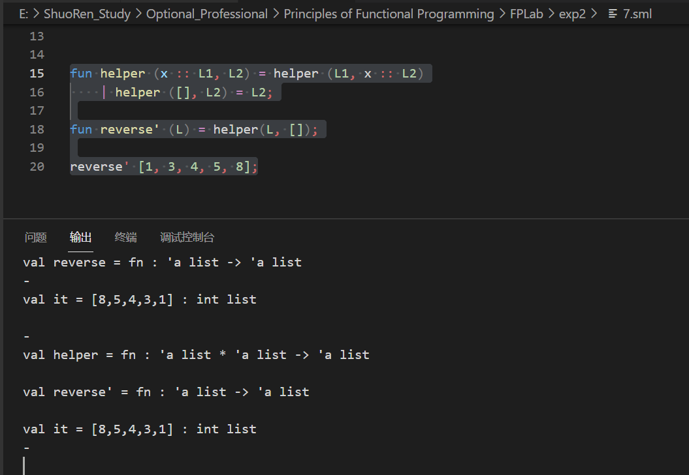
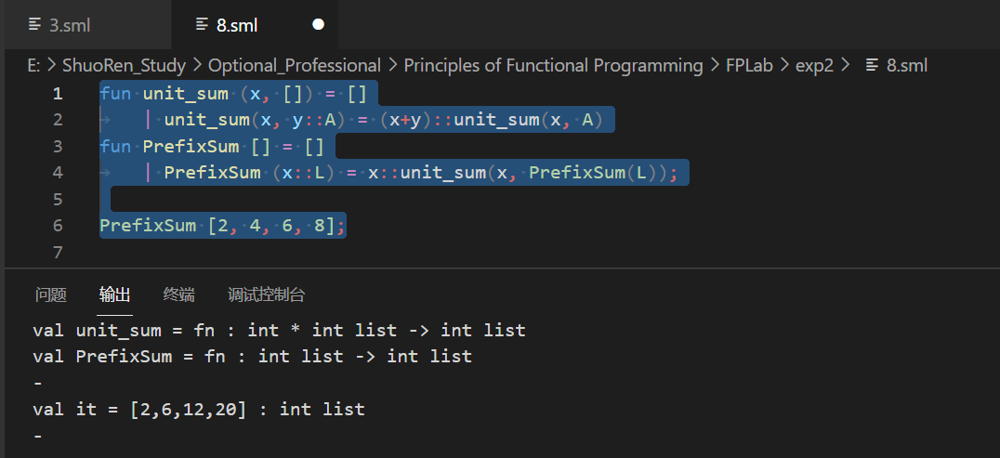

 ##### exp2


###### 1. 分析以下函数或表达式的类型

(1)**分析以下函数或表达式的类型**(先自己分析再程序验证)

> 类型：int * string list -> string list
> 函数功能：在string list base前添加your个“are belong to us”

```sml
fun all (your,base)=
    case your of
        0=>base
        |_=>"are belong to us"::all(your-1,base);
```

测试：


分析：

> ::all(your-1, base) 说明函数返回类型为list
>
> “are belong to us” 说明生成的 list 的类型为 string


(2) 第二个

> 类型：('a * int -> int) * 'a list -> int

```sml
fun funny(f,[])=0
    | funny(f,x::xs)=f(x,funny(f,xs));
```

分析：

> 第一行  0 知道返回类型为 int ，数据元素元 为 int
>
> x::xs  后面是一个 list




(3) 第三个

> 'x -> 'y -> 'x
>
> Hello,World是输入 -- 输入一个 Hello World

```sml
(x => (fn y => x)) "Hello, World!"
```

分析：

> _   + Hello.. 后面是hello world
>
> 前面是一个整体，fnx 调 后面， 再调回来  最后 hello world 


###### 2.用归纳法证明ins函数和isort函数的正确性

> 对任一整数x和有序整数序列L，函数ins(x, L) 计算结果为x和L中所有元素构成的一个有序序列

```sml
fun ins (x, []) = [x]
    | ins (x, y::L) = case compare(x, y) of
		    GREATER => y::ins(x, L)
		    |   _ 	=> x::y::L
```

函数中用到 <font color = "red">compare</font>,在这里补充定义一下

> datatype order = LESS | EQUAL | GREATER;  
>
> fun compare(x:int, y:int):order =
>
> ​	if x<y then LESS else
>
> ​	if y<x then GREATER else EQUAL;  

演示截图：



证明（1）ins函数的正确性：

> ins(x,L)。当L是空表时，结果为[x]，是一个有序序列。
>
> ​	假设: 对于长度<k的有序表L来说，ins(x,L)的结果均为x和L中所有元素构成的有序序列。
>
> ​	那么对于长度为k的有序表L来说：
>
> ​	ins(x,L) 时会将L的首元素y取出，剩余部分为Y，即L=y::Y。
>
> ​	然后，将y与x进行比较，
>
> ① if x>y。则进行操作y::ins（x,Y）。因为Y的长度为k-1，而由假设可知，ins(x,Y)会
>
> 得到一个有序表。然后将y加入这个有序表的首部。因为表L本身就是有序的，所以它的首元素y是整个表
>
> 中最小的元素，如果x大于y的话，那么在加入x的排好序的列表中，y还应该是首元素。
>
> 所以可得，当x>y时所得结果正确。
>
> ② if x<=y。则直接将x放入L的首元素。因为y本身就是L中最小的元素，如果x仍小于y，那么只有将它
>
> 放到首部才能构成有序序列。由此可知当x<=y所得结果正确。
>
> 综上可知，该函数能够达到要求。


**isort**

> (* REQUIRES true 				*)
> (* ENSURES isort(L) = a sorted perm of L 	*)
> (*对所有整数序列L，isort L计算得到L中所有元素的一个有序排列。*)

```sml
fun isort [ ] = [ ]
   |   isort (x::L) = ins (x, isort L);
```



证明（2）isort函数的正确性：

> 对于空表来说，所得结果仍为空表。正确
>
> 假设对于所有长度<k的列表来说，所得结果均为一个递增的有序序列。
>
> 那么对于长度为k的列表L来说：
>
> 假设L=y::Y.
>
> 进行isort（L）= ins( y , isort( Y ) )
>
> 由于Y长度为k-1，根据假设可知，isort(Y)的结果是一个有序序列，不妨将其设为Z。
>
> 然后进行ins(x,Z)。已经证毕，ins()的计算结果为x和Z中所有元素构成的一个有序序列。
>
> 综上可知，isort能够将列表元素进行排序。
>


###### 3分析下面菲波拉契函数的时间复杂度

两个函数的展示：


1. fun fib n 的性能分析

```
fun fib n = if n<=2 then 1 else fib(n-1) + fib(n-2);
```

fib(n)的复杂度为O(2^n)

> 二叉树，n层，最底层的叶子结点的数量级 2^n

2.fun fibber (0: int) 的性能分析

```sml
fun fibber (0: int) : int * int = (1, 1)
  | fibber (n: int) : int * int =
      let val (x: int, y: int) = fibber (n-1)
      in (y, x + y)
      end;
```

fibber的复杂度为O(n)；

> 由推导可知，在let in 结构中，推导出：
>
> 如果fibber(n-1)在前面的结构中计算过，则直接调用；
>
> 跟fib相比：避免了比如 f 5 ,f 6   都调用计算量 f4 的情况；


###### 4. 定义函数divisibleByThree: int -> bool

> 定义函数divisibleByThree: int -> bool，以使当n为3的倍数时，divisibleByThree n为true，否则为false。
>
>  注意：程序中不能使用取余函数’mod’。

程序：

```sml
fun divisibleByThree 0 = true
    | divisibleByThree 1 = false
    | divisibleByThree 2 = false
    | divisibleByThree n = divisibleByThree (n - 3);
```


###### 5. 函数 - 判断奇偶

```sml


fun oddP 0 = false
    | oddP 1 = true
    | oddP n = oddP (n - 2);
```




###### 6. 编写函数 interleave: int list * int list -> int list

> 编写函数 interleave: int list * int list -> int list，该函数能实现两个int list数据的合并，且两个list中的元素在结果中交替出现，直至其中一个int list数据结束，而另一个int list数据中的剩余元素则直接附加至结果数据的尾部。如：
>
> interleave([2],[4]) = [2,4]
>
> interleave([2,3],[4,5]) = [2,4,3,5]
>
> interleave([2,3],[4,5,6,7,8,9]) = [2,4,3,5,6,7,8,9]
>
> interleave([2,3],[ ]) = [2,3]

```sml
fun interleave (x :: L1, y :: L2) = x :: (y :: interleave(L1, L2))
    | interleave (x :: L1, []) = x :: interleave(L1, [])
    | interleave ([], y :: L2) = y :: interleave([], L2)
    | interleave ([], []) = [];
```

测试：

> interleave([2],[4]) = [2,4]
>
> interleave([2,3],[4,5]) = [2,4,3,5]
>
> interleave([2,3],[4,5,6,7,8,9]) = [2,4,3,5,6,7,8,9]
>
> interleave([2,3],[ ]) = [2,3]


###### 7. 编写函数reverse和reverse’

> 编写函数reverse和reverse’，要求：
>
> ①函数类型均为：int list->int list，功能均为实现输出表参数的逆序输出；
>
> ②函数reverse不能借助任何帮助函数；函数reverse’可以借助帮助函数，时间复杂度为*O*(n)。

(1) 实现逆序输出：

```sml
fun reverse (x :: L) = reverse(L) @ [x]
    | reverse ([]) = [];

reverse [1, 3, 4, 5, 8];
```




(2) 时间复杂度为*O*(n)

```sml
fun helper (x :: L1, L2) = helper (L1, x :: L2)
    | helper ([], L2) = L2;

fun reverse' (L) = helper(L, []);

reverse [1, 3, 4, 5, 8];
```




###### 8. PrefixSum 函数 - 求前缀和

(1) W = O(n^2)

```sml
fun unit_sum (x, []) = []
	| unit_sum(x, y::A) = (x+y)::unit_sum(x, A)
fun PrefixSum [] = []
	| PrefixSum (x::L) = x::unit_sum(x, PrefixSum(L));

PrefixSum [2, 4, 6, 8];
```




(2) W = O(n)

```sml
fun fastPrefixSum [] = []
	| fastPrefixSum [x] = [x]
	| fastPrefixSum (x::y::L) = x::fastPrefixSum((x + y)::L);

PrefixSum [2, 4, 6, 8];
```


