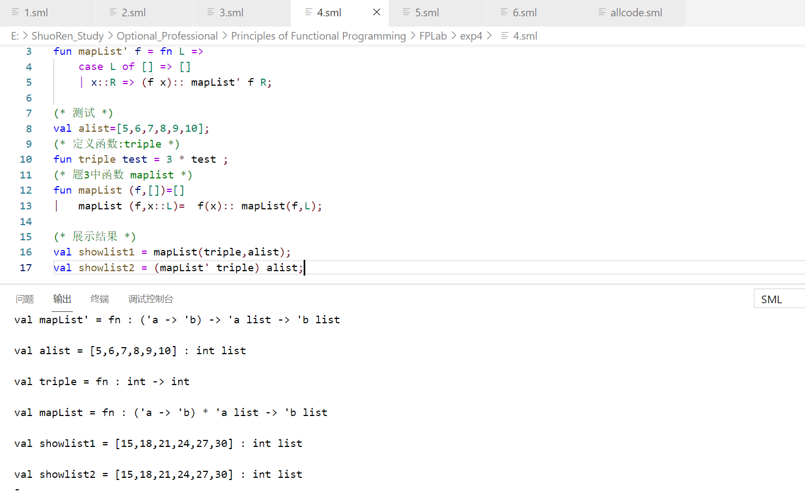
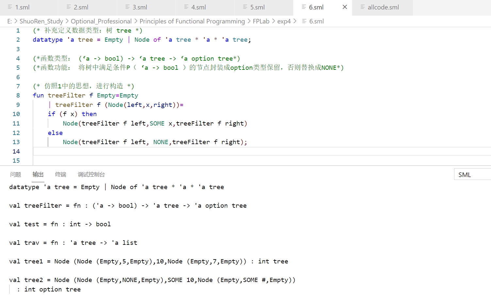

##### 任硕实验4-记录


###### 0.运行环境

VSCode + Standard ML + SML Environment


###### 1推导下列表达式的类型和计算结果，并描述其功能。

```sml
(* map: ('a -> 'b) -> 'a list -> 'b list *)
fun map f [ ] = [ ]
    | map f (x::xs) = (f x) :: (map f xs)
(* 函数作用：将list中按需求分离 *)

(* filter: ('a -> bool) -> 'a list -> 'a list *)
fun filter f [] = []
    | filter f (x::xs) = if f x then x :: (filter f xs)
			     else filter f xs
(* 函数作用：满足f函数时保留，其余的都过滤掉 *)

map (filter (fn a => size a = 4)) [["Sunday", "Monday"], ["one", "two", "three", "four", "five"], ["year", "month", "day"]];

(* 按照要求，过滤掉其余的，只保留住长度为4的string *)
```

运行截图如下：


###### 2.编写函数thenAddOne

```sml
(*函数类型： ((int ->int) * int) -> int*)
(*函数功能： 为将一个整数通过函数变换(如翻倍、求平方或求阶乘)后再加1*)

fun thenAddOne (f,x)= f x +1;
(* 设变换为f *)
(*测试*)

fun triple test = 3 * test ;
(* 定义一个小函数，将传入数据翻为原来的3倍 *)
val a = 3;

val ans = thenAddOne(double,a);
```

用triple（变化为原来的3倍）函数进行测试，截图如下：


###### 3.编写函数mapList

```sml
(*函数类型：((‘a -> ‘b) * ‘a list) -> ‘b list*)
(*函数功能：实现整数集的数学变换(如翻倍、求平方或求阶乘)*)

fun mapList (f,[])=[]
|   mapList (f,x::L)=  f(x):: mapList(f,L);

fun triple test = 3 * test ;
val alist = [3, 4, 5, 6];
val ans = mapList(triple,alist);
(* ans 若等于 [9, 12, 15, 18] 说明功能正确 *)
```


测试截图：


###### 4.编写函数mapList’

```sml
(*函数类型： (‘a -> ‘b) -> (‘a list -> ‘b list) *)
(*函数功能：实现整数集的数学变换(如翻倍、求平方或求阶乘)*)
x

(* 测试 *)
val alist=[5,6,7,8,9,10];
(* 定义函数:triple *)
fun triple test = 3 * test ;
(* 题3中函数 maplist *)
fun mapList (f,[])=[]
|   mapList (f,x::L)=  f(x):: mapList(f,L);

(* 展示结果 *)
val showlist1 = mapList(triple,alist);
val showlist2 = (mapList' triple) alist;
```

**分析、体会maplist和maplist',它们有什么不同**

> ① 函数类型不同：前者为：((‘a -> ‘b) * ‘a list) -> ‘b list 后者为：(‘a -> ‘b) -> (‘a list -> ‘b list)
>
> ② 后者为直接对一个list进行操作，操作封装性更好一些

测试截图：




###### 5.编写函数

```sml
(* option的文档解释：option is a SML datatype for handling potential undefined values.
 Formally, the option type is parametrized by a single polymorphic type variable,
  so for every SML type t, there is a type t option. *)

fun exists(p) = fn L => foldr (fn (a, b) => a orelse b) false (map p L)
fun forall(p) = fn L => foldr (fn (a, b) => a andalso b) true (map p L)

(* 定义函数：判断是否是偶数 *)
fun IsEven(x) = x mod 2 = 0;


exists(IsEven) [3, 5, 7, 9, 11]; (* 不存在偶数 *)
exists(IsEven) [1, 3, 5, 8]; (* 存在偶数8 *)
forall(IsEven) [0, 2, 4, 7]; (* 存在7不是偶数 *)
forall(IsEven) [0, 2, 4, 6, 8, 10]; (* 所有数字均为偶数 *)
(* 分别对应之下要求 *)
(* exist p L =>* true if there is an x in L such that p x=true;
	         exits p L =>* false otherwise.
	         forall p L =>* true if p x = true for every item x in L;
	         forall p L =>* false otherwise.
 *)
```

测试截图


###### 6.编写函数：treeFilter

```sml
(* 补充定义数据类型：树 tree *)
datatype 'a tree = Empty | Node of 'a tree * 'a * 'a tree;

(*函数类型： (‘a -> bool) -> ‘a tree -> ‘a option tree*)
(*函数功能： 将树中满足条件P（ ‘a -> bool ）的节点封装成option类型保留，否则替换成NONE*)

(* 仿照1中的思想，进行构造 *)
fun treeFilter f Empty=Empty
    | treeFilter f (Node(left,x,right))=
    if (f x) then 
        Node(treeFilter f left,SOME x,treeFilter f right)
    else
        Node(treeFilter f left, NONE,treeFilter f right);


fun test temp= (temp mod 3) = 1;

fun trav(Empty) = [] 
    | trav(Node(L, v, R)) = trav(L)@v::trav(R);

val tree1 = Node(Node(Empty,5,Empty), 10,Node(Empty,7,Empty));
val tree2 = treeFilter test tree1;

```

测试截图：

