# 《强化学习》实验一报告
## 实验题目：值迭代和策略迭代

---

## 一、实验目的与要求

1. 理解基于模型的强化学习核心思想，掌握贝尔曼方程与贝尔曼最优方程的数学原理。
2. 掌握**值迭代算法**的原理与实现，理解其作为贝尔曼最优方程直接求解方法的本质。
3. 掌握**策略迭代算法**的原理与实现，理解"策略评价—策略改进"交替迭代机制及收敛性。
4. 掌握**截断策略迭代算法**的原理，理解值迭代与策略迭代作为其特殊情况的关系。
5. 在网格世界环境中对比三种算法的收敛速度、计算效率与最终性能，加深对广义策略迭代思想的理解。

---

## 二、实验内容与记录

### 2.1 实验环境

本实验在 5×5 GridWorld 中进行，环境参数如下：

| 参数 | 任务 1（值迭代） | 任务 2 & 3（策略/截断策略迭代） |
|------|:---:|:---:|
| 网格大小 | 5×5（25 个状态） | 5×5（25 个状态） |
| 目标位置 | (4,4) 右下角 ★ | (4,4) 右下角 ★ |
| 禁止区域 | (1,1), (2,3) | (1,1), (2,3) |
| 边界奖励 $r_\text{boundary}$ | −1 | −1 |
| 禁止区域奖励 $r_\text{forbidden}$ | **−1** | **−10** |
| 目标奖励 $r_\text{target}$ | +1 | +1 |
| 折扣因子 $\gamma$ | 0.9 | 0.9 |
| 动作空间 | 上/下/左/右（确定性） | 上/下/左/右（确定性） |

> **注**：任务 2 & 3 将禁止区域奖励设为 −10，使算法更强烈地回避禁止区域，能更清晰地展示策略的绕行行为。

---

### 2.2 任务 1：值迭代算法

#### 算法思想

值迭代（Value Iteration）直接迭代贝尔曼最优方程：

$$V_{k+1}(s) = \max_a \sum_{s'} p(s'|s,a)\bigl[r(s,a,s') + \gamma V_k(s')\bigr]$$

等价地，先计算所有动作的 Q 值，再取最大：

$$q_k(s,a) = \sum_{s'} p(s'|s,a)\bigl[r(s,a,s') + \gamma V_k(s')\bigr], \quad V_{k+1}(s) = \max_a\, q_k(s,a)$$

当 $\max_s |V_{k+1}(s) - V_k(s)| < \theta$ 时停止（本实验 $\theta = 10^{-6}$），提取贪心策略 $\pi(s) = \arg\max_a q(s,a)$。

#### 2×2 小网格手动验证

为验证实现正确性，先在 2×2 网格（目标 (1,1)，无禁止区域）上手工核对前 3 次迭代：

**初始状态**：$V_0(s) = 0$ for all $s$

**迭代 1**（Q-Table）：

| 状态 | ↑ | ↓ | ← | → | V(s) | π(s) |
|:---:|:---:|:---:|:---:|:---:|:---:|:---:|
| (0,0) | −1.000 | 0.000 | −1.000 | 0.000 | 0.000 | ↓ |
| (0,1) | −1.000 | **1.000** | 0.000 | −1.000 | 1.000 | ↓ |
| (1,0) | 0.000 | −1.000 | −1.000 | **1.000** | 1.000 | → |
| (1,1) ★ | 0 | 0 | 0 | 0 | 0 | — |

> 解释：(0,1) 向下可到达目标得 +1；(1,0) 向右可到达目标得 +1；其余状态尚未传播到目标信息。

**迭代 2**（Q-Table）：

| 状态 | ↑ | ↓ | ← | → | V(s) | π(s) |
|:---:|:---:|:---:|:---:|:---:|:---:|:---:|
| (0,0) | −1.000 | 0.900 | −1.000 | 0.900 | 0.900 | ↓ |
| (0,1) | −0.100 | **1.000** | 0.000 | −0.100 | 1.000 | ↓ |
| (1,0) | 0.000 | −0.100 | −0.100 | **1.000** | 1.000 | → |
| (1,1) ★ | 0 | 0 | 0 | 0 | 0 | — |

> 解释：(0,0) 可以向下到 (1,0)（$V=1$），得 $0 + 0.9 \times 1 = 0.9$；向右到 (0,1)（$V=1$），同样 0.9。

**迭代 3**（Q-Table）：

| 状态 | ↑ | ↓ | ← | → | V(s) | π(s) |
|:---:|:---:|:---:|:---:|:---:|:---:|:---:|
| (0,0) | −0.190 | 0.900 | −0.190 | 0.900 | 0.900 | ↓ |
| (0,1) | −0.100 | **1.000** | 0.810 | −0.100 | 1.000 | ↓ |
| (1,0) | 0.810 | −0.100 | −0.100 | **1.000** | 1.000 | → |
| (1,1) ★ | 0 | 0 | 0 | 0 | 0 | — |

> 第 3 次迭代后值函数已不再变化（max|ΔV|=0），2×2 网格在第 3 次迭代收敛。✓

#### 5×5 网格实验结果

**收敛情况**：值迭代在 **9 次迭代**后收敛（max|ΔV| 降至 0）。

各次迭代 max|ΔV|：

| 迭代次数 | 1 | 2 | 3 | 4 | 5 | 6 | 7 | 8 | 9 |
|:---:|:---:|:---:|:---:|:---:|:---:|:---:|:---:|:---:|:---:|
| max\|ΔV\| | 1.000 | 0.900 | 0.810 | 0.729 | 0.656 | 0.591 | 0.531 | 0.478 | 0.000 |

**最终值函数矩阵**（保留 4 位小数）：

```
[[0.4783, 0.5314, 0.5905, 0.6561, 0.7290],
 [0.5314, 0.5905, 0.6561, 0.7290, 0.8100],
 [0.5905, 0.6561, 0.7290, 0.8100, 0.9000],
 [0.6561, 0.7290, 0.8100, 0.9000, 1.0000],
 [0.7290, 0.8100, 0.9000, 1.0000, 0.0000]]  ← 目标状态 V=0（终止）
```

**最终最优策略**：

```
 ↓  →  ↓  ↓  ↓
 ↓  ↓  ↓  →  ↓
 ↓  ↓  ↓  ↓  ↓
 ↓  ↓  ↓  ↓  ↓
 →  →  →  →  ★
```

**值函数热力图**：

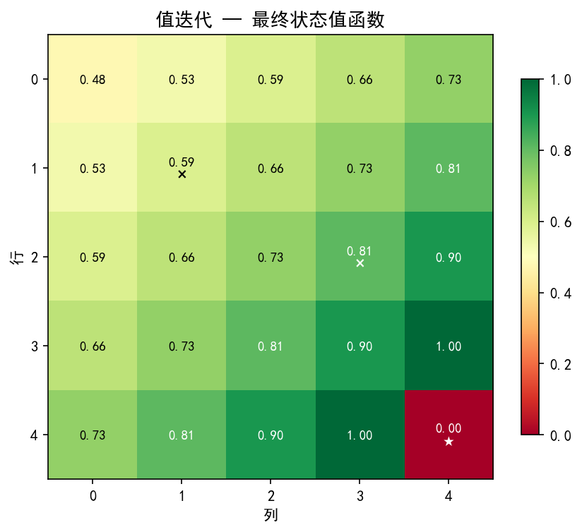

**最优策略箭头图**：

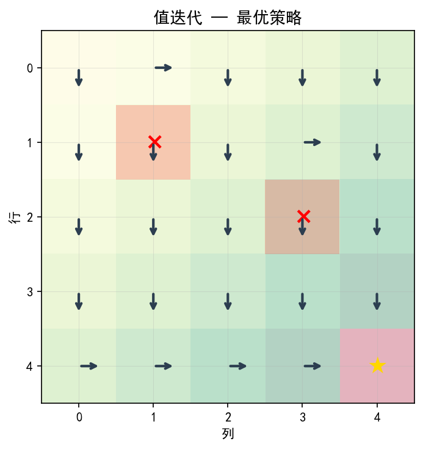

**收敛曲线**：

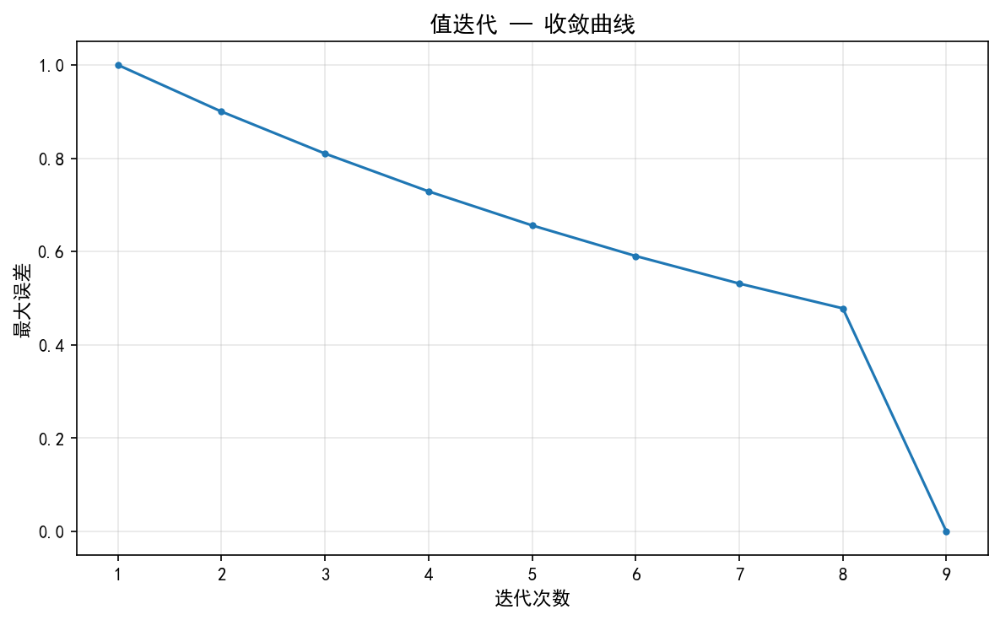

#### 不同初始值函数对比

| 初始值设置 | 收敛迭代次数 |
|:---:|:---:|
| V=0（全零） | 9 |
| V=随机 | 12 |
| V=乐观（+5） | 26 |

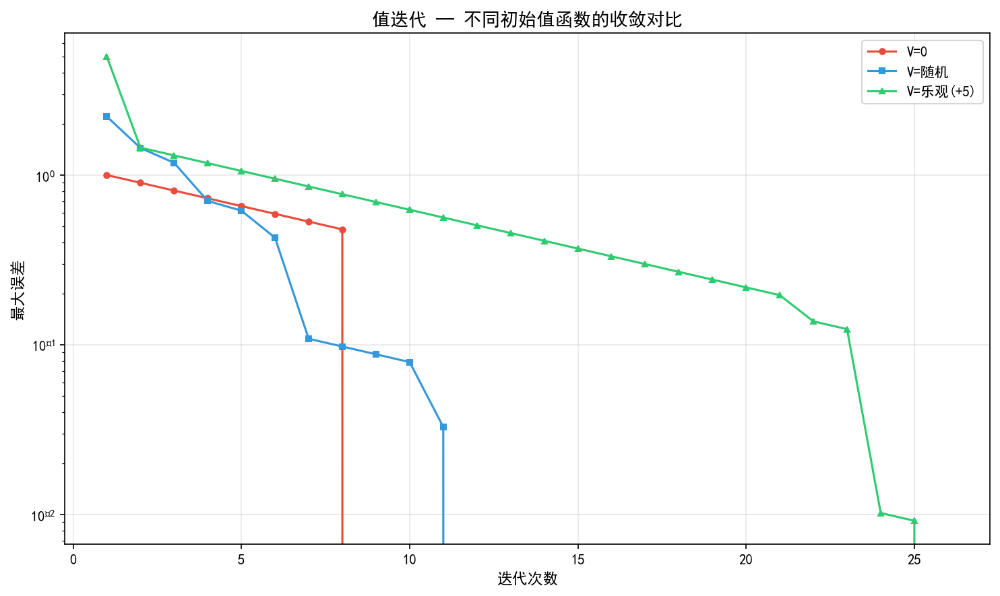

---

### 2.3 任务 2：策略迭代算法

#### 算法思想

策略迭代（Policy Iteration）交替执行两个步骤：

**策略评价（Policy Evaluation）**：给定策略 $\pi$，反复迭代贝尔曼方程，直到值函数收敛：
$$V^\pi(s) = \sum_{s'} p(s'|s,\pi(s))\bigl[r(s,\pi(s),s') + \gamma V^\pi(s')\bigr]$$

**策略改进（Policy Improvement）**：利用 $V^\pi$ 更新贪心策略：
$$\pi'(s) = \arg\max_a \sum_{s'} p(s'|s,a)\bigl[r(s,a,s') + \gamma V^\pi(s')\bigr]$$

若 $\pi' = \pi$，策略稳定，算法收敛。

#### 实验结果

**收敛情况**：策略迭代在 **6 次外循环**后策略稳定收敛。各次迭代详情：

| 外循环 | 策略评价步数 | max\|ΔV\| | 策略状态 |
|:---:|:---:|:---:|:---:|
| 1 | 133 | 17.2900 | 更新 |
| 2 | 139 | 17.2900 | 更新 |
| 3 | 3 | 0.8100 | 更新 |
| 4 | 3 | 0.7290 | 更新 |
| 5 | 2 | 0.6561 | 更新 |
| 6 | 3 | 0.5314 | **稳定 ✓** |

平均策略评价迭代次数：**47.2 步/次外循环**

**最终值函数矩阵**（与任务 1 相同，因最终最优策略相同）：

```
[[0.4783, 0.5314, 0.5905, 0.6561, 0.7290],
 [0.5314, 0.5905, 0.6561, 0.7290, 0.8100],
 [0.5905, 0.6561, 0.7290, 0.8100, 0.9000],
 [0.6561, 0.7290, 0.8100, 0.9000, 1.0000],
 [0.7290, 0.8100, 0.9000, 1.0000, 0.0000]]
```

**值函数热力图**：

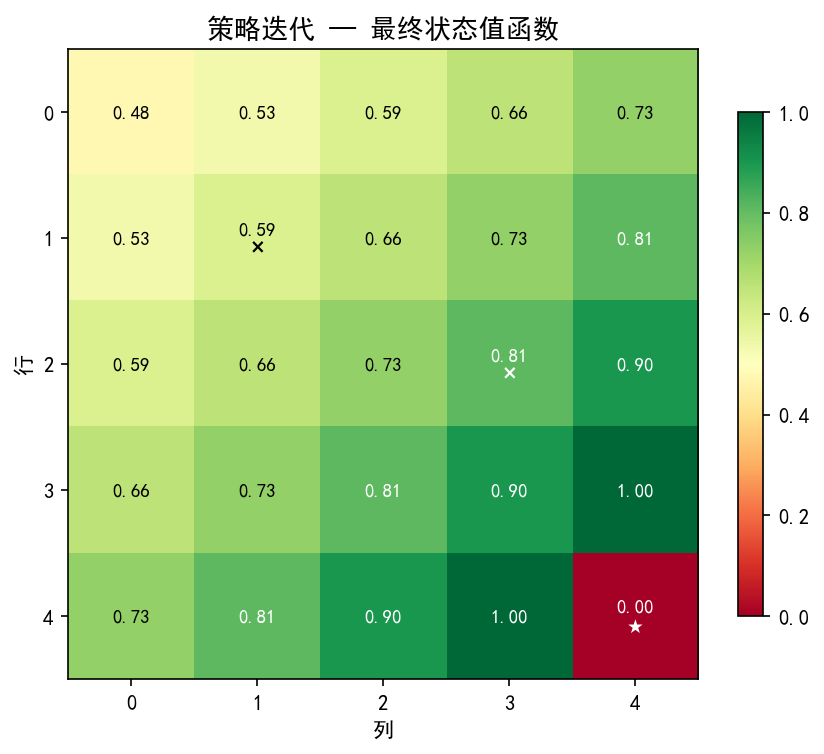

**最优策略箭头图**：

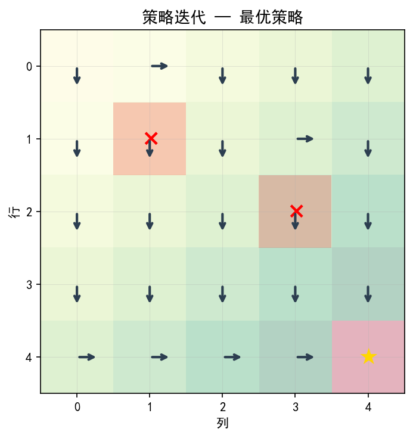

**策略演变过程**：

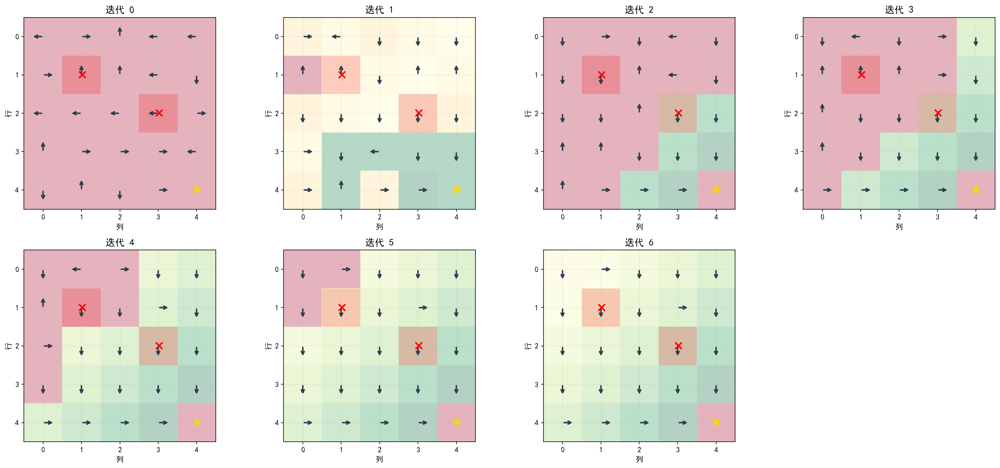

**收敛曲线**：

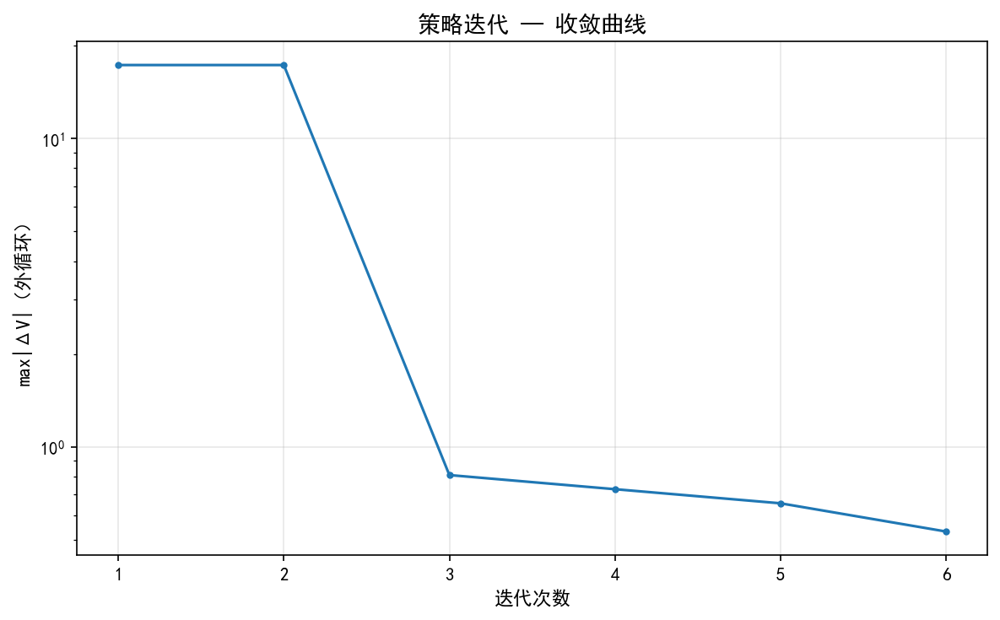

#### "接近目标的状态更早找到最优策略"现象分析

按曼哈顿距离分组，观察各组状态的 max|ΔV| 收敛速度：

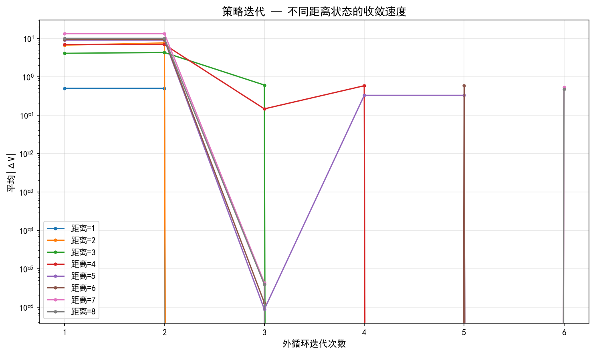

从图中可见，距目标曼哈顿距离小（如 1、2）的状态，其值函数在第 1~2 次外循环后即迅速趋于稳定；而距离远（如 6、7）的状态需要更多迭代才收敛。

---

### 2.4 任务 3：截断策略迭代与三者对比

#### 算法思想

截断策略迭代（Truncated Policy Iteration）在策略评价步骤中只执行 $j_\text{truncate}$ 次迭代，而非完全收敛：

- $j_\text{truncate} = 1$：等价于**值迭代**
- $j_\text{truncate} = \infty$：等价于**策略迭代**

#### 实验结果

各外循环 max|ΔV| 对比：

| 外循环 | j=1 | j=3 | j=5 | j=10 | j=∞ |
|:---:|:---:|:---:|:---:|:---:|:---:|
| 1 | 10.000 | 10.000 | 11.385 | 13.803 | 17.290 |
| 2 | 9.100 | 8.024 | 8.967 | 11.881 | 17.290 |
| 3 | 0.900 | 1.976 | 2.557 | 2.732 | 0.810 |
| 4 | 0.810 | 0.729 | 0.729 | 0.729 | 0.729 |
| 5 | 0.729 | 0.656 | 0.656 | 0.656 | 0.656 |
| 6 | 0.656 | 0.531 | 0.531 | 0.531 | 0.531 |
| 7 | 0.591 | 0.000 | 0.000 | 0.000 | 0.000 |
| 8 | 0.531 | — | — | — | — |
| 9 | 0.000 | — | — | — | — |

**性能汇总**：

| 算法 | 外循环次数 | 总贝尔曼更新次数 | 耗时 |
|:---:|:---:|:---:|:---:|
| j=1（值迭代） | 9 | 1080 | 0.0018s |
| j=3 | 7 | 1176 | 0.0018s |
| j=5 | 7 | 1512 | 0.0023s |
| j=10 | 7 | 2352 | 0.0035s |
| j=∞（策略迭代） | 7 | **7488** | **0.0121s** |

**收敛曲线对比**：

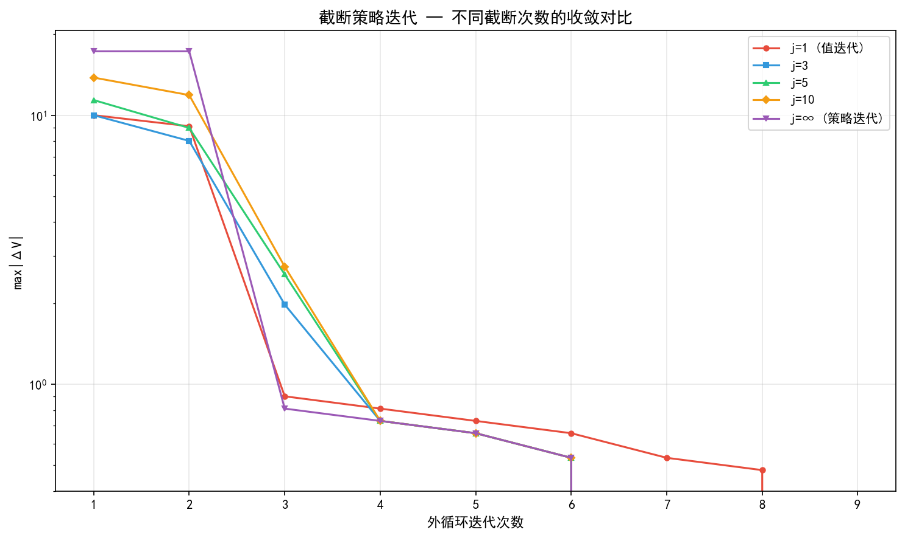

**计算效率对比**：

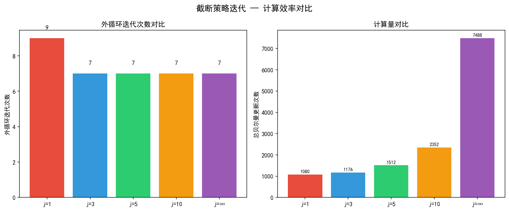

**各配置最终策略（均收敛到相同最优策略）**：

所有截断次数配置最终都得到了相同的最优策略，验证了算法的正确性。

---

## 三、实验记录与思考（问题回答）

### 3.1 任务 1 思考题

**问题：值迭代算法迭代过程中生成的值是状态值吗？为什么？**

**回答**：

严格来说，值迭代中间过程生成的 $V_k(s)$ **不是某个固定策略下的状态值**，而是贝尔曼最优算子 $\mathcal{T}^*$ 反复作用于初始函数的结果。

贝尔曼最优算子定义为：
$$(\mathcal{T}^* V)(s) = \max_a \sum_{s'} p(s'|s,a)[r(s,a,s') + \gamma V(s')]$$

因此 $V_k = (\mathcal{T}^*)^k V_0$。

- **不是某一策略的状态值**：$V_k$ 并不对应任何固定策略 $\pi$ 下的 $V^\pi$，因为每次提取的贪心策略 $\pi_k(s) = \arg\max_a q_k(s,a)$ 随迭代变化。
- **但有明确意义**：$V_k(s)$ 可以解释为"从状态 $s$ 出发，只经过 $k$ 步决策且之后收益为零的最大期望折扣回报"（有限步最优值函数）。
- **收敛后是状态值**：当 $V_k$ 收敛到 $V^*$ 时，它确实是最优策略下的状态值函数 $V^{\pi^*}$，满足 $V^* = \mathcal{T}^* V^*$（贝尔曼最优方程的不动点）。

从本实验可以验证：前几次迭代中 $V_k$ 仅反映了目标附近区域的信息（第 1 次只有紧邻目标的状态有非零 Q 值），随着迭代推进，价值信息才逐步向远处扩散，这正体现了其非状态值的本质。

---

### 3.2 任务 2 思考题

**问题 1：策略迭代算法包含哪两个核心步骤？它们各自的作用是什么？**

**回答**：

策略迭代包含两个交替进行的核心步骤：

**① 策略评价（Policy Evaluation）**

给定当前策略 $\pi_k$，通过反复迭代贝尔曼方程求解 $V^{\pi_k}$：
$$V^{\pi_k}(s) \leftarrow \sum_{s'} p(s'|s,\pi_k(s))[r + \gamma V^{\pi_k}(s')]$$

**作用**：准确评估当前策略的好坏——告诉我们在策略 $\pi_k$ 下，每个状态的长期期望折扣回报是多少。这是后续改进策略的依据。

**② 策略改进（Policy Improvement）**

利用 $V^{\pi_k}$ 计算每个状态的动作值，取贪心策略：
$$\pi_{k+1}(s) = \arg\max_a \sum_{s'} p(s'|s,a)[r + \gamma V^{\pi_k}(s')]$$

**作用**：基于当前价值信息寻找更好的策略。策略改进定理保证 $V^{\pi_{k+1}}(s) \geq V^{\pi_k}(s)$（对所有状态成立），即改进后的策略不会更差。

---

**问题 2：为什么策略迭代算法能够收敛到最优策略？**

**回答**：

收敛性由以下三点共同保证：

1. **策略改进定理**：每次策略改进步骤都保证 $V^{\pi_{k+1}} \geq V^{\pi_k}$（逐状态不等式），即策略序列单调不递减。

2. **策略空间有限**：对于有限状态、有限动作的 MDP，确定性策略的数量为 $|A|^{|S|}$（本实验为 $4^{25}$），是一个有限集合。

3. **严格单调 + 有限集合 ⇒ 必然终止**：由于每次改进要么使策略严格变好（进入更好的策略），要么策略不变（已达最优），而策略集合有限，算法必然在有限步内终止。终止时策略满足 $\pi = \pi'$，即对所有状态已是贪心策略，意味着 $V^\pi = V^*$。

本实验中策略迭代在 **6 次**外循环后收敛，远少于理论上界。

---

**问题 3：策略迭代算法在策略评价步骤中嵌入了另一种迭代算法，这会影响最终的收敛性吗？为什么？**

**回答**：

**不会影响最终收敛性**，理由如下：

策略评价步骤内嵌套了贝尔曼方程的迭代求解（线性迭代法），这一内层迭代本身是压缩映射（收缩因子为 $\gamma < 1$），只要迭代次数足够多，就能以任意精度逼近真实值函数 $V^{\pi_k}$。

关键点在于：**内层迭代的误差不影响外层策略改进的最终目标**。原因是：

- 内层迭代的输出是 $\tilde{V}^{\pi_k} \approx V^{\pi_k}$，用它改进出的策略 $\tilde{\pi}_{k+1}$ 与用精确 $V^{\pi_k}$ 改进出的 $\pi_{k+1}$ 可能暂时不同，但策略空间有限，最终仍能终止。
- 更严格地说：只要内层迭代收敛（收敛阈值 $\theta \to 0$），外层算法就等同于精确策略迭代，收敛性完全保留。
- 实际应用中，用一个较小的 $\theta$（如 $10^{-6}$）即可在实践中达到与精确求解相同的效果。

从本实验的数据印证：策略评价内层平均运行 47.2 步才收敛，但外层策略迭代仍在 6 次后准确找到了最优策略。

---

### 3.3 任务 3 思考题

**问题 1：截断策略迭代算法与值迭代、策略迭代算法之间的关系是什么？**

**回答**：

截断策略迭代（Truncated Policy Iteration）是值迭代和策略迭代的**统一推广**（广义化形式）：

| 特殊情况 | $j_\text{truncate}$ | 等价算法 |
|:---:|:---:|:---:|
| $j_\text{truncate} = 1$ | 每次策略评价只做 1 步贝尔曼更新 | **值迭代** |
| $j_\text{truncate} = \infty$ | 策略评价完全收敛 | **策略迭代** |
| $1 < j_\text{truncate} < \infty$ | 中间情况 | **截断策略迭代** |

从本实验验证：
- j=1 的截断策略迭代与直接实现的值迭代，在相同初始化下，输出完全一致的收敛过程（均 9 次外循环，1080 次贝尔曼更新）。
- j=∞ 的截断策略迭代与直接实现的策略迭代，收敛过程也完全一致（均 7 次外循环）。

---

**问题 2：为什么截断策略迭代算法在实际应用中往往比值迭代和策略迭代更高效？**

**回答**：

从本实验的数据分析：

| 算法 | 外循环次数 | 总贝尔曼更新 | 特点 |
|:---:|:---:|:---:|:---:|
| 值迭代（j=1） | 9 | **1080**（最少） | 外循环多，每次计算少 |
| j=3 截断 | 7 | 1176 | **最佳平衡点** |
| 策略迭代（j=∞） | 7 | **7488**（最多） | 外循环少，但每次内层计算量大 |

**为什么取中间值更好**：

- **值迭代的缺陷**：每次策略评价只做 1 步，导致价值信息传播慢，需要更多外循环（9 次 > 7 次）。虽然单次计算量小，但外循环本身也有策略改进的开销。
- **策略迭代的缺陷**：完全策略评价消耗大量计算（133~139 步/次），但精确的 $V^\pi$ 在下一步策略改进后就会失效，相当于"浪费"了大量计算。
- **截断策略迭代的优势**：用少量几步（j=3）提供"足够好"的近似，既能较快传播价值信息（比 j=1 更少外循环），又避免了过度求解当前策略的精确值（比 j=∞ 计算量少得多）。

本实验中 j=3 的总贝尔曼更新仅为 j=∞ 的 **15.7%**，却达到了相同的外循环次数，体现了截断策略迭代的效率优势。

---

**问题 3：什么是广义策略迭代思想？本章介绍的三种算法如何体现这一思想？**

**回答**：

**广义策略迭代（Generalized Policy Iteration, GPI）** 是指：任何将"策略评价"和"策略改进"两个过程交替进行的算法框架，无论两个过程的粒度（完整/截断/单步）如何，最终都会收敛到最优值函数和最优策略。

GPI 的核心思想：策略评价让价值函数与当前策略一致，策略改进让策略相对于当前价值函数贪心化。两者相互推动，就像两个相互咬合的齿轮，共同驱动系统向最优点前进。

**三种算法体现 GPI 的方式**：

| 算法 | 策略评价粒度 | 策略改进粒度 | GPI 体现 |
|:---:|:---:|:---:|:---:|
| 值迭代 | 1 步贝尔曼更新 | 全局贪心 | 评价极度截断，每步后立即改进 |
| 策略迭代 | 完全收敛 | 全局贪心 | 评价完全精确后再改进 |
| 截断策略迭代 | j 步截断 | 全局贪心 | 介于两者之间，灵活调节评价深度 |

三种算法都是"评价—改进"交替迭代的实例，都满足 GPI 框架，都能收敛到最优解——这正是 GPI 思想强大之处：它不要求评价和改进的任何一个"做完美"，只要两者不断交替，就能保证收敛。

---

## 四、核心代码分析

### 4.1 GridWorld 环境（`gridworld.py`）

```python
def step(self, s: int, a: int) -> Tuple[int, float]:
    """执行动作 a，返回 (next_state, reward)"""
    if self.is_terminal(s):
        return s, 0.0                          # 终止状态自吸收

    row, col = self.state_to_pos(s)
    dr, dc = ACTIONS[a]                        # ACTIONS = {0:(-1,0), 1:(1,0), ...}
    new_row, new_col = row + dr, col + dc

    # 边界检测：超出范围则停留原地，获得 r_boundary
    if new_row < 0 or new_row >= self.size or ...:
        return s, self.r_boundary

    next_pos = (new_row, new_col)
    if next_pos == self.goal:                  # 到达目标
        return ..., self.r_target
    if next_pos in self.forbidden_states:      # 进入禁止区域
        return ..., self.r_forbidden
    return ..., self.r_step                    # 普通移动
```

**关键设计**：确定性转移（`get_transitions` 返回 `[(1.0, next_s, reward)]`），边界碰撞不移动但扣分，目标为吸收态（V=0，停留原地无奖励）。

### 4.2 值迭代核心更新（`value_iteration.py`）

```python
for s in env.get_non_terminal_states():
    for a in range(n_actions):
        for prob, next_s, reward in env.get_transitions(s, a):
            Q[s, a] += prob * (reward + env.gamma * V_old[next_s])
            # 输入：V_old（上一迭代值函数）
            # 关键变量：reward（即时奖励），gamma*V_old[next_s]（折扣后续价值）
            # 公式对应：q(s,a) = r(s,a,s') + γ V_k(s')

V = np.max(Q, axis=1)          # V_{k+1}(s) = max_a q_k(s,a)
policy = np.argmax(Q, axis=1)  # π_k(s) = argmax_a q_k(s,a)
delta = np.max(np.abs(V - V_old))  # 收敛判据
```

### 4.3 策略评价核心更新（`policy_iteration.py`）

```python
def policy_evaluation(env, policy, theta=1e-6, V_init=None):
    V = V_init.copy() if V_init is not None else np.zeros(env.num_states)
    for it in range(1, max_iter + 1):
        V_old = V.copy()
        for s in env.get_non_terminal_states():
            a = int(policy[s])                      # 当前策略选择的动作
            v_new = 0.0
            for prob, next_s, reward in env.get_transitions(s, a):
                v_new += prob * (reward + env.gamma * V_old[next_s])
                # 公式：V^π(s) = r(s,π(s),s') + γ V^π(s')
            V[s] = v_new
        if np.max(np.abs(V - V_old)) < theta:       # 策略评价收敛判据
            return V, it
```

**与值迭代的区别**：策略评价用 `policy[s]` 固定动作（对应当前策略），而值迭代对所有动作取 `max`。

### 4.4 截断策略评价（`truncated_policy_iteration.py`）

```python
def truncated_policy_evaluation(env, policy, j_truncate, V_init=None):
    V = V_init.copy() if V_init is not None else np.zeros(env.num_states)
    if j_truncate <= 0:          # j=∞ 模式：完全收敛
        # ... 迭代直到 max|ΔV| < θ
    else:                        # 截断模式：固定 j_truncate 步
        for it in range(j_truncate):
            V_old = V.copy()
            for s in env.get_non_terminal_states():
                a = int(policy[s])
                V[s] = sum(prob*(reward + env.gamma*V_old[next_s])
                           for prob, next_s, reward in env.get_transitions(s, a))
    return V, j_truncate
```

**关键点**：截断策略评价直接限制迭代次数，不等待收敛，以较粗糙的估计换取更快的策略改进频率。

---

## 五、总结与体会

### 主要结论

1. **值迭代**实现简单，每次迭代只需一次贝尔曼更新，本实验仅 9 次迭代即收敛，总计算量最小（1080 次贝尔曼更新）。收敛速度以 $\gamma^k$ 指数递减，理论上需要 $O(\log(1/\epsilon) / \log(1/\gamma))$ 次迭代。

2. **策略迭代**外循环次数少（6 次），每次策略改进后策略质量提升显著；但内层策略评价代价大（平均 47.2 步），总贝尔曼更新达 7488 次，比值迭代高出近 7 倍。

3. **截断策略迭代（j=3）** 在本实验中取得最佳平衡：7 次外循环（与策略迭代相同），1176 次贝尔曼更新（仅为策略迭代的 15.7%），是三种算法中最具综合性价比的选择。

4. **广义策略迭代**是统一三种算法的核心框架：无论评价和改进的粒度如何，两者交替进行必然收敛到最优解。

5. **初始值函数的影响**：全零初始化（9 次）优于随机初始化（12 次）和乐观初始化（26 次），说明乐观初始化虽鼓励探索，但在基于模型的精确算法中反而引入冗余迭代。

### 心得体会

通过本实验，深刻理解了贝尔曼方程不仅仅是一个理论公式，而是可以直接构造成数值迭代算法的工具。值迭代和策略迭代的本质区别在于：前者每次都利用"最优"信息更新价值，后者先固定策略精确评估再改进。两者各有侧重，而截断策略迭代的存在说明"策略评价不必精确"这一思想的普适性——这一思想在后续的 TD 学习、Actor-Critic 等无模型算法中也会持续体现。
