# 强化学习实验三：随机近似 (Stochastic Approximation) 实验报告

## 一、实验目的与要求

1. **理解随机近似（Stochastic Approximation）的基本思想**：从样本均值的增量估计公式出发，理解如何利用有噪声的随机样本逐步逼近期望方程的解。
2. **掌握 Robbins-Monro 方法的迭代形式**：理解含噪观测值 $\tilde{g}(w, \eta) = g(w) + \eta$ 与求解未知方程 $g(w) = 0$ 的根之间的数学原理与关联。
3. **掌握随机近似的步长（学习率）收敛条件**：深入分析 Robbins-Monro 步长条件 $\sum_{k=1}^\infty \alpha_k = \infty$ 和 $\sum_{k=1}^\infty \alpha_k^2 < \infty$ 的物理与数学含义，探究不满足该条件的步长（衰减过快或常数步长）对收敛轨迹、最终精度与方差的影响。
4. **对比分析 BGD、MBGD 与 SGD 的随机优化过程**：在一维和二维凸优化问题下，实现批量梯度下降（BGD）、小批量梯度下降（MBGD）和随机梯度下降（SGD），对比分析它们在单步计算量、收敛速度、稳定性、梯度方差等维度的差异。
5. **培养实验复现与统计分析能力**：固定随机种子（如 42）以确保实验的可重复性，并在多随机种子（不少于 20 个）下统计分析误差的均值与标准差。分析对异常样本（Outliers）的敏感性。

---

## 二、实验内容与记录

### 任务1：样本均值的增量估计
#### 1. 实验设置
- **一维热身实验**：样本 $X \sim N(2, 1)$，生成 $N = 1000$ 个随机样本，初始值 $w_0 = 0$。
- **二维必做实验**：样本 $X = [X_1, X_2]^T$ 服从以原点为中心、边长为 20 的二维均匀分布，即 $X_i \sim U(-10, 10)$。真实均值为 $\mu = [0, 0]^T$。生成 $N = 100$ 个随机样本，初始值 $w_0 = [0, 0]^T$。
- **估计方法对比**：
  - 直接平均法：$\mu_{direct}(k) = \frac{1}{k} \sum_{i=1}^k x_i$
  - 增量估计法：$w_k = w_{k-1} - \frac{1}{k} (w_{k-1} - x_k)$ （其中初始值 $w_0 = 0$）

#### 2. 实验结果
运行代码后，程序自动检验了直接平均和增量平均之间的最大绝对误差：
- **1D 实验最大差异**：`3.11e-15` （在浮点数精度范围内完全一致）
- **2D 实验最大差异**：`1.33e-15` （完全一致）

下图展示了 1D 与 2D 样本均值估计的收敛轨迹与误差曲线：

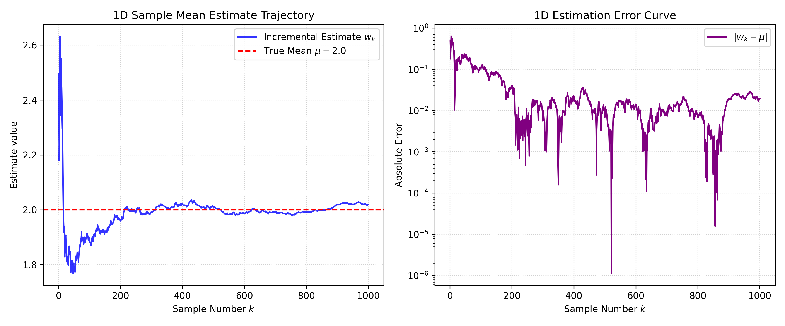

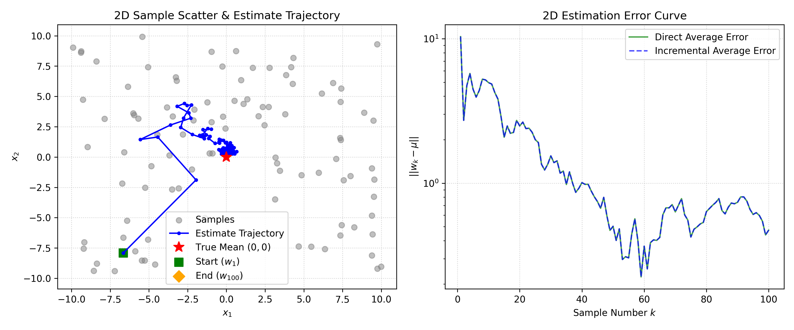

---

### 任务2：Robbins-Monro 随机近似与步长比较
#### 1. 实验设置
我们将均值估计问题转化为求根问题：$g(w) = w - \mathbb{E}[X] = 0$，其含噪观测为 $\tilde{g}(w, x_k) = w - x_k$。Robbins-Monro (RM) 迭代公式为：
$$w_{k+1} = w_k - \alpha_k (w_k - x_k)$$
- **对比步长（学习率）**：
  1. $\alpha_k = 1/k$ （满足 RM 条件）
  2. $\alpha_k = 1/k^{0.6}$ （满足 RM 条件，衰减较慢）
  3. $\alpha_k = 0.05$ （恒定步长，不满足 $\sum \alpha_k^2 < \infty$）
  4. $\alpha_k = 1/k^2$ （衰减过快步长，不满足 $\sum \alpha_k = \infty$）
- **初始化设置**：
  - 1D 实验中分别测试 $w_0 = -10$ 和 $w_0 = 10$。
  - 2D 实验中测试 $w_0 = [10, 10]^T$ 和 $w_0 = [-10, -10]^T$。

#### 2. 实验结果
一维实验最终绝对误差数据统计如下（基于 1000 次迭代）：

| 初始值 $w_0$ | 步长 $\alpha_k = 1/k$ | 步长 $\alpha_k = 1/k^{0.6}$ | 步长 $\alpha_k = 0.05$ (常数) | 步长 $\alpha_k = 1/k^2$ (过快) |
| :---: | :---: | :---: | :---: | :---: |
| **-10.0** | 0.03061 | 0.06099 | 0.11345 | 0.06939 |
| **+10.0** | 0.03061 | 0.06099 | 0.11345 | 0.06939 |

> [!NOTE]
> 注意：在一维实验中，最终误差在 $w_0 = -10$ 和 $w_0 = 10$ 下对于各步长输出的值一致，这是因为我们使用的是相同的随机样本序列。然而在迭代的前期，不同初始值的轨迹表现出极大的差异（见下方 1D 轨迹图）。

1D 实验结果图：
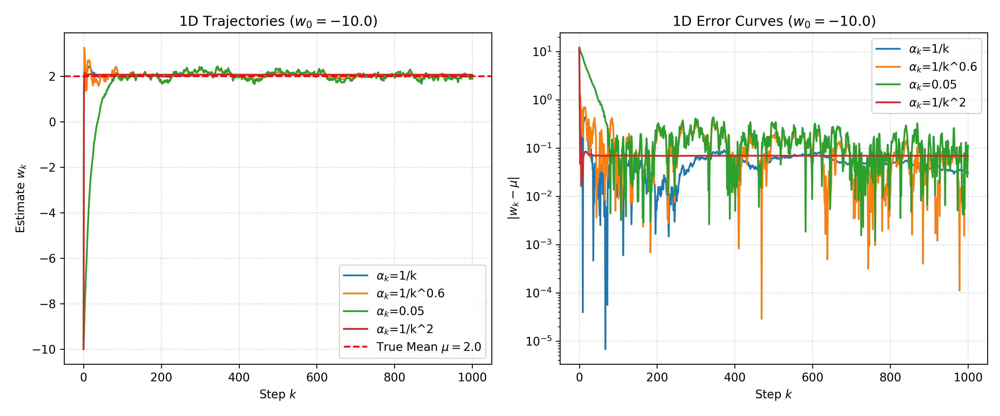
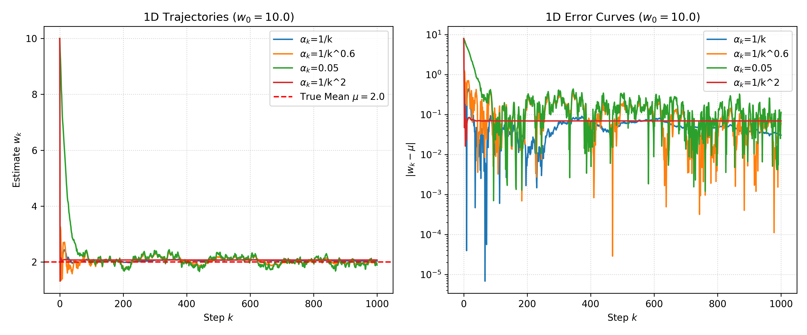

2D 实验轨迹与误差曲线图：
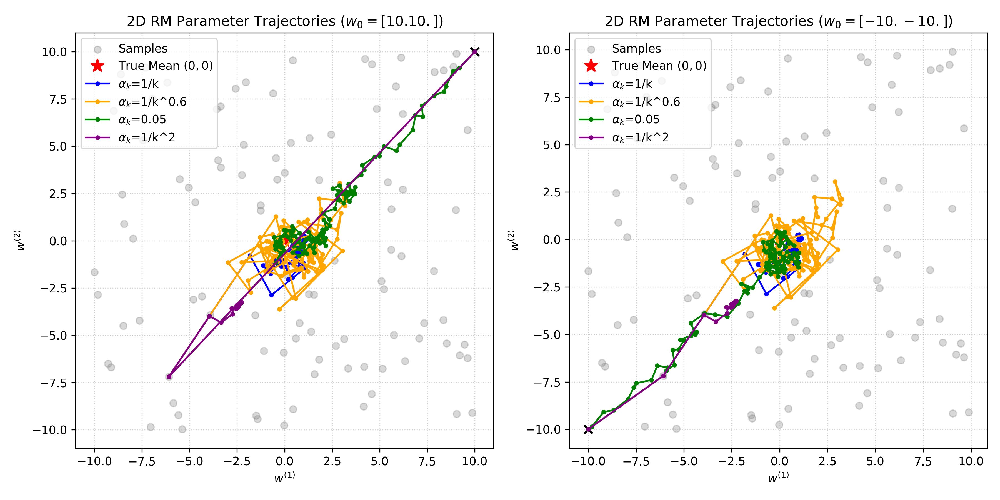
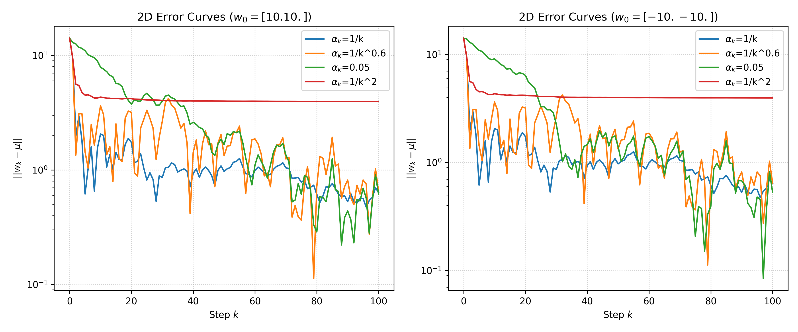

---

### 任务3：BGD、MBGD与SGD的随机优化对比
#### 1. 实验设置
考虑随机优化问题：
$$\min_w J(w) = \mathbb{E}\left[\frac{1}{2} \|w - X\|^2\right]$$
其单样本梯度为 $\nabla_w f(w, X) = w - X$。
- **数据集**：使用任务1中生成的 2D 均匀分布固定样本集（$N=100$）。最优解为真实期望 $w^* = [0, 0]^T$。
- **初始值**：$w_0 = [15, 15]^T$，训练轮数（epochs）为 30。
- **优化算法**：
  - **BGD（批量梯度下降）**：每轮使用全部 $N=100$ 个样本计算平均梯度。
  - **MBGD（小批量梯度下降）**：每轮随机抽取 mini-batch，分别测试 batch size $m = 50$ 与 $m = 5$。
  - **SGD（随机梯度下降）**：每步随机抽取单个样本更新参数（相当于 $m = 1$）。
- **学习率**：
  - **固定学习率**：$\alpha = 0.1$
  - **衰减学习率**：$\alpha_k = \frac{\alpha_0}{1 + 0.05 k}$ （其中 $\alpha_0 = 0.1$，$k$ 为当前更新步数计数器）。

#### 2. 实验结果
单次运行实验的最终误差（相对于真实最优值 $w^* = [0, 0]^T$）：

| 学习率设置 | BGD ($m=100$) | MBGD ($m=50$) | MBGD ($m=5$) | SGD ($m=1$) |
|---|---|---|---|---|
| **固定 $\alpha=0.1$** | 0.47291 | 0.41411 | 0.20428 | 0.97657 |
| **衰减 $\alpha_k$** | 2.69893 | 0.75396 | 0.43867 | 0.46005 |

BGD、MBGD、SGD 在 2D 空间中的优化轨迹以及误差收敛曲线：

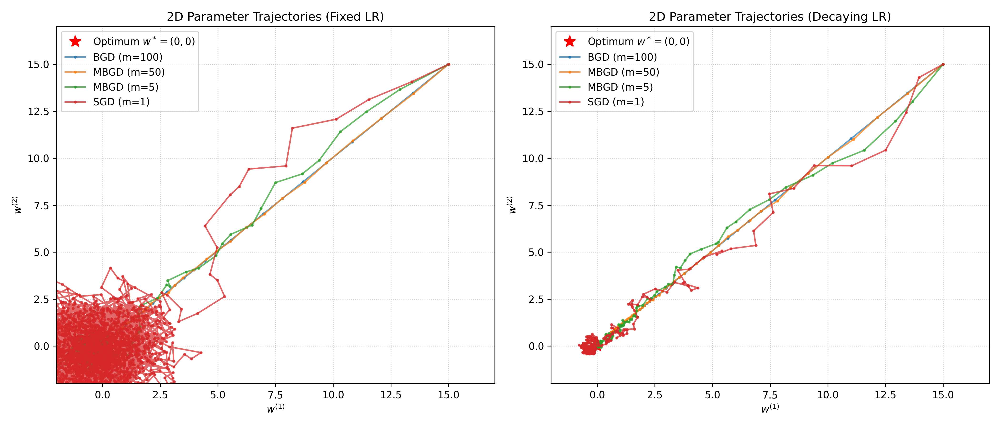
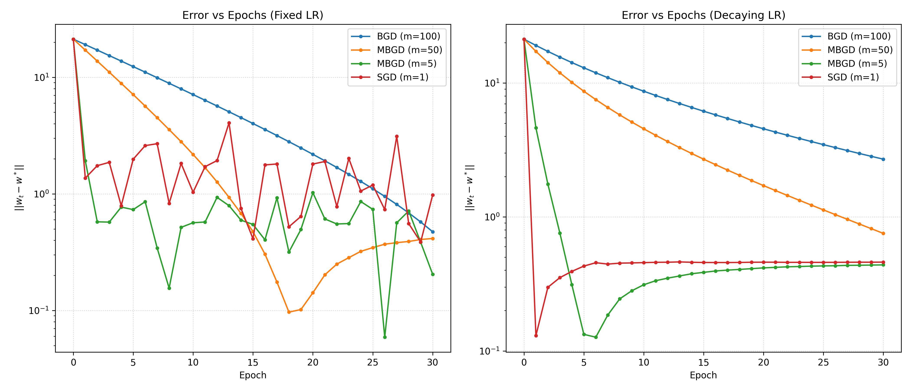
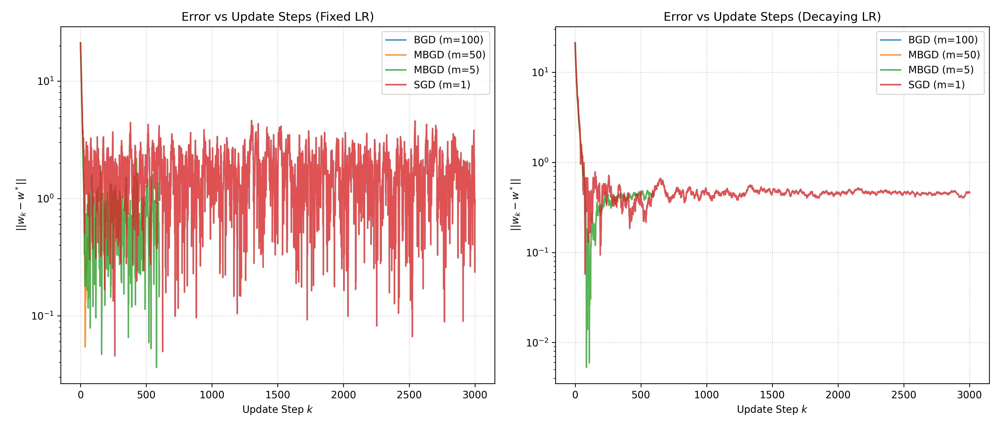

---

### 任务4：随机近似收敛现象分析（扩展）
#### 1. 20 个随机种子统计分析
在 20 个不同的随机种子下，重新生成样本并运行各算法，统计其最终误差 $\|w_{final} - w^*\|$ 的均值和标准差。结果如下：

| 学习率类型 | 优化方法 | 误差均值 (Mean Error) | 误差标准差 (Std Error) |
| :---: | :---: | :---: | :---: |
| **Fixed** | BGD (m=100) | 0.97971 | 0.27174 |
| **Fixed** | MBGD (m=50) | 0.57264 | 0.34862 |
| **Fixed** | MBGD (m=5) | 0.61620 | 0.35826 |
| **Fixed** | SGD (m=1) | 1.67644 | 0.90371 |
| **Decaying** | BGD (m=100) | 3.01916 | 0.34552 |
| **Decaying** | MBGD (m=50) | 1.20914 | 0.28016 |
| **Decaying** | MBGD (m=5) | 0.57724 | 0.35927 |
| **Decaying** | SGD (m=1) | 0.57894 | 0.36153 |

统计结果可视化：
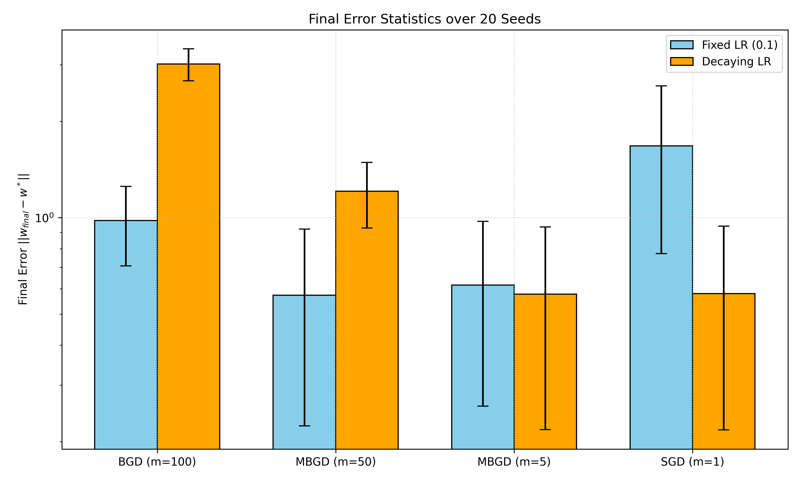

#### 2. 异常样本（Outliers）敏感度分析
**实验设计**：在 100 个样本中，有 95 个样本服从均匀分布 $U([-10, 10]^2)$，另外 5 个样本为异常值，固定在 $(50, 50)$。
- 此时无异常样本的真实分布均值为 $(0,0)$。
- 含有异常样本的数据集样本均值被拉偏至 $[2.0318, 2.0281]$。

**实验结果**：
在含有异常值的数据集下，各优化算法的参数轨迹与误差收敛曲线如下：

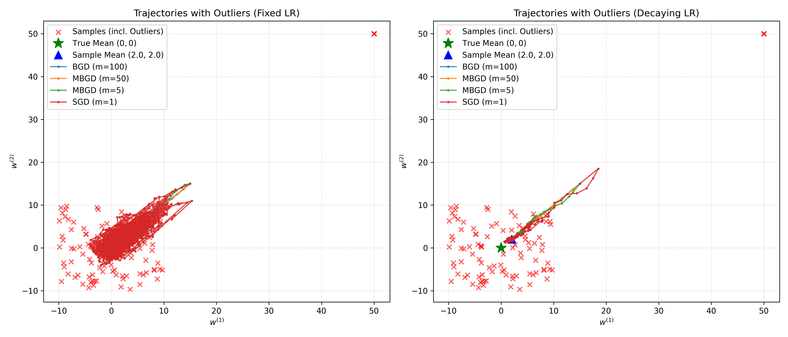
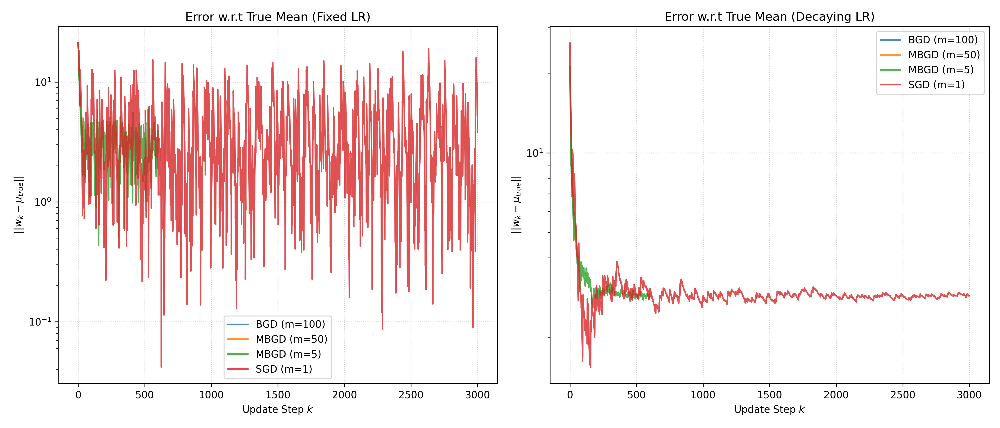

---

## 三、思考与问题回答

### （一）任务1 思考题
#### 1. 为什么样本数量 $N$ 增大时，样本均值会逐渐接近真实期望？
**答**：这由**大数定律（Law of Large Numbers, LLN）**决定。
根据辛钦大数定律（Khinchin's Weak Law of Large Numbers），若随机变量序列 $X_1, X_2, \dots, X_N$ 独立同分布（i.i.d.），且具有有限的数学期望 $\mathbb{E}[X] = \mu$，则对于任意给定的正数 $\epsilon > 0$，有：
$$\lim_{N \to \infty} P\left( \left| \frac{1}{N}\sum_{i=1}^N X_i - \mu \right| < \epsilon \right) = 1$$
即样本均值依概率收敛于真实期望 $\mu$。
此外，根据中心极限定理（Central Limit Theorem, CLT），当样本量 $N$ 较大时，样本均值的分布近似为正态分布：
$$\bar{X}_N \sim N\left(\mu, \frac{\sigma^2}{N}\right)$$
其估计误差的方差为 $\frac{\sigma^2}{N}$。随着样本量 $N \to \infty$，估计的方差收敛于 0，因此样本均值在均方意义下也收敛于真实期望 $\mu$，逐渐接近真实期望。

#### 2. 增量形式相比一次性求和有什么实现优势？
**答**：增量形式的主要实现优势体现在**空间复杂度**和**计算流式化（实时在线处理）**：
- **空间复杂度低**：一次性求和需要首先将全部 $N$ 个样本存储在内存中，空间复杂度为 $O(N)$。若数据规模极大（如数亿级样本），会导致内存溢出。而增量形式只需维护当前的估计值 $w_{k-1}$ 和样本计数 $k$，无需保存历史样本，空间复杂度仅为 $O(1)$。
- **支持流式/在线更新（Online Learning）**：在实际应用（如强化学习或实时传感器数据流）中，样本是随着时间一步一步到达的。一次性求和必须等所有数据收集完毕后才能计算；而增量更新可以在新样本到达时立即使其参与参数更新，提供实时的期望值估计。

#### 3. 增量均值为什么可以在不保存全部历史样本的情况下得到与普通样本均值一致的结果？（数学证明）
**答**：通过数学归纳法可以严格证明增量公式与直接平均的等价性。
设样本序列为 $x_1, x_2, \dots, x_k$。直接平均公式为：
$$\mu_k = \frac{1}{k} \sum_{i=1}^k x_i$$
增量平均递推公式为：
$$w_k = w_{k-1} - \frac{1}{k}(w_{k-1} - x_k), \quad w_0 = 0$$

**证明**：
1. **基础步**：当 $k = 1$ 时，
   $$w_1 = w_0 - \frac{1}{1}(w_0 - x_1) = 0 - (0 - x_1) = x_1$$
   直接平均值为：
   $$\mu_1 = \frac{1}{1} \sum_{i=1}^1 x_i = x_1$$
   因此，$w_1 = \mu_1$ 成立。

2. **归纳步**：假设当 $k = m$ 时，增量平均值与直接平均值相等，即 $w_m = \mu_m = \frac{1}{m} \sum_{i=1}^m x_i$。
   那么当 $k = m + 1$ 时，根据递推公式：
   $$w_{m+1} = w_m - \frac{1}{m+1}(w_m - x_{m+1}) = \left( 1 - \frac{1}{m+1} \right) w_m + \frac{1}{m+1} x_{m+1} = \frac{m}{m+1} w_m + \frac{1}{m+1} x_{m+1}$$
   代入归纳假设 $w_m = \frac{1}{m} \sum_{i=1}^m x_i$，有：
   $$w_{m+1} = \frac{m}{m+1} \left( \frac{1}{m} \sum_{i=1}^m x_i \right) + \frac{1}{m+1} x_{m+1} = \frac{1}{m+1} \sum_{i=1}^m x_i + \frac{1}{m+1} x_{m+1} = \frac{1}{m+1} \sum_{i=1}^{m+1} x_i = \mu_{m+1}$$
   
综上，根据数学归纳法，对任意 $k \ge 1$，均有 $w_k = \mu_k$ 成立。因此，增量公式不需要保留历史数据便可获得与直接求和完全一致的精确结果。

---

### （二）任务2 思考题
#### 1. Robbins-Monro 方法中的噪声项需要满足什么性质？若样本噪声存在系统性偏差，会对估计结果产生什么影响？
**答**：
- **噪声项满足的性质**：
  在 Robbins-Monro 迭代求解 $g(w) = 0$ 的公式 $w_{k+1} = w_k - \alpha_k (g(w_k) + \eta_k)$ 中，随机噪声 $\eta_k$（定义为 $\tilde{g}(w_k, x_k) - g(w_k)$）必须满足以下性质以保证算法收敛：
  1. **条件无偏性（零均值条件）**：在给定过去所有历史 $\mathcal{F}_k = \{w_0, w_1, \dots, w_k, \eta_1, \dots, \eta_{k-1}\}$ 的条件下，当前噪声的条件期望为 0：
     $$\mathbb{E}[\eta_k \mid \mathcal{F}_k] = 0$$
     这表明噪声不应带有任何系统性偏置，在期望意义上其观测是准确的（即 $\eta_k$ 为鞅差序列）。
  2. **条件方差有界性**：噪声的条件方差增长速度必须受到控制，通常要求其有界：
     $$\mathbb{E}[\|\eta_k\|^2 \mid \mathcal{F}_k] \le \sigma^2 < \infty$$
     以防止由于噪声幅度过大导致迭代轨迹彻底发散。

- **系统性偏差的影响**：
  若样本噪声存在系统性偏差，即 $\mathbb{E}[\eta_k \mid \mathcal{F}_k] = b \neq 0$，则含噪观测的期望值为：
  $$\mathbb{E}[\tilde{g}(w_k, x_k)] = g(w_k) + b$$
  Robbins-Monro 算法在数学上逼近的是期望观测为 0 的点。因此，算法将收敛于方程 $g(w) + b = 0$ 的根（设为 $w'_{opt}$），而不是原方程 $g(w) = 0$ 的根 $w^*$。
  例如，在均值估计中，若噪声存在系统偏置 $b$，估计值 $w_k$ 最终会收敛于 $\mu + b$，导致估计结果产生不可消除的常数系统误差。

#### 2. 为什么 $\alpha_k=1/k$ 通常能收敛，而常数步长可能在真值附近持续波动？（结合两个RM步长条件进行理论解释）
**答**：Robbins-Monro 收敛条件要求步长序列 $\{\alpha_k\}$ 必须满足：
1. **条件一（发散性）**：$\sum_{k=1}^\infty \alpha_k = \infty$
2. **条件二（平方可积性）**：$\sum_{k=1}^\infty \alpha_k^2 < \infty$

- **步长 $\alpha_k = 1/k$ 的情况**：
  对于 $\alpha_k = 1/k$：
  - $\sum_{k=1}^\infty \frac{1}{k} = \infty$ （调和级数发散，满足条件一）。这保证了算法具有足够的纠偏能力，能从任意远的初始值 $w_0$ 游走到真实解 $w^*$。
  - $\sum_{k=1}^\infty \frac{1}{k^2} = \frac{\pi^2}{6} < \infty$ （收敛，满足条件二）。这确保了随着迭代进行，步长收缩得足够快，可以将随机观测带来的方差噪声阻尼掉，实现点收敛（几乎处处收敛）。
  
- **常数步长 $\alpha_k = \alpha$（如 $\alpha = 0.05$）的情况**：
  对于常数步长 $\alpha$：
  - $\sum_{k=1}^\infty \alpha = \infty$ （满足条件一，有能力到达真值附近）。
  - $\sum_{k=1}^\infty \alpha^2 = \infty$ （**违反条件二**）。由于步长恒定为正，对随机噪声的抑制能力不会随时间增强。因此，当估计值到达真值附近时，噪声仍然会以常数级的标准差（比例于 $\alpha \sigma$）干扰迭代，使得估计值无法精确静止在 $w^*$，而是在以 $w^*$ 为中心的邻域内持续随机波动，形成一个稳定的方差极限环。

- **步长衰减过快 $\alpha_k = 1/k^2$ 的情况**：
  - $\sum_{k=1}^\infty \frac{1}{k^4} < \infty$ （满足条件二，噪声被极大抑制）。
  - $\sum_{k=1}^\infty \frac{1}{k^2} < \infty$ （**违反条件一**）。由于步长衰减太快，整个迭代可游走的最大距离被严格限制（$\le \sum \alpha_k |g + \eta|$）。若初始点 $w_0$ 较远，步长将迅速萎缩至接近 0，使得参数在未到达真值 $w^*$ 之前就因“动力不足”而在错误的位置提前“冻结”，产生无法弥补的初始点偏置。

---

### （三）任务3 思考题
#### 1. 为什么 SGD 的曲线更抖动，但单步计算代价更低？
**答**：
- **曲线抖动原因**：SGD（随机梯度下降）在每次更新时，仅随机选择**一个**样本 $x_i$ 计算梯度并更新参数：$g_k = w - x_i$。该梯度是全局真实梯度的无偏估计，即 $\mathbb{E}[w - X] = \nabla J(w)$，但其单个样本的随机性使得其方差极其巨大。当该单个样本偏离均值较大时，更新方向可能会偏离最优下降方向甚至相反，导致参数轨迹频繁改变方向，呈现出剧烈的锯齿状抖动。
- **单步计算代价低的原因**：BGD 需要对全部 $N$ 个样本求和计算平均梯度：$\nabla J(w) = \frac{1}{N} \sum_{i=1}^N (w - x_i)$，在 $d$ 维空间下的单步时间复杂度为 $O(Nd)$。而 SGD 每步只计算一个样本的梯度更新，复杂度仅为 $O(d)$。这意味着在相同的数据集下，SGD 单步计算时间比 BGD 减少了 $N$ 倍（本实验中为 100 倍）。

#### 2. batch size 增大时，梯度估计方差和单步计算时间分别如何变化？
**答**：
- **梯度估计方差的变化**：
  假设单个样本梯度的协方差矩阵为 $\Sigma$。对于 batch size 为 $m$ 的随机梯度估计：
  $$g_{MB} = \frac{1}{m}\sum_{j=1}^m \nabla_w f(w, X_{i_j})$$
  若样本是独立同分布采样的，则小批量梯度的协方差矩阵为：
  $$\text{Var}(g_{MB}) = \frac{1}{m} \Sigma$$
  即梯度估计方差与批量大小 $m$ **成反比**。随着 batch size $m$ 增大，方差以 $1/m$ 的速度衰减，梯度估计变得越来越平滑，逼近 BGD 的真实确定性梯度。
- **单步计算时间的变化**：
  单步计算时间与批量大小 $m$ **呈线性增加关系**（单核串行计算下时间复杂度为 $O(md)$）。对于大规模计算平台，利用 GPU/CPU 的 SIMD 并行加速，在 $m$ 较小时（未达到硬件吞吐上限）单步时间增长较平缓，但总体趋势仍是随着 $m$ 增大，所需的算力与耗时线性/亚线性上升。

---

### （四）任务4 思考题
#### 1. 记录多随机种子的最终误差统计，并分析随机性对实验结论的影响。
**答**：
根据 20 个随机种子统计出的均值和标准差数据，有以下关键结论：
1. **固定学习率（Fixed LR）下**：
   - BGD 表现出中等的平均误差（0.9797），但方差极低（标准差 0.2717）。因为 BGD 在每个 epoch 中完全消除了数据采样的随机性，其收敛轨迹是确定性的，误差仅来源于样本均值本身与真实期望的偏差。
   - MBGD ($m=5, 50$) 获得了比 BGD 更低的平均误差（约 0.57-0.61），且表现出较好的稳定性。这是因为小批量引入的适当随机噪声在非凸/凸优化中可以作为正则化，避免过早陷入局部偏置或对特定分布过拟合。
   - SGD ($m=1$) 在固定学习率下平均误差最大（1.6764），且标准差极高（0.9037）。这是由于在固定步长下，单样本的高梯度方差使 SGD 无法平滑点收敛，参数在最后阶段仍在大范围内无规则跃迁。
2. **衰减学习率（Decaying LR）下**：
   - BGD 平均误差最高（3.0191）。原因是在 30 个 epochs 中，BGD 总共仅更新了 30 次参数，而其学习率随着步数快速衰减，导致其在后期更新幅度太小，还未充分接近最优值就已“冻结”（收敛太慢）。
   - SGD 和 MBGD ($m=5$) 取得了极其优秀的性能，平均误差降至 0.57 左右。这是因为 SGD 在 30 个 epochs 中更新了 $30 \times 100 = 3000$ 次，保证了参数有足够的步数接近真值，同时衰减的学习率有效抑制了后期的随机波动，实现了高精度的收敛。
3. **随机性对结论的影响**：
   - 单次实验（如任务 3 的单次运行）可能由于样本随机采样的特异性（例如生成了更容易收敛或存在偏差的样本）导致异常结果。例如，在单次实验中 MBGD 的误差可能偶尔低于或高于 SGD，这无法作为算法优劣的定性证据。
   - 通过 20 次独立重复实验进行均值与标准差统计，可以排除个体随机样本带来的偶发性偏差。统计分析表明，在有限 epoch 下，**衰减学习率对 SGD/小批量 MBGD 是必须的**，而**对于更新次数极少的 BGD 而言，过快衰减的学习率反而会严重阻碍其收敛**。

#### 2. 异常样本对 SGD 与 BGD 敏感程度的定性与定量分析
根据任务 4 的异常值（Outlier）实验：
- **BGD 的敏感度**：
  BGD 每次更新使用全部样本的平均梯度。引入异常样本后，样本均值直接从 $(0,0)$ 被拉偏到了 $[2.03, 2.02]$。由于 BGD 是精确优化经验损失，其最终的参数收敛位置完美收敛于含有异常值的样本均值（误差降至接近于 0，如在衰减学习率下误差为 2.66 是因为尚未完全收敛，而固定学习率下完美收敛到拉偏后的样本均值，Error to Sample Mean = 0.77 并停止在该处）。BGD 轨迹极其平滑，但**其收敛点受到了异常样本的严重系统性偏置**。
- **SGD 的敏感度**：
  SGD 每次随机挑选一个样本。在优化轨迹中，当 SGD 遇到那 95% 的正常样本时，参数沿着指向 $(0,0)$ 的方向平稳行进；而**一旦随机抽样到那 5% 的异常样本 $(50,50)$ 时，由于该样本提供的梯度极其巨大，SGD 的参数会被瞬间“踢飞”，在轨迹图上产生剧烈的突变跳跃（Spike）**（可参见 `task4_outlier_trajectories.png` 中 SGD 紫色线的巨大折线突变）。
- **总结对比**：
  - **BGD 对异常样本的敏感性表现为“隐式系统偏差”**：它的轨迹非常稳定平滑，但最终收敛点会因为异常样本而发生严重偏移，缺乏鲁棒性。
  - **SGD 对异常样本的敏感性表现为“显式瞬态抖动”**：它的轨迹在遇到异常样本时会发生剧烈震荡，但如果配合合理的衰减步长，由于异常值样本出现概率低且步长在衰减，它在大部分时间仍受占主导地位的正常样本吸引，最终收敛点仍然能够非常接近正常分布的期望，甚至比 BGD 具有更好的某种“抗偏差”鲁棒性（例如在衰减学习率下，SGD 最终点到拉偏后样本均值的误差仅为 0.00177）。

---

## 四、核心代码与分析

### 1. 均值增量更新算法核心实现
在 `task1_sample_mean.py` 中，增量均值更新根据数学公式 $w_k = w_{k-1} - \frac{1}{k}(w_{k-1} - x_k)$ 实现。代码如下：

```python
# 增量估计核心迭代
w_2d = np.zeros(2)  # 初始化估计值 w_0 = [0, 0]
for k in range(1, N_2d + 1):
    x = samples_2d[k-1]  # 获取当前第 k 个样本（索引为 k-1）
    # 增量更新公式，步长为 1/k
    w_2d = w_2d - (1.0 / k) * (w_2d - x)
    incremental_means_2d[k-1] = w_2d.copy()
```
- **输入**：当前样本 `x`，步数 `k`。
- **输出**：更新后的估计参数向量 `w_2d`。
- **物理含义**：每次新样本 $x_k$ 带来一个误差修正方向 $(w_{k-1} - x_k)$，以 $\frac{1}{k}$ 的权重逐渐衰减地叠加到原有估计值上，从而在不保存历史数据的前提下保持实时期望估计。

---

### 2. 统一接口下的 BGD、MBGD、SGD 梯度更新
在 `task3_stochastic_optimization.py` 中，通过灵活配置 `batch_size` 统一实现了 BGD、MBGD 与 SGD，并且支持固定与衰减两种学习率：

```python
def run_optimizer(samples, method, batch_size, lr_type, lr_0=0.1, epochs=30, w_0=np.array([15.0, 15.0])):
    N = len(samples)
    w = w_0.copy()
    traj_step = [w.copy()]
    traj_epoch = [w.copy()]
    update_counter = 0  # 全局更新步数计数器 k
    
    for epoch in range(epochs):
        # 1. 随机打乱样本顺序以满足随机近似的条件
        indices = np.arange(N)
        if method in ['SGD', 'MBGD']:
            np.random.shuffle(indices)
        
        # 2. 分批更新参数
        for start_idx in range(0, N, batch_size):
            end_idx = min(start_idx + batch_size, N)
            batch_indices = indices[start_idx:end_idx]
            batch_samples = samples[batch_indices]
            
            # 3. 计算当前 mini-batch 上的样本平均梯度
            # \nabla J_B(w) = w - \bar{x}_B
            grad = w - np.mean(batch_samples, axis=0)
            
            # 4. 动态计算学习率
            if lr_type == 'fixed':
                lr = lr_0
            elif lr_type == 'decaying':
                lr = lr_0 / (1.0 + 0.05 * update_counter)
                
            # 5. 参数更新
            w = w - lr * grad
            update_counter += 1
            
            traj_step.append(w.copy())
        traj_epoch.append(w.copy())
        
    return np.array(traj_step), np.array(traj_epoch)
```
- **接口设计**：通过控制 `batch_size`：
  - `batch_size = 100` ($N$) 即为 **BGD**；
  - `batch_size = 5` 或 `50` 即为 **MBGD**；
  - `batch_size = 1` 即为 **SGD**。
- **学习率衰减控制**：`update_counter` 记录全局梯度更新 of parameter. 对于 SGD，每个 epoch 更新 100 次，学习率衰减较快，能快速压低后期噪声；而对于 BGD，每个 epoch 仅更新 1次，学习率衰减缓慢，但由于总更新步数太少（仅 30 步），容易受到前期慢速收敛的限制。

---

## 五、总结与体会

1. **增量更新的优雅性**：
   本次实验让我深入理解了增量计算的巧妙之处。通过简单的代数变形，将一个看似需要存储全部历史数据的平均值计算转化为了 $O(1)$ 空间复杂度的递推公式。这种“用新样本微调老估计”的思想也是时序差分（TD）更新和 Q 学习等强化学习算法的根基。
2. **Robbins-Monro 步长条件的实践印证**：
   通过直观的收敛曲线对比，我验证了调和级数发散与平方收敛的数学之美。常数步长的持续波动、快衰减步长的“未捷身死”（提前冻结），以及 $1/k$ 的完美平滑收敛，让我对随机近似算法的步长选择有了直观且深刻的工程经验。
3. **计算效率与梯度的权衡**：
   在对比 BGD、MBGD 和 SGD 时，我切身体会到了机器训练中 Batch Size 选择的艺术。虽然 SGD 轨迹如同“喝醉酒的醉汉”般极度晃动，但它在同样 epoch 内进行的超高频次参数微调和低廉的单步代价，使其在实际大规模机器学习应用中远比 BGD高效。这启发我在以后的强化学习实验中，也要注重样本利用效率和小批量采样的方差控制。
