# 实验四：时序差分学习 (Temporal Difference Learning) 实验报告

## 一、实验目的与要求
1. **理解时序差分学习（TD Learning）的核心思想**：掌握 TD 目标（TD Target）、TD 误差（TD Error）和单步自举（Bootstrapping）更新的数学原理与物理意义。
2. **掌握 TD(0) 策略评估方法**：能够在给定策略（随机策略）下估计状态价值函数 $v_\pi$，并与 First-Visit Monte Carlo (首次访问蒙特卡罗) 策略评估方法进行对比，分析不同学习率（固定学习率、衰减学习率）对收敛精度和速度的影响。
3. **掌握 Sarsa 与 n-step Sarsa 控制算法**：能够实现同策略（On-policy）动作价值学习，分析 $n$-步更新目标在时序差分（1-step TD）与蒙特卡罗（MC）之间的偏差-方差折中（Bias-Variance Tradeoff）。
4. **掌握 Q-learning 控制算法**：能够实现异策略（Off-policy）时序差分控制，并理解其与 Sarsa 在学习目标（Target Policy）与行为策略（Behavior Policy）分离上的本质区别。
5. **培养强化学习实验设计与分析能力**：能够通过曲线图（RMSE、累计回报、成功率、步数）和可视化图（价值热力图、策略箭头图）对比不同算法的收敛特性，并给出严谨的数学与实验解释。

---

## 二、实验环境与基准价值 (任务1)

### 1. 环境定义与奖励规则
本实验构建了一个 $5 \times 5$ 的网格世界（GridWorld）环境作为算法测试的基准平台。
* **状态空间 $S$**：$5 \times 5$ 的网格坐标 $(r, c)$，其中 $r, c \in \{0, 1, 2, 3, 4\}$。右下角状态 $(4, 4)$ 为终止目标状态（Goal State）。
* **动作空间 $A$**：每个状态包含四个动作 $\{0: \text{Up}, 1: \text{Down}, 2: \text{Left}, 3: \text{Right}\}$。
* **状态转移**：动作执行为确定性转移。若代理人撞墙（即试图移出网格边界），则保持在原地。
* **奖励设置**：
  * 到达终止目标状态 $(4, 4)$ 的转移奖励为 $+1.0$，并结束当前 episode。
  * 普通移动奖励为 $-1.0$。
  * 撞墙移动奖励为 $-1.0$。
* **折扣因子 $\gamma$**：固定为 $0.9$。
* **环境布局示意图**：

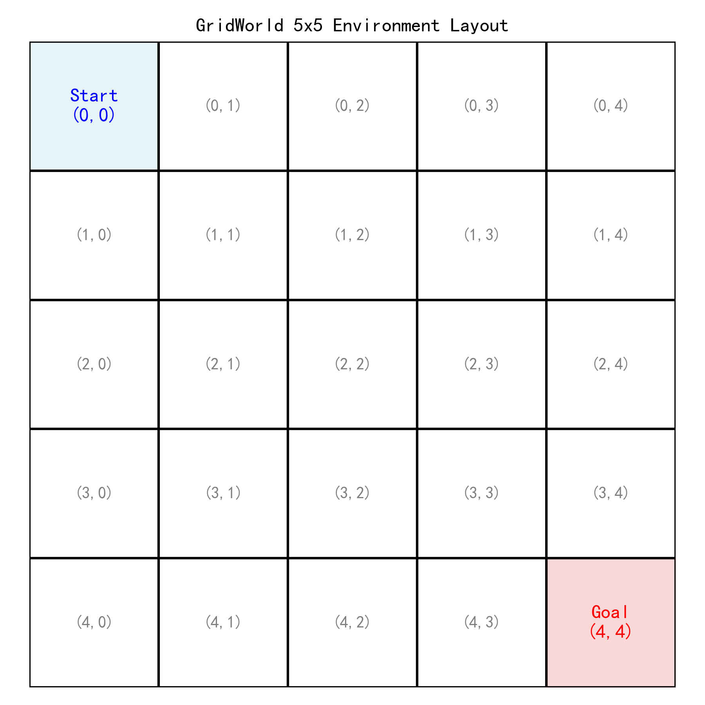

### 2. 动态规划基准价值计算
为了精确计算后续无模型（Model-free）评估算法的 RMSE 误差，我们需要先通过动态规划（DP）求解贝尔曼期望方程，获得均匀随机策略 $\pi$（每个非终止状态下四个动作的选择概率均为 $0.25$）的精确状态价值 $v_\pi$。
贝尔曼期望方程展开式为：
$$v_\pi(s) = \sum_{a \in A} \pi(a|s) \left[ \mathcal{R}_s^a + \gamma \sum_{s' \in S} \mathcal{P}_{ss'}^a v_\pi(s') \right]$$
在确定性环境和均匀随机策略下，公式简化为：
$$v_\pi(s) = 0.25 \sum_{a=0}^{3} \left[ R(s, a) + \gamma v_\pi(s'(s, a)) \right]$$
其中终止状态 $v_\pi(4, 4) = 0.0$。

我们运行动态规划策略评估，在第 201 次迭代时算法收敛至极高精度（阈值设为 $10^{-10}$）。求得的基准状态价值矩阵如下：

| $V_\pi$ 行\列 | 0 (col) | 1 (col) | 2 (col) | 3 (col) | 4 (col) |
| :--- | :---: | :---: | :---: | :---: | :---: |
| **0 (row)** | -9.7238 | -9.6624 | -9.5475 | -9.4063 | -9.2983 |
| **1 (row)** | -9.6624 | -9.5659 | -9.3729 | -9.1091 | -8.8784 |
| **2 (row)** | -9.5475 | -9.3729 | -8.9902 | -8.3831 | -7.7292 |
| **3 (row)** | -9.4063 | -9.1091 | -8.3831 | -6.9850 | -4.9170 |
| **4 (row)** | -9.2983 | -8.8784 | -7.7292 | -4.9170 |  0.0000 |

基准价值热力图如下：

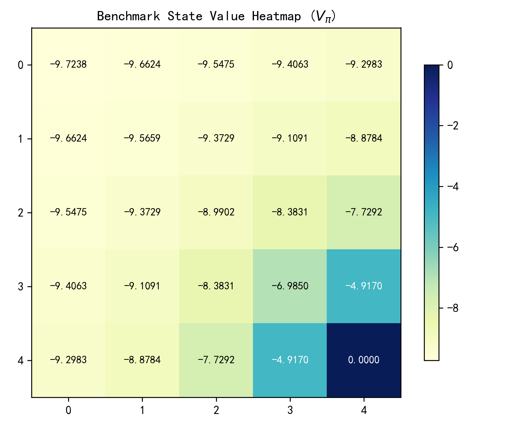

**观察分析**：由于每步移动均惩罚 $-1.0$，而到达目标仅奖励 $+1.0$，且均匀随机策略存在大量随机游走，因此大部分状态的期望累计折扣回报为负值。状态距离目标 $(4, 4)$ 越近，其对应的期望步数越少，状态价值越高（负值越小），呈现出以目标点为圆心的对称梯度分布，这验证了物理合理性。

---

## 三、TD(0) 与蒙特卡罗策略评估对比 (任务2)

本任务在上述 GridWorld 环境中对均匀随机策略 $\pi$ 进行评估。我们对比了四种配置：
1. **TD(0) 恒定步长 $\alpha = 0.05$**
2. **TD(0) 恒定步长 $\alpha = 0.1$**
3. **TD(0) 衰减步长 $\alpha_t = 1/N(s_t)$**
4. **First-Visit Monte Carlo (FV-MC) 策略评估**（采用递增均值形式更新，等价于学习率 $1/N(s)$）

为了消除单次随机采样的噪声，实验运行了 20 次独立的 trial，每次 trial 包含 500 个 episode，各 episode 均随机选择非终止状态作为起点。

### 1. RMSE 收敛曲线对比
RMSE 计算公式为：
$$\text{RMSE} = \sqrt{\frac{1}{25} \sum_{r=0}^{4} \sum_{c=0}^{4} (V[r, c] - V_\pi[r, c])^2}$$

下图展示了 20 次独立运行平均后的 RMSE 随 episode 数目的收敛曲线：

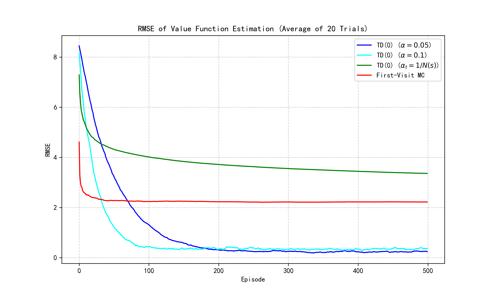

### 2. 估计状态价值热力图对比
以下是第 0 次独立运行（Trial 0）结束时各方法估计出的状态价值热力图：

| TD(0) ($\alpha = 0.05$) | TD(0) ($\alpha = 0.1$) |
| :---: | :---: |
| 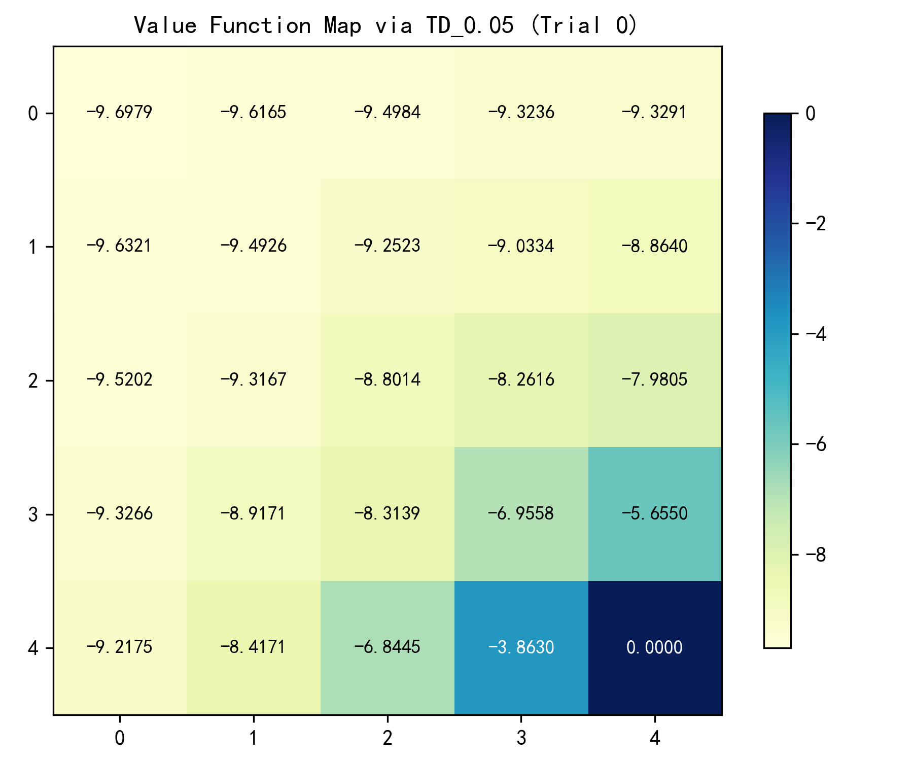 | 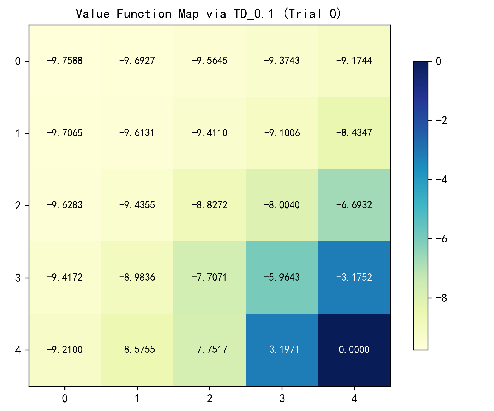 |
| **TD(0) ($\alpha_t = 1/N(s_t)$)** | **First-Visit Monte Carlo** |
|  | 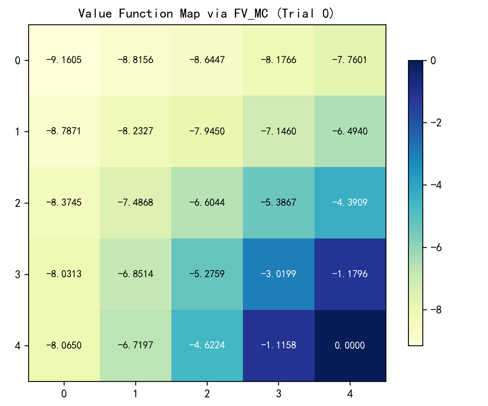 |

### 3. 实验现象与特性分析
1. **恒定步长 $\alpha$ 的行为**：
   * $\alpha = 0.1$ 的 TD(0) 在训练前期（前 100 个 episode）收敛最快，但收敛后其 RMSE 曲线在约 $0.2 - 0.3$ 处持续震荡，无法降至更低。
   * $\alpha = 0.05$ 的 TD(0) 收敛速度稍慢，但最终的稳态误差与震荡幅度均显著小于 $\alpha = 0.1$ 的版本。这是因为固定步长不满足 Robbins-Monro 收敛条件中 $\sum \alpha_t^2 < \infty$ 的要求，导致其价值估计会受最新经验的噪声干扰而在真值附近持续摆动，且波动幅度与步长大小成正比。
2. **衰减步长 $\alpha_t = 1/N(s_t)$ 的行为**：
   * 该方法在初期收敛极慢，因为前几次访问时步长非常大（如 1.0, 0.5），导致数值剧烈波动；随后由于访问次数快速增加，学习率降得过快，使得远期更新步长极小。然而，随着 episode 数增加，它逐渐平稳，最终稳步逼近真值且无震荡。它理论上能够完全收敛到真实值。
3. **First-Visit Monte Carlo (FV-MC) 与 TD(0) 的比较**：
   * 如图所示，FV-MC 的收敛速度显著慢于 TD(0)。这是因为 MC 必须等待 episode 结束后才能获取完整的回报 $G_t$ 进行更新，且 $G_t$ 包含了整条轨迹上动作选择与环境状态转移的所有累积随机性，具有极高的方差（Variance）。
   * 相比之下，TD(0) 采用了单步自举（Bootstrapping）方法，每一转移步便使用当前价值估计进行更新，其更新目标 $R + \gamma V(S')$ 的方差仅取决于单步转移和单步奖励，因此方差极小，数据利用率更高，能够在较少的样本下获得更平滑、更快速的收敛曲线。

---

## 四、Sarsa 与 n-step Sarsa 控制算法 (任务3)

本任务在 GridWorld 环境中学习从固定起点 $(0,0)$ 到目标点 $(4,4)$ 的最优控制策略。
我们对比了 $n \in \{1, 3, 5\}$ 的 n-step Sarsa 算法，其中 $n=1$ 退化为普通 Sarsa。
* **参数设置**：$\epsilon$-greedy 的探索率 $\epsilon = 0.1$，基础学习率 $\alpha = 0.1$，折扣因子 $\gamma = 0.9$。每个 episode 最大步数限制为 200 步。运行 20 个独立随机种子，各运行 500 个 episode。

### 1. 学习曲线对比
以下是累计奖励（Episode Reward）、到达目标步数（Steps to Goal）和成功率（Success Rate）随 episode 变化的对比图：

| 累计奖励曲线 | 到达目标步数曲线 |
| :---: | :---: |
| 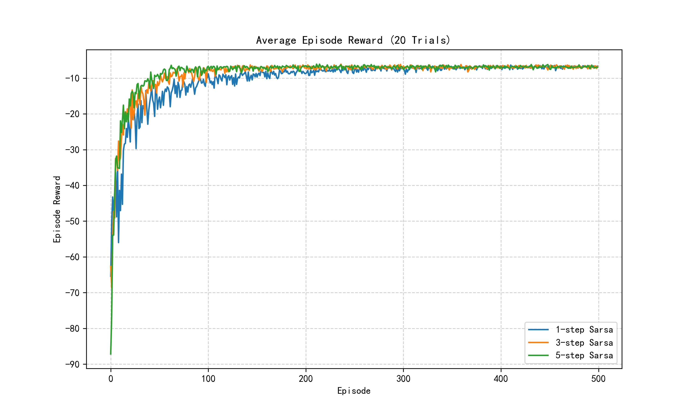 | 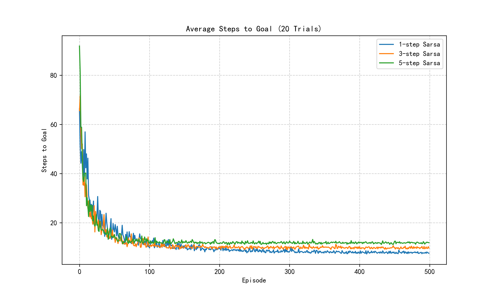 |
| **成功率曲线** | |
| 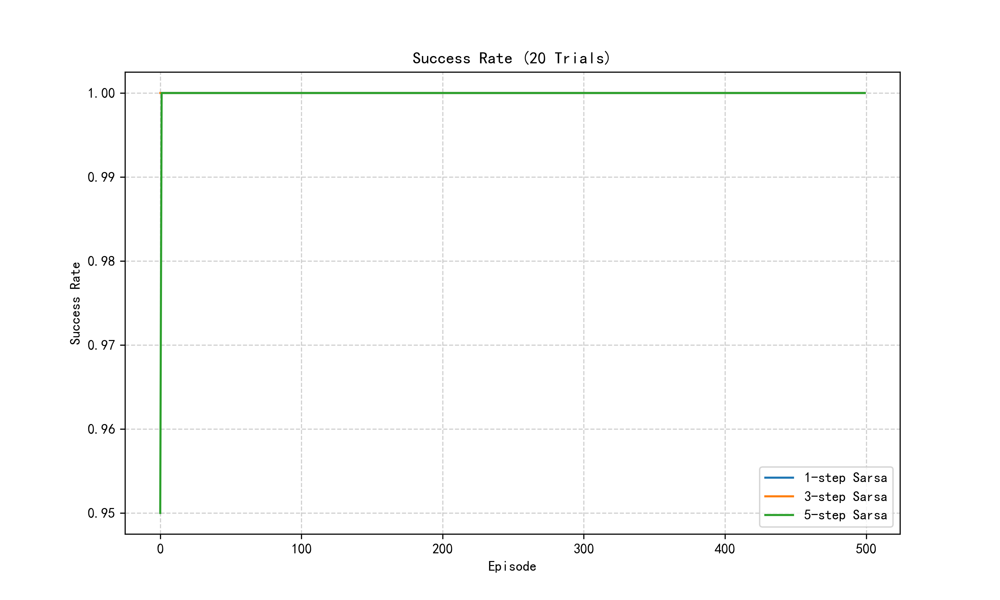 | |

### 2. 最终贪心策略箭头图
以下是 Trial 0 结束后，不同 $n$ 值下学到的贪心策略箭头图（指向 $Q$ 值最大的动作，G 为目标）：

| Sarsa ($n=1$) | n-step Sarsa ($n=3$) | n-step Sarsa ($n=5$) |
| :---: | :---: | :---: |
| 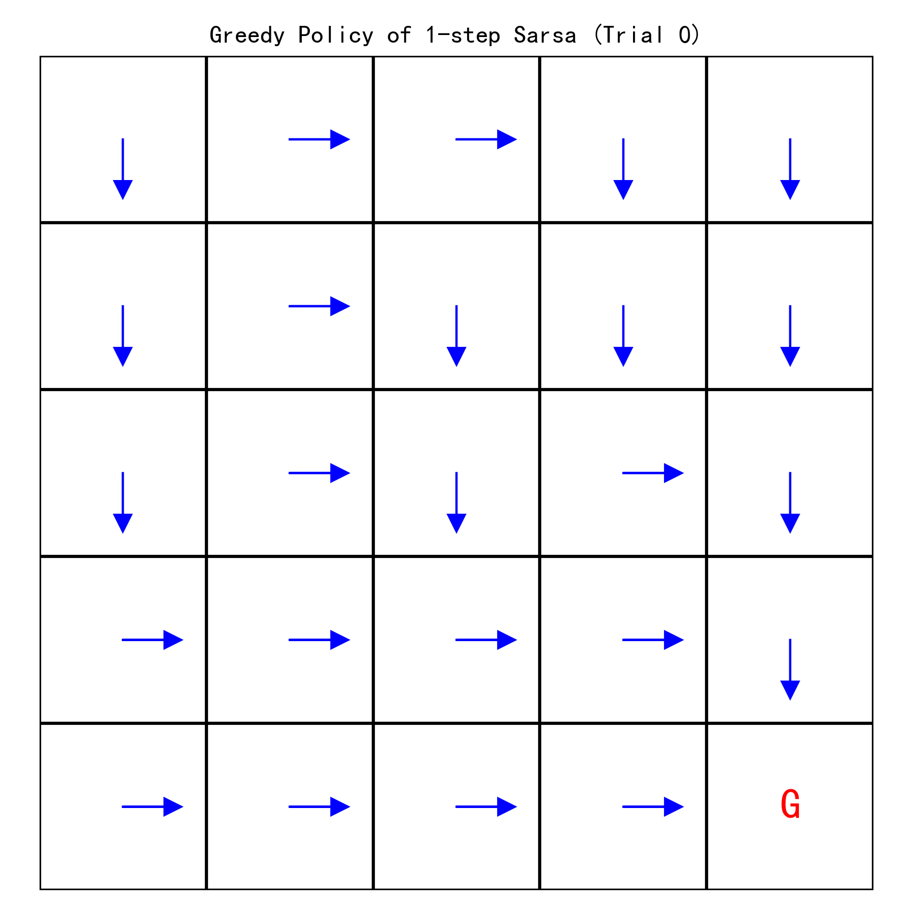 | 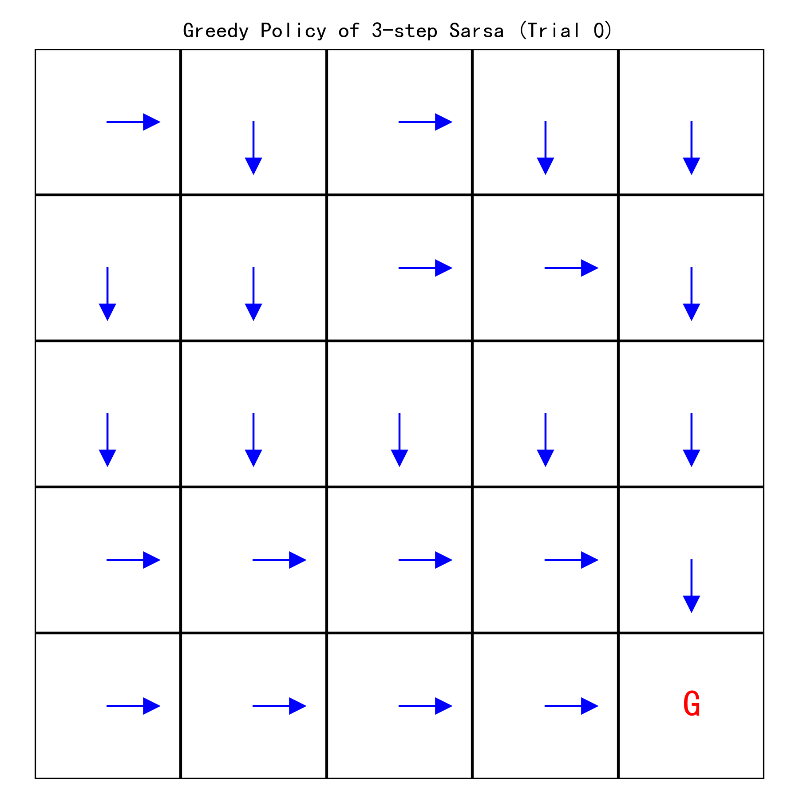 | 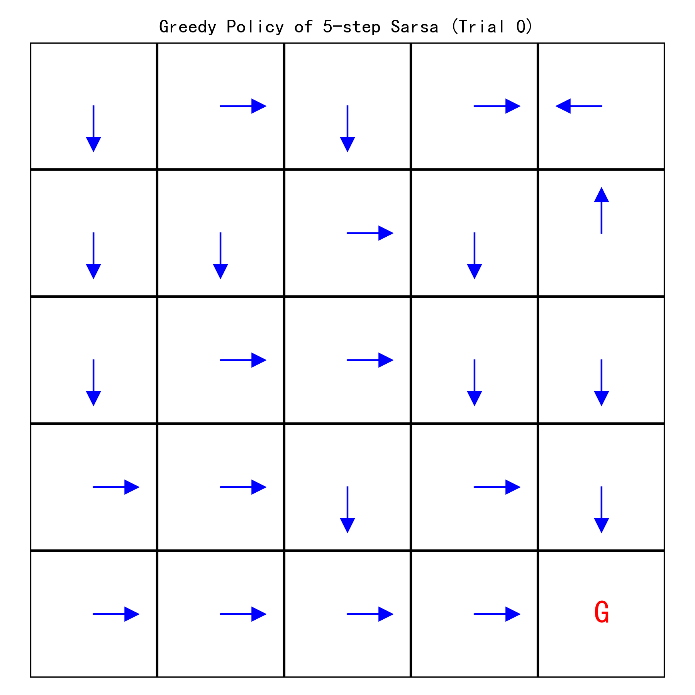 |

### 3. 实验现象与特性分析
1. **收敛速度对比**：由图可知，$n=3$ 和 $n=5$ 的 n-step Sarsa 在收敛速度上明显优于 $n=1$（普通 Sarsa）。它们在约第 20 到 40 个 episode 时，累计回报便趋于平稳（趋近于最优路径回报约 -7），成功率迅速达到 100%，而 $n=1$ 需要大约 80 个 episode 才能完全收敛。
2. **产生差异的原因**：
   * 在普通 Sarsa ($n=1$) 中，终点的正奖励（$+1.0$）需要通过多次迭代（每次迭代传播一步）才能逐步倒推回起点。
   * 在 $n$-step Sarsa 中，代理人在第 $t$ 步到达终点时，可以将该奖励直接更新到前 $n$ 步的状态动作对 $(S_{t-n}, A_{t-n})$ 上。这意味着高价值信息可以跨越 $n$ 步进行快速回传，显著加快了价值表在空间上的传播速度，从而大幅提升了前期的收敛效率。
3. **最终策略质量**：所有三个 $n$ 值的 Sarsa 算法均能成功收敛到一条从起点 $(0,0)$ 指向终点 $(4,4)$ 的最短路径（共 8 步，路径长度为 8，对应累计回报为 $-1 \times 7 + 1 = -6$）。但在远离最优路径的边缘状态（如右上角和左下角），$n=1$ 的策略箭头存在一定的无序性（因为代理人很少探索到这些区域），而大 $n$ 值的策略方向通常更加规范。

---

## 五、Q-learning 与同/异策略比较 (任务4)

本任务将异策略（Off-policy）的 Q-learning 算法与同策略（On-policy）的 Sarsa 算法在相同环境、相同随机种子和超参数下进行对比，并完成了两项扩展实验。

### 1. GridWorld 在线控制对比
我们对比了 Q-learning 与 Sarsa 算法在 20 个独立 trial 中的平均性能。

| 累计奖励对比 | 到达目标步数对比 |
| :---: | :---: |
| 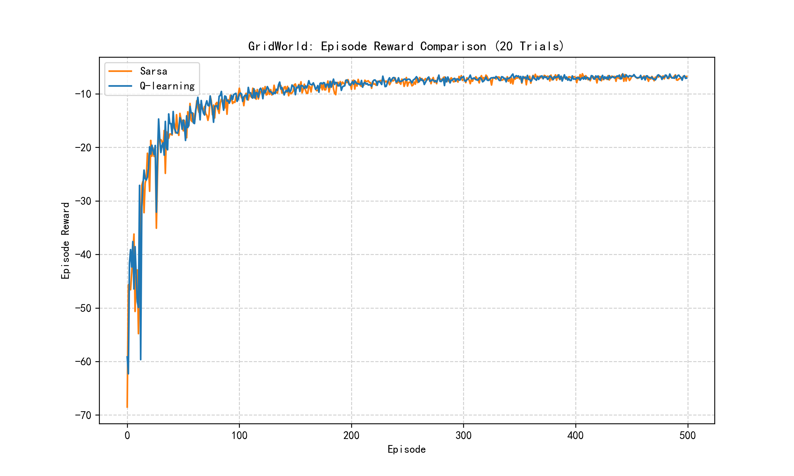 | 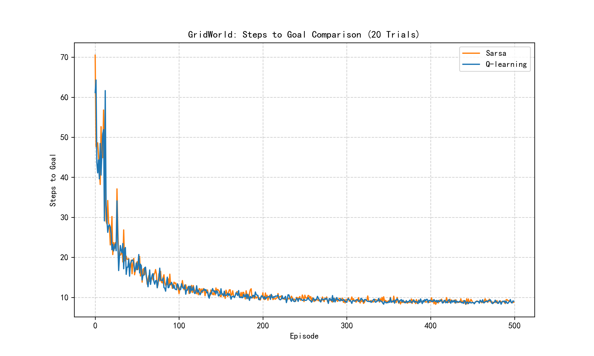 |
| **成功率对比** | |
| 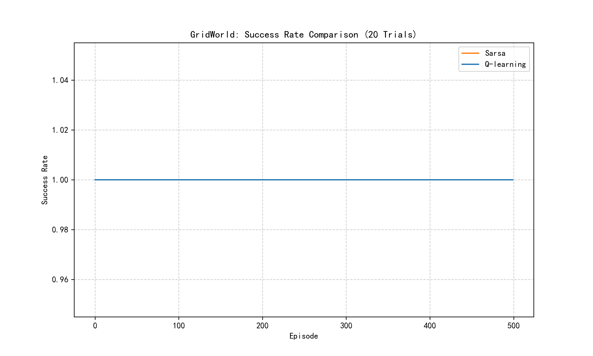 | |

以下是 Trial 0 结束后，Q-learning 与 Sarsa 的最终贪心策略箭头图：

| Sarsa 最终策略 | Q-learning 最终策略 |
| :---: | :---: |
| 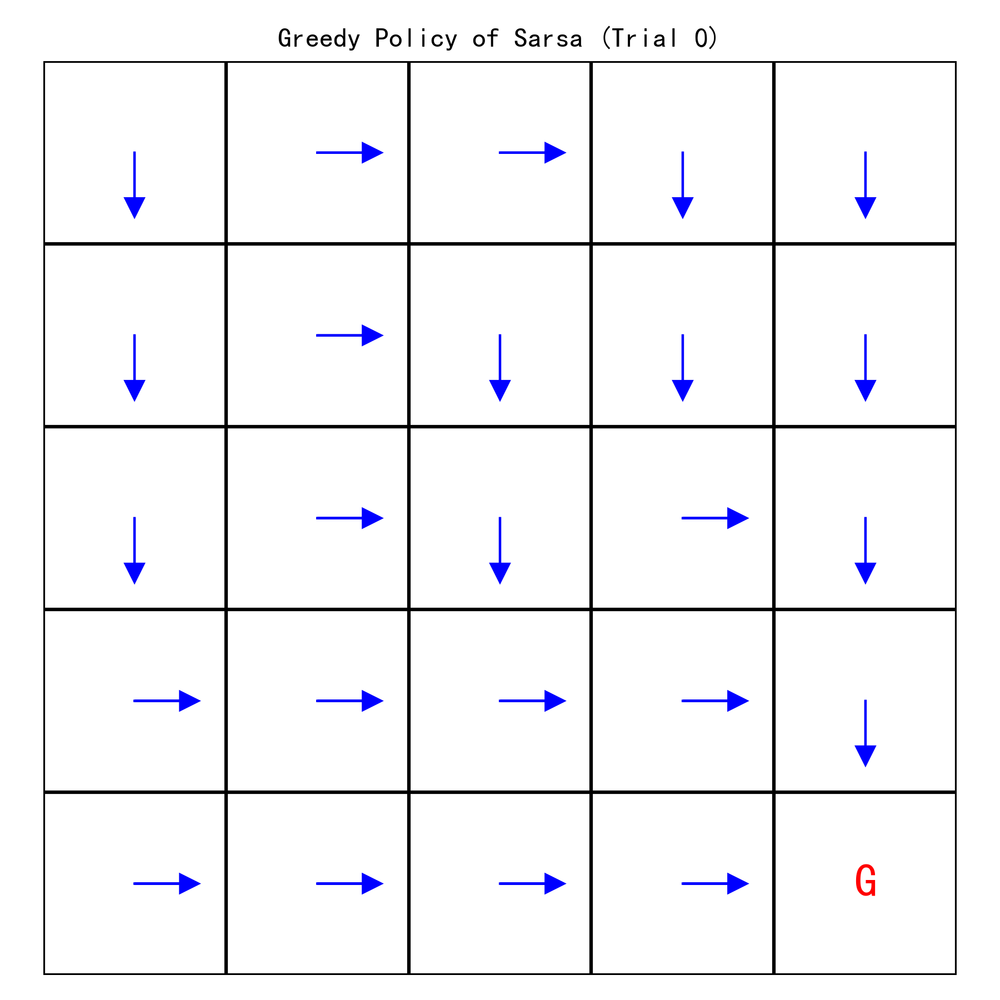 | 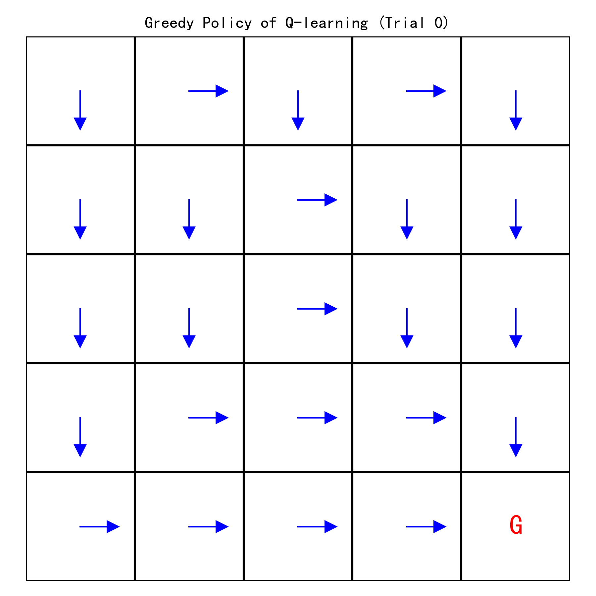 |

**在线控制分析**：在确定性的 $5 \times 5$ GridWorld 中，Sarsa 与 Q-learning 的收敛曲线非常接近，均能在大约 80 个 episode 内实现 100% 的成功率，且均收敛到了最优策略路径。由于环境结构简单且无特殊风险区域，两者均表现出了极佳的收敛稳定性。

### 2. 选做扩展1：离线 Q-learning (Offline Q-learning)
为了验证异策略学习的强大威力，我们让一个完全随机的策略在 GridWorld 中运行，生成一个包含 **50,000 个转移样本** 的固定数据集 $\mathcal{D} = \{(s, a, r, s', done)\}$。接着，我们初始化 $Q(s,a)=0$，不再与环境交互，而完全从该固定数据集中进行 **100,000 步** 的离线 Q-learning 更新。
其更新公式为：
$$q(s,a) \leftarrow q(s,a) + \alpha [r + \gamma \max_{a'} q(s', a') (1 - done) - q(s,a)]$$

离线训练完成后，我们绘制了其最终的贪心策略箭头图：

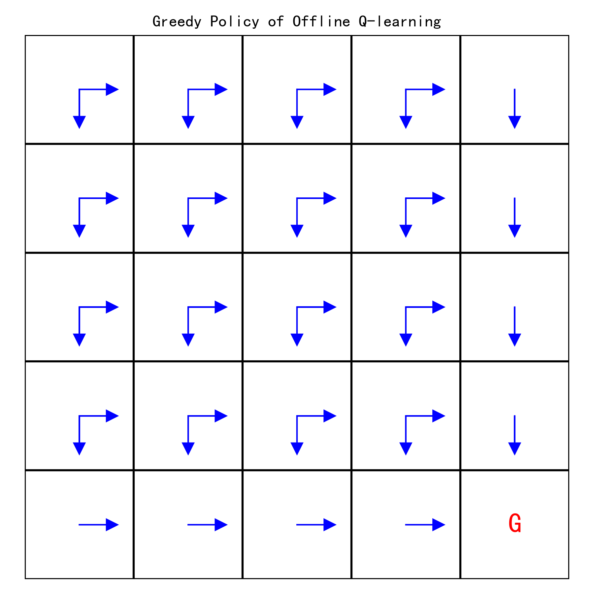

**分析结论**：离线 Q-learning 能够完美学到从所有非终止状态直达终点的最优贪心路径！这证明了 Q-learning 具有纯粹的 **异策略（Off-policy）属性**。因为其 TD 更新目标仅采用下一状态的最大动作价值 $\max_{a'} q(s', a')$，与生成转移数据的行为策略（完全随机探索策略）毫无关系。只要数据集 $\mathcal{D}$ 能够充分覆盖所有的状态-动作空间（即满足探索充分性），Q-learning 就能从中提取出最优的确定性策略。

### 3. 选做扩展2：悬崖寻路环境对比 (Cliff Walking)
我们在经典的悬崖寻路（Cliff Walking）环境中深入对比 Sarsa 与 Q-learning 的行为。
* **悬崖寻路环境**：网格大小为 $4 \times 12$，起点在左下角 $(3, 0)$，终点在右下角 $(3, 11)$。中间底部 $(3, 1) \sim (3, 10)$ 均为悬崖（Cliff）。掉入悬崖会受到 $-100$ 奖励惩罚，并被强行传送回起点重新开始（但 episode 不终止）。普通移动奖励为 $-1$。
* **实验参数**：$\epsilon = 0.1$ 的 $\epsilon$-greedy 探索策略，$\alpha = 0.1$，$\gamma = 0.9$。

以下是 20 次独立运行平均后的 episode 累计奖励曲线：

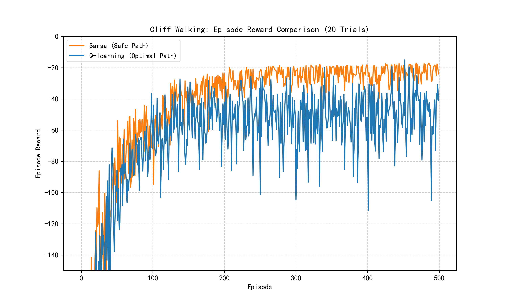

以下是 Trial 0 结束后，Sarsa 与 Q-learning 在悬崖环境中学习到的最终贪心策略路线图：

| Sarsa（安全路径） |
| :---: |
| 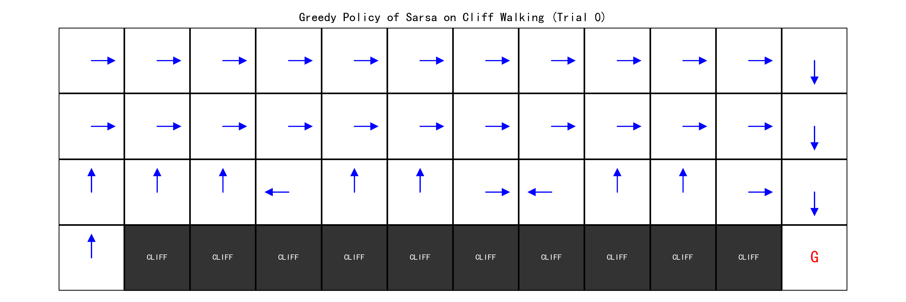 |
| **Q-learning（最优但危险的路径）** |
| 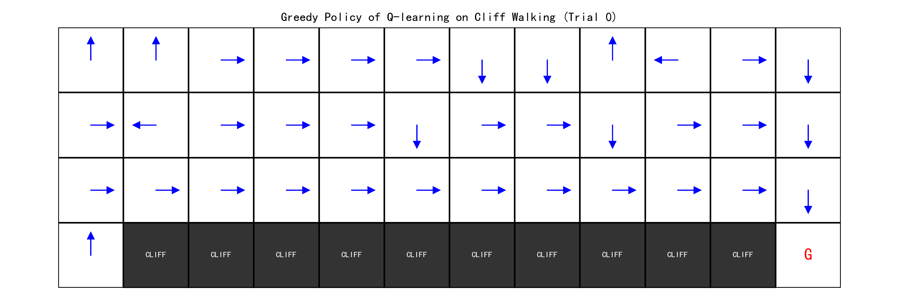 |

**深度对比分析**：
1. **路径选择的差异**：
   * **Sarsa** 选择了一条**远离悬崖边缘的安全路径**（往上走两步，横跨网格顶部，再往下两步到达终点）。
   * **Q-learning** 选择了一条**贴着悬崖边缘的最短最优路径**（沿第三行，即 $(2,0) \to (2,1) \dots \to (2,11)$ 移动）。
2. **学习曲线的表现**：
   * 从累计奖励曲线可以看出，在收敛后，**Sarsa 在线学习的回报（约 -20）显著优于 Q-learning（约 -40）**。
   * **原因解释**：Q-learning 的更新假设代理人之后会采取最优的确定性策略，因此它忽视了在线训练中 $\epsilon = 0.1$ 的探索机制。当代理人在悬崖边行进时，由于 10% 的概率会选择随机动作，代理人有极高概率会失足跌入悬崖（惩罚 -100）。而 Sarsa 属于同策略，它的更新直接依赖于代理人实际做出的动作（包括探索动作）。当它发现贴着悬崖走容易因为探索而坠崖时，它会降低悬崖边缘状态动作的 $Q$ 值，迫使策略转向更安全的区域。
   * **总结**：Q-learning 学习到的是**最优路径（Optimal Path）**，但在有探索噪声的在线运行中平均表现较差；Sarsa 学习到的是**安全路径（Safe Path）**，能够防范自身的探索性失误。

---

## 六、思考与问题回答

### 1. 任务1的思考题：为什么需要基准价值函数？如果没有动态规划真值，还可以如何近似评估算法误差？
* **为什么需要基准价值函数**：在强化学习算法的学术研究和算法开发中，基准价值函数提供了一个“绝对真值”（Ground Truth）。只有对比真值，我们才能定量计算每个状态价值估计的精确误差（如 RMSE、最大绝对误差等），从而精确对比不同算法在特定步长和 episode 数量下的收敛速度、逼近精度以及数值稳定性。
* **无动态规划真值时的近似评估方法**：
  1. **高样本量蒙特卡罗近似（High-sample MC Approximation）**：可以使用当前策略在环境中运行极大数量的 episode（例如数十万轮），并对每个状态的累计折扣回报进行经验平均，根据大数定律，其平均值会无限逼近真实期望。
  2. **高精度时序差分收敛值**：使用微小的固定步长（或严格衰减的步长）运行 TD 算法至极其长的时间，此时价值矩阵的变化率趋近于零（即 $V_{t+1} \approx V_t$），可将此时的状态价值作为近似真值。
  3. **基于时序差分残差（TD Residual / Bellman Error）**：直接计算每个状态的贝尔曼残差 $\delta(s) = \left| \sum_a \pi(a|s) \sum_{s'} p(s'|s,a)[r + \gamma V(s')] - V(s) \right|$。当网络或表格逼近真值时，整体贝尔曼误差应趋近于零。

### 2. 任务2的思考题一：TD 与 MC 在是否 bootstrapping、是否等待完整 episode 结束方面有什么区别？
* **布特（Bootstrapping，自举）**：
  * **TD 方法** 包含自举。它的更新目标 $R_{t+1} + \gamma V(S_{t+1})$ 依赖于后续状态的**当前价值估计值** $V(S_{t+1})$。它用“猜测来更新猜测”。
  * **MC 方法** 不包含自举。它的更新目标是该步骤之后实际观测到的**完整真实累计折扣回报** $G_t = \sum_{k=t}^{T-1} \gamma^{k-t} R_{k+1}$，不依赖任何估计价值。
* **等待 episode 结束**：
  * **TD 方法** 不需要等待 episode 结束。它采用单步在线更新（1-step TD），在转移一步并获得 $(S_t, A_t, R_{t+1}, S_{t+1})$ 后，便可以立即计算 TD 误差并更新 $V(S_t)$。这使得它适用于持续进行的任务（Continuing Tasks）。
  * **MC 方法** 必须等待 episode 完整结束并到达终止状态。因为只有 episode 结束后，我们才能从后往前计算出每个时间步的真实累计回报 $G_t$。

### 3. 任务2的思考题二：若初始价值函数全部设为 0，TD 更新中的 bootstrapping 会带来哪些优点和潜在偏差？
* **优点**：
  1. **加速信息回传与学习**：由于可以直接利用后续状态的当前估计值进行自举，代理人不需要经历漫长的随机游走并到达终点，就能在前期转移过程中不断建立状态间的相对价值依赖，数据利用效率极高。
  2. **减小方差**：Bootstrapping 用单步期望近似长期的随机路径，这截断了未来多步动作与转移的噪声累积，使得估计目标的方差大幅度降低，极大地提高了收敛的平滑度。
* **潜在偏差（Bias）**：
  1. **初始状态估计的系统性偏差**：当初始 $V(s) = 0$ 时，TD 目标的估计在前期会严重偏向于 0，这会导致前期的价值更新存在较大的系统性低估（或者高估，取决于奖励的正负）。
  2. **错误信息的自我强化与慢收敛**：如果某个状态的初始估计是不准确的，TD 会在前期不断通过自举将这一错误估计传播给相邻状态，导致误差在局部状态网中自激励，需要大量的样本交互才能逐步纠正这种由“猜测更新猜测”引入的偏差。

### 4. 任务3的思考题：$n$ 从 1 增大时，更新目标更接近 TD 还是 Monte Carlo？这对偏差和方差有什么影响？
* **更接近谁**：随着 $n$ 的增大，$n$-step 目标：
  $$G_t^{(n)} = R_{t+1} + \gamma R_{t+2} + \dots + \gamma^{n-1} R_{t+n} + \gamma^n Q(S_{t+n}, A_{t+n})$$
  中实际观测到的真实奖励项增多，而自举项 $Q(S_{t+n}, A_{t+n})$ 的折扣衰减因子 $\gamma^n$ 越来越小。因此，$n$ 增大时，更新目标**更接近蒙特卡罗（MC）方法**。当 $n \ge T - t$ 时，它会彻底退化为 MC 更新。
* **对偏差和方差的影响**：
  * **对偏差（Bias）的影响**：$n$ 越大，自举的成分越少，直接采用真实环境回报的成分越多，因而估计的**偏差越小**。
  * **对方差（Variance）的影响**：由于引入了未来 $n$ 个步长中所有随机状态转移与随机动作选择的探索噪声，目标的**方差越大**。
  * **折中选择**：因此，$n$ 的选择构成了偏差-方差折中。通常，中间的 $n$ 值（如 $n=3$ 或 $n=5$）由于兼顾了较低的初始偏差与可接受的方差，其实际收敛速度和控制效果往往明显好于极端的 $n=1$（TD）或 $n=\infty$（MC）。

### 5. 任务4的思考题一：Q-learning 与 Sarsa 的 TD 目标有什么核心区别？为什么 Q-learning 可以学习目标贪心策略而行为策略仍保持探索？
* **TD 目标的核心区别**：
  * **Sarsa**（同策略）的更新目标是基于**实际执行的下一个动作** $A_{t+1}$（通过当前行为策略生成）：
    $$\text{Target}_{\text{Sarsa}} = R_{t+1} + \gamma Q(S_{t+1}, A_{t+1})$$
  * **Q-learning**（异策略）的更新目标是基于**理论上最优的贪心动作** $\max_a Q(S_{t+1}, a)$，而不管实际执行的行为动作是什么：
    $$\text{Target}_{\text{Q-learning}} = R_{t+1} + \gamma \max_{a} Q(S_{t+1}, a)$$
* **为什么可以保持分离（行为策略探索，目标策略贪心）**：
  * Q-learning 将**行为策略（Behavior Policy）**与**目标策略（Target Policy）**解耦。
  * **行为策略**用于生成与环境交互的样本，我们可以令其为高度探索性的策略（例如常数 $\epsilon = 0.1$ 的 $\epsilon$-greedy，或者完全随机策略），以确保对环境有足够的覆盖度。
  * **目标策略**则是我们最终想要评估和改进的策略（确定性贪心策略 $\arg\max_a Q(s,a)$）。
  * 异策略更新中，由于 $Q$-value 的迭代公式采用的是 $\max_a Q(S_{t+1}, a)$，这正好在数学上等价于对目标贪心策略的价值评估。因此，即使行为策略一直在跌跌撞撞地探索，Q-learning 的更新轨迹也始终在逼近最优贪心策略的动作价值。

### 6. 任务4的思考题二：在你的实验中，Q-learning 是否比 Sarsa 收敛更快或更不稳定？结合曲线说明原因。
* **实验结果分析**：
  * **在 $5 \times 5$ GridWorld 中**：Q-learning 与 Sarsa 的收敛轨迹高度重合，且都在 80-100 个 episode 左右达到完美的成功率。这是因为网格空间较小，且没有能够引起策略分化的惩罚陷阱，因此两者的学习曲线都非常稳定，并未出现明显的不稳定现象。
  * **在 Cliff Walking 中**：两者的学习表现呈现出剧烈分化。
    * 从收敛速度看：Sarsa 能够稳步且平滑地收敛到一个高水平（累计奖励约 -20）。
    * 从不稳定性与累计奖励看：Q-learning 的累计奖励曲线在收敛后仍持续在 -40 左右剧烈震荡，呈现极大的不稳定性和低回报。
    * **原因解释**：这并非因为 Q-learning 算法学到的 $Q$ 值不稳，而是因为其**行为策略是 $\epsilon$-greedy**。Q-learning 学到了紧贴悬崖的最短最优路径。当它使用这个最优路径作为行为策略进行交互时，10% 的探索概率必然会导致它以较高的频率误坠悬崖。每次坠崖都会直接带来 -100 的巨额惩罚，导致其在线运行的累计回报曲线剧烈抖动且均值偏低。而 Sarsa 则学到了一条“容错率极高”的安全路径，即使在行进中发生 10% 的随机晃动，也不会掉入悬崖，因而表现出极高的在线回报和极佳的稳定性。

### 7. 补充思考题：简述同策略（On-policy）与异策略（Off-policy）的核心区别，并分析各自优缺点。
* **核心区别**：
  * **同策略（On-policy）**：代理人评估和改进的策略，与它用于和环境交互生成训练数据的行为策略是**同一个策略**（即评估和更新时，未来的动作 $A'$ 是严格按照当前策略采样出来的）。
  * **异策略（Off-policy）**：代理人评估和改进的策略（目标策略 $\pi$），与用于产生环境数据的行为策略（$\beta$）是**两个不同的策略**。
* **各自优缺点对比**：
  | 维度 | 同策略 (On-policy，如 Sarsa) | 异策略 (Off-policy，如 Q-learning) |
  | :--- | :--- | :--- |
  | **样本效率** | **低**。数据是一次性的，策略更新后，旧数据无法用于当前策略的训练。 | **高**。可以使用历史经验回放（Experience Replay）或离线样本重复训练。 |
  | **探索与最优性** | **折中限制**。为了持续探索，不得不训练一个随机软策略，导致最终学到的策略可能不是全局理论最优（如悬崖寻路中的安全路径）。 | **解耦优化**。行为策略可以极尽探索，目标策略仍能精准收敛到最优确定性策略。 |
  | **收敛稳定性** | **极佳**。因为数据生成与目标评估完全一致，更新目标始终是对当前实际行为的估计，极少发散。 | **存在发散风险**。与神经网络结合时，异策略、自举和函数近似（三要素，Deadly Triad）会导致严重的数学发散风险。 |

---

## 七、核心代码与分析

### 1. GridWorld 环境状态转移与奖励 (env.py)
以下是网格环境的 `step` 实现。程序准确处理了边界碰撞和目标状态的终止逻辑：
```python
def step(self, action):
    # 终止状态下无法执行动作，直接返回
    if self.state == self.goal:
        return self.state, 0.0, True, {}
        
    r, c = self.state
    # 动作映射：0:上, 1:下, 2:左, 3:右
    if action == 0:    # Up
        nr, nc = r - 1, c
    elif action == 1:  # Down
        nr, nc = r + 1, c
    elif action == 2:  # Left
        nr, nc = r, c - 1
    elif action == 3:  # Right
        nr, nc = r, c + 1
        
    bump = False
    # 撞墙边界检查
    if nr < 0 or nr >= self.size or nc < 0 or nc >= self.size:
        nr, nc = r, c
        bump = True
        
    self.state = (nr, nc)
    done = (self.state == self.goal)
    
    # 奖励规则：到达终点得 +1.0，撞墙或普通移动均得 -1.0
    if done:
        reward = 1.0
    else:
        reward = -1.0
        
    return self.state, reward, done, {}
```

### 2. TD(0) 评估核心更新 (task2_td0_eval.py)
本段展示了单步 TD 误差 $\delta_t = R_{t+1} + \gamma V(S_{t+1}) - V(S_t)$ 的计算与增量式更新：
```python
# TD(0) 更新核心
# 若 next_state 为 Goal，则 done=True，此时 v_next 强制为 0.0
v_next = V[nr, nc] if not done else 0.0
td_target = reward + env.gamma * v_next
# 更新公式：V(s) <- V(s) + alpha * [ TD_Target - V(s) ]
V[r, c] += lr * (td_target - V[r, c])
```

### 3. n-step Sarsa 控制核心更新 (task3_sarsa.py)
算法通过数组缓存单步的状态、动作与奖励。在当前时间步超过 $n$ 后，从后往前计算折现累计回报 $G$，并在有终点截断的情况下正确处理自举项：
```python
tau = t - n + 1
if tau >= 0:
    G = 0.0
    # 计算从 tau+1 到 min(tau+n, T) 的真实折扣回报和
    for i in range(tau + 1, min(tau + n, T) + 1):
        G += (gamma ** (i - tau - 1)) * rewards[i]
    # 若 n 步之内未到终点，则自举加上 tau+n 状态动作对的 Q 值估计
    if tau + n < T:
        s_tn = states[tau + n]
        a_tn = actions[tau + n]
        G += (gamma ** n) * Q[s_tn[0], s_tn[1], a_tn]
    
    # 更新 Q-table
    s_tau = states[tau]
    a_tau = actions[tau]
    Q[s_tau[0], s_tau[1], a_tau] += alpha * (G - Q[s_tau[0], s_tau[1], a_tau])
```

### 4. Q-learning 离线更新逻辑 (task4_qlearning.py)
从离线数据集中随机采样转移元组，通过最大动作为下一步的价值目标实施更新：
```python
# 离线 Q-learning 更新核心
idx = np.random.randint(dataset_size)
s, a, r, s_next, done = dataset[idx]

if done:
    td_target = r
else:
    # 异策略自举：直接选择 s_next 下的所有动作中最大的 Q 值进行自举
    td_target = r + gamma * np.max(Q[s_next[0], s_next[1]])
    
Q[s[0], s[1], a] += alpha * (td_target - Q[s[0], s[1], a])
```

---

## 八、总结与体会

通过本次实验，我深入掌握了时序差分（TD）学习的核心技术，并获得了以下几点核心体会：
1. **理解了 Bootstrapping 的双刃剑本质**：相比蒙特卡罗方法，自举使得 TD 算法能够“边走边更新”，极大地缩减了估计方差并提高了数据采样效率。但是，它在前期的更新会受到基准初值（如设为 0）的系统偏差干扰，不如 MC 方法那样天生具有无偏特性。
2. **直观体会了偏差-方差的参数化权衡**：在 n-step Sarsa 实验中，$n=3$ 和 $n=5$ 的表现显著优于 $n=1$。这说明在实际应用中，通过选择合适的时序跨度，能够同时压低方差与偏差，达到超越极端的 Sarsa 和蒙特卡罗的学习效果。
3. **明晰了同策略与异策略的实质差异**：悬崖寻路（Cliff Walking）实验是本次实验中最令人兴奋的部分。它生动地展示了即使在相同的参数配置下，由于更新目标中是否包含探索动作为自举项，Sarsa 选择学习了保守防御的“安全路径”，而 Q-learning 执着于激进冒险的“最优路径”。同时，离线 Q-learning 的成功实现也确凿地证明了异策略对于任意探索行为历史数据的极佳重用性，这为深度强化学习中的经验回放机制奠定了坚实的理论认知基础。
