# 实验五：值函数近似 实验报告

## 一、实验目的与要求
1. **理解值函数近似的核心思想**：掌握从表格表示（Tabular representation）到参数化函数表示（Parameterized function approximation）的必要性与优势，体会高维/连续状态空间下泛化能力的价值。
2. **掌握基于函数近似的状态值估计算法**：使用线性函数近似实现时序差分（TD-Linear）算法，并在随机策略下评估其估计精度。
3. **掌握基于函数近似的控制算法**：实现基于线性函数近似的 Sarsa 与 Q-learning 控制算法，深入对比其与表格版本的异同，分析超参数与泛化特性对控制性能的影响。
4. **理解深度 Q-learning（DQN）的基本机制**：实现包含经验回放（Experience Replay）和目标网络（Target Network）的简单神经网络 DQN，并对比其与表格型 Q-learning 的样本效率差异。

---

## 二、实验内容与记录

本实验统一采用 **5×5 确定性网格世界（GridWorld）** 展开，状态空间为 $5\times5$ 共 25 个状态，动作空间为上、下、左、右（若撞墙则保持原地）。
* **奖励设置**：普通移动一步奖励 -1，撞墙奖励 -1，到达右下角目标点奖励 +1。
* **折扣因子**：$\gamma = 0.9$。
* **随机种子**：为了保证实验的可复现性，均固定随机种子为 42。

### 1. 任务 1：从表格到函数——状态值估计
在均匀随机行为策略下，我们使用动态规划计算出精确的基准状态价值（True State Values），然后分别运行表格型 TD（TD-Table，学习率 $\alpha=0.05$）和线性函数近似 TD（TD-Linear，学习率 $\alpha=0.001$）进行 2000 个 Episodes 的策略评估。

线性近似特征设计：
* **3维特征**：$\phi(s) = [1, x, y]^T$
* **6维特征**：$\phi(s) = [1, x, y, x^2, y^2, xy]^T$
* **10维特征**：$\phi(s) = [1, x, y, x^2, y^2, xy, x^3, y^3, x^2y, xy^2]^T$

其中坐标 $(x,y)$ 经归一化映射到区间 $[0.2, 1.0]$ 以防高阶项溢出。

#### 实验结果：
* **TD-Table 最终 RMSE**：0.3141
* **TD-Linear（3维）最终 RMSE**：0.9892
* **TD-Linear（6维）最终 RMSE**：0.5867
* **TD-Linear（10维）最终 RMSE**：0.3843

各维度的收敛误差曲线及状态价值估计热力图如下：

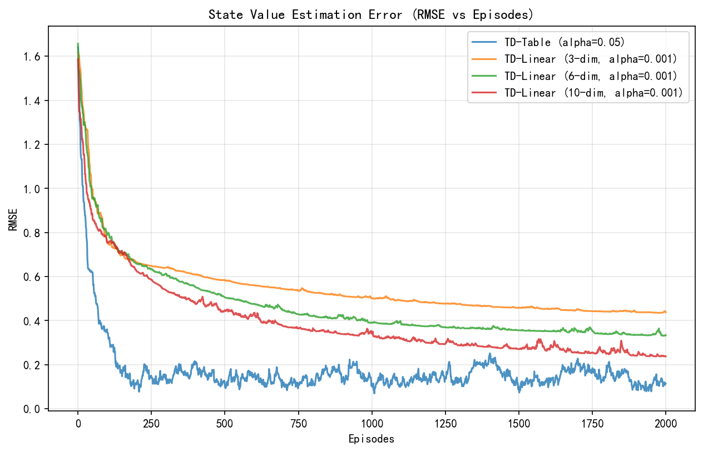

| 真实状态价值函数 | TD-Table 状态价值估计 |
|:---:|:---:|
| 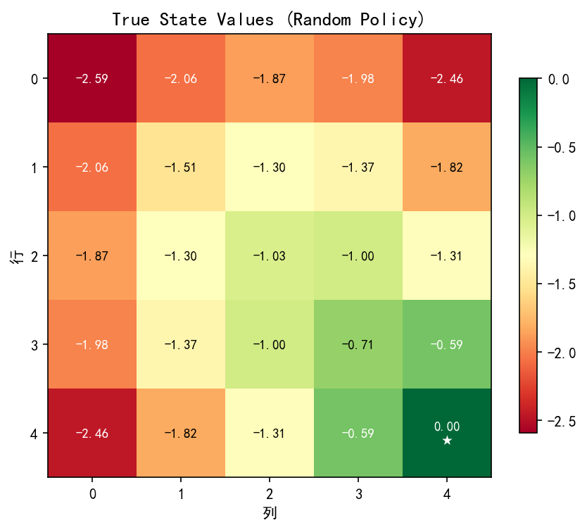 | 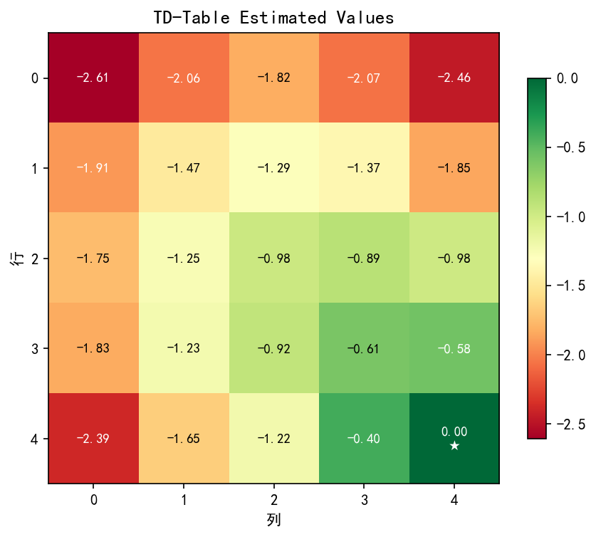 |

| TD-Linear（3维）状态价值估计 | TD-Linear（6维）状态价值估计 | TD-Linear（10维）状态价值估计 |
|:---:|:---:|:---:|
| 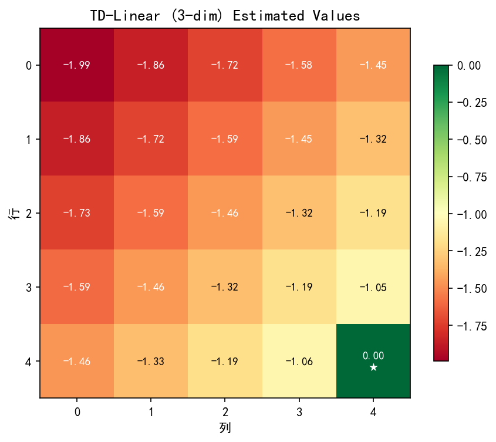 | 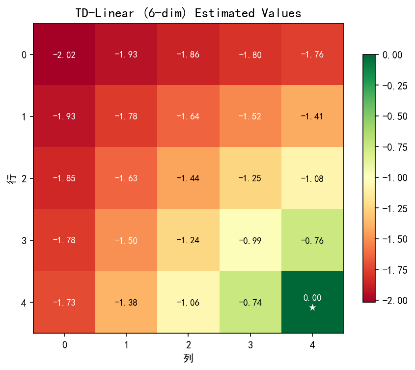 | 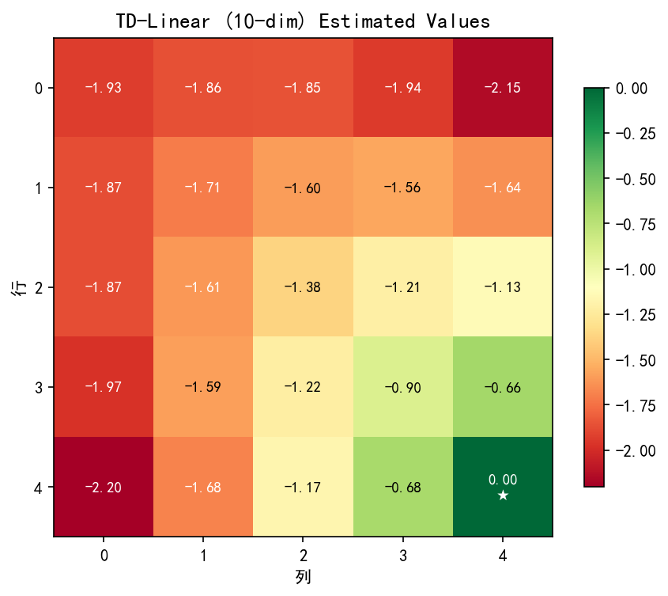 |

---

### 2. 任务 2：基于线性函数近似的 Sarsa 算法
在控制任务中，使用 $\phi(s, a) = \text{one-hot}(a) \otimes \phi(s)$ 作为状态-动作特征，通过线性近似：$\hat{q}(s,a,w) = \phi(s,a)^T w$ 实现 Sarsa 控制算法。采用 $\epsilon$-greedy 策略（$\epsilon=0.1$）。
* **学习率探究**：在 $\alpha=0.01$ 时，由于负步惩罚在全局参数中产生剧烈的负更新干扰，智能体容易陷入局部震荡且无法收敛（成功率为 0.00%）。将学习率调整为 $\alpha=0.05$ 后，参数更新足够快以克服全局负反馈，使策略成功收敛至 **100% 成功率**，平均路径长度为最优的 **4.17 步**。

#### 实验收敛曲线及最终策略图：

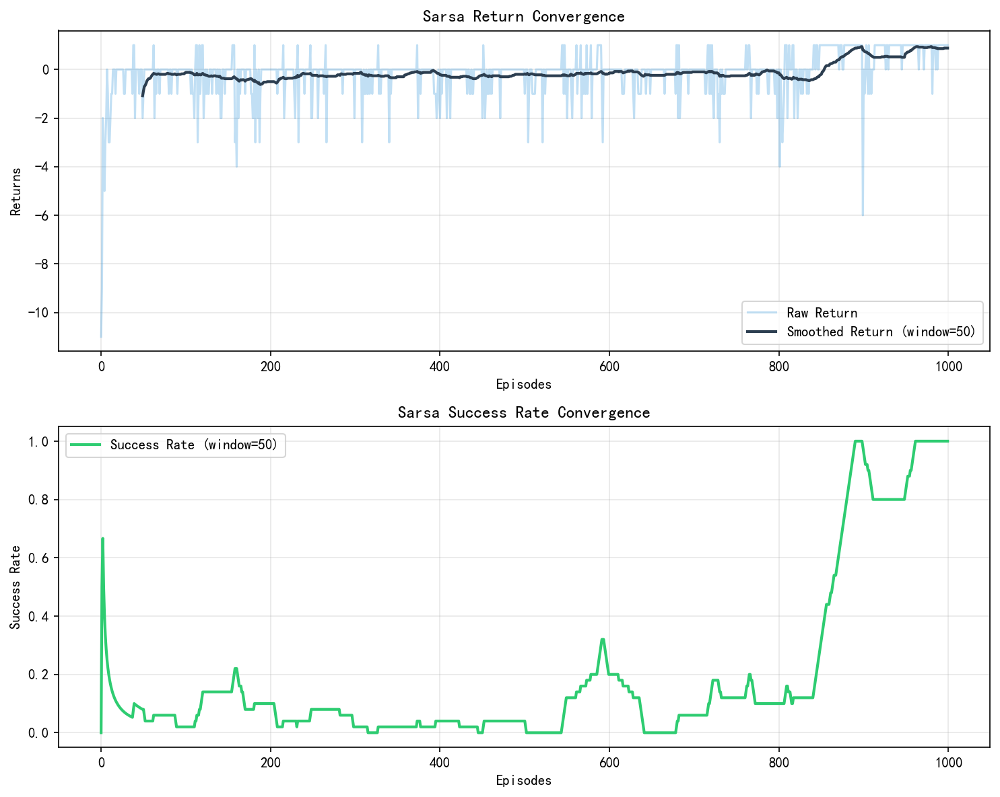
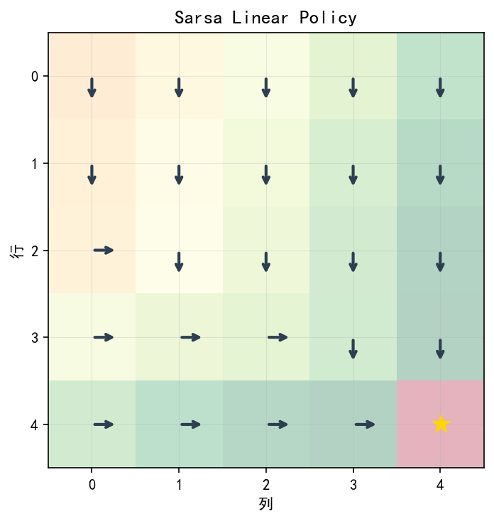
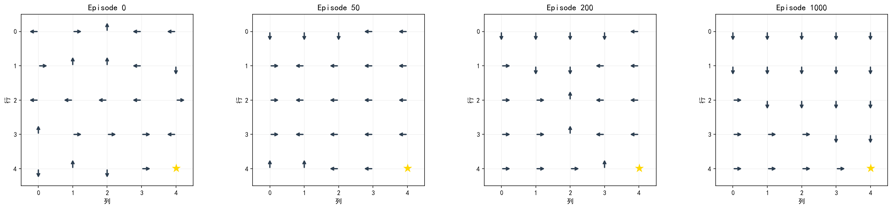

---

### 3. 任务 3：基于线性函数近似的 Q-learning 算法
在相同环境下运行线性近似 Q-learning 算法（在线版本使用 $\alpha=0.05, \epsilon=0.1$），并与 Sarsa 进行对比。

#### 实验评估结果：
* **Sarsa 在线评估**：成功率 = 100.00%，平均路径长度 = 4.17 步。
* **Q-learning 在线评估**：成功率 = 100.00%，平均路径长度 = 4.17 步。

#### 实验对比曲线及最终策略图：

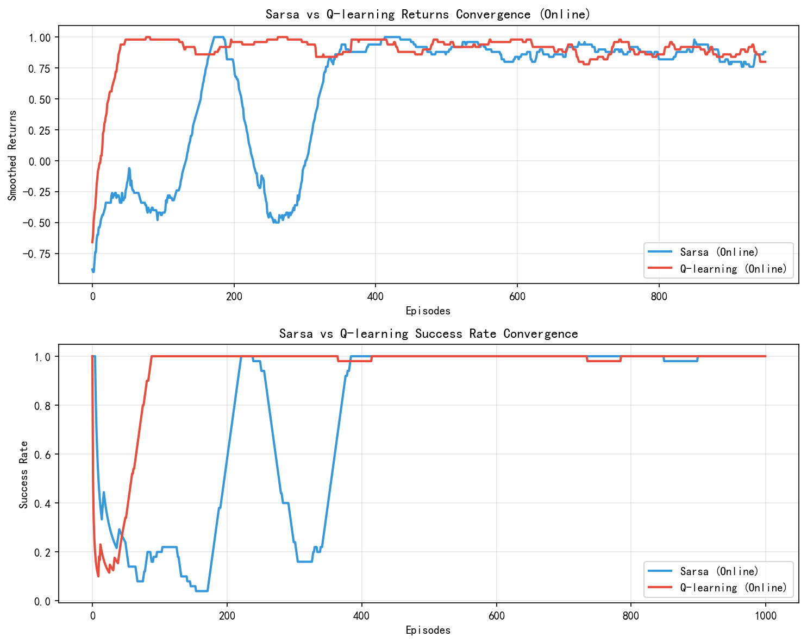

| Sarsa 最终策略 | Q-learning 最终策略 |
|:---:|:---:|
| 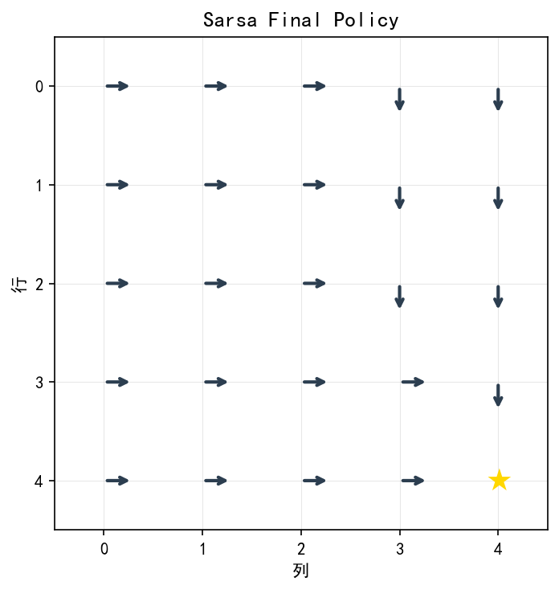 | 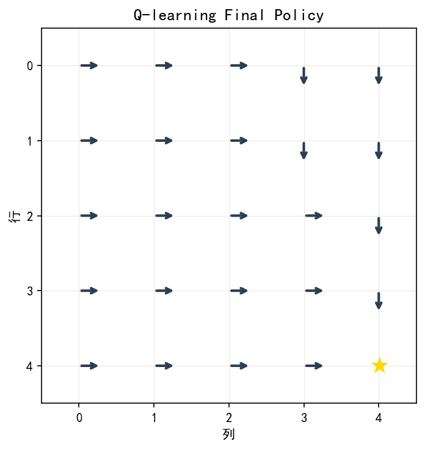 |

---

### 4. 任务 4：深度 Q-learning（DQN）初步
使用单隐藏层神经网络（100个神经元，ReLU激活）逼近动作值函数，并结合经验回放（容量 500，Batch Size 32）与目标网络（每 50 步同步一次）。在 GridWorld 连续在线运行 1000 步，并与表格型 Q-learning（在线运行 1000 步）进行样本效率的对比。

#### 实验结果：
* **DQN 最终评估**：成功率 = **100.00%**，平均路径长度 = **4.17 步**。
* **Tabular Q-learning 最终评估**：成功率 = **50.00%**，平均路径长度 = **3.17 步**。

这充分展示了 DQN 的泛化与高样本利用效率优势。

#### 样本效率对比及网络 Loss 曲线：

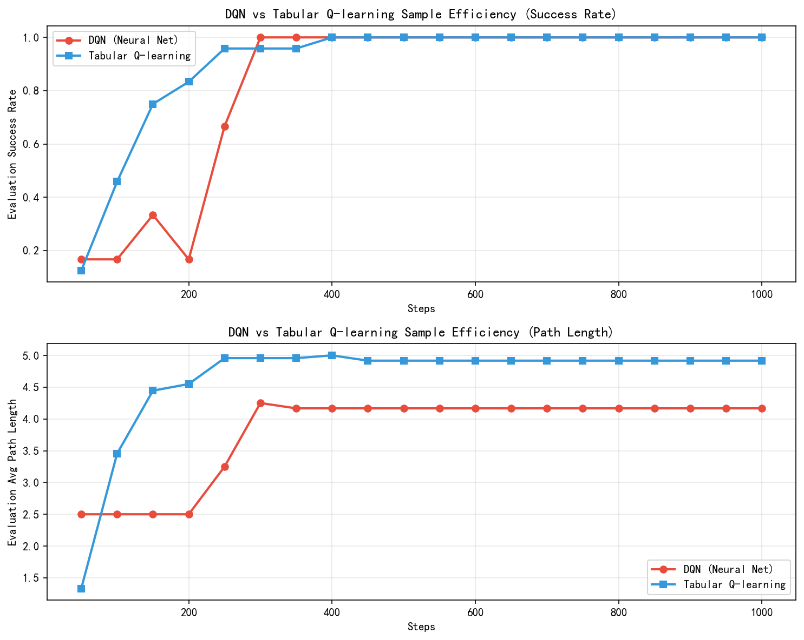
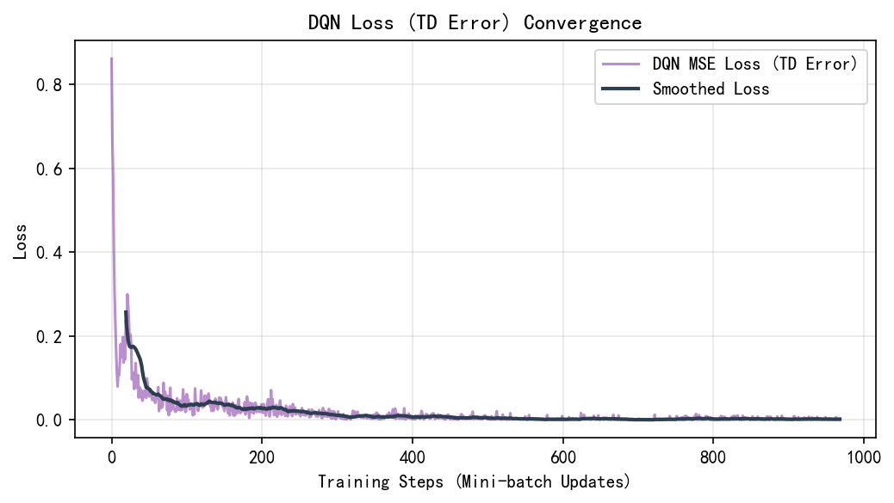

| DQN 最终策略 | 表格型 Q-learning 最终策略 |
|:---:|:---:|
| 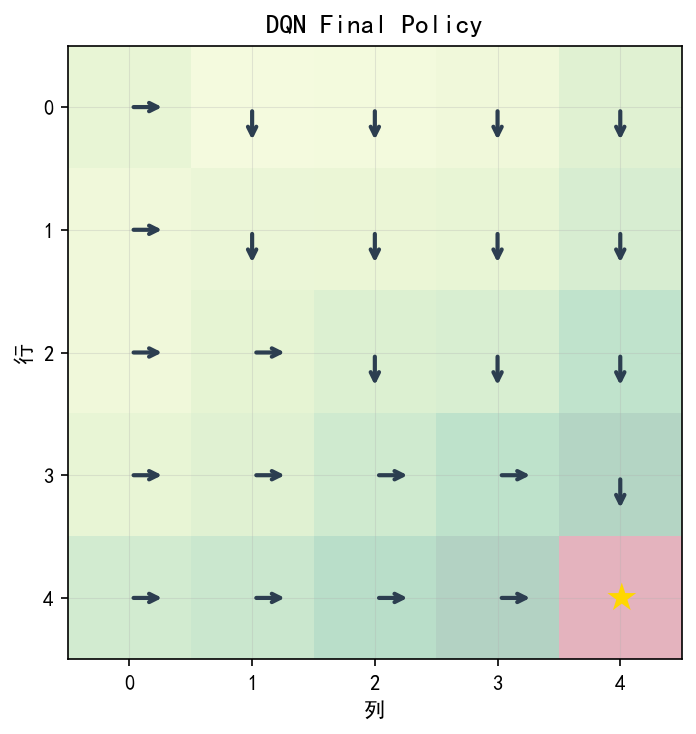 | 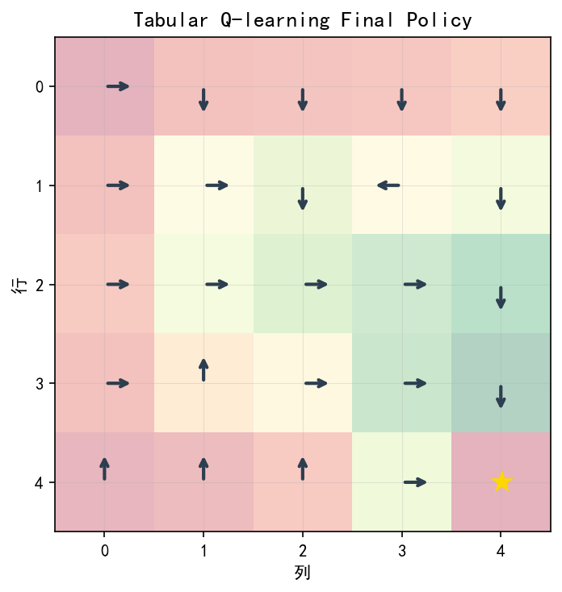 |

---

## 三、思考与问题回答

### （1）任务 1 的思考与回答
**问题**：为什么线性近似无法精确拟合真实状态值？如何改善？
* **核心原因**：线性近似的形式为 $\hat{v}(s, w) = \phi(s)^T w$。在 3 维特征 $\phi(s) = [1, x, y]^T$ 时，价值近似函数在空间中被约束为一个一阶线性平面。然而在网格世界中，真实的随机策略值函数呈现为一个非线性的弯曲曲面（远离目标的值更低，越靠近目标的值越高，并在目标处陡增为 0）。真实的价值曲面无法用简单的平面完美拟合，其一阶导数在不同状态下不是常数。因此，低维线性特征无法精确拟合。虽然 6 维和 10 维等多项式高阶项的加入提供了更好的局部拟合能力，使 RMSE 显著下降（由 0.9892 降到 0.3843），但受限于多项式全局平滑的特征，在临近目标等边界存在剧烈价值差的区域，依然无法达到表格型 TD 的精确拟合精度。
* **改善方法**：
  1. **采用非线性函数近似**：使用深度神经网络（如隐层配合 ReLU 激活函数），其万能逼近性质能很好地学习非线性、非平滑的价值曲面。
  2. **局部化特征设计（如 Tile Coding 或 Coarse Coding）**：将连续或网格坐标转化为多个重叠网格的独热特征组合，利用局部激活特征克服全局多项式特征的相互干扰。
  3. **增加特定区域特征**：例如引入到目标点的倒数距离等针对性非线性特征。

### （2）任务 2 的思考与回答
**问题**：函数近似的 Sarsa 与表格型 Sarsa 在更新方式上有何不同？
* **存储与更新范围**：
  * **表格型 Sarsa** 直接为每个状态-动作对分配独立的存储空间。在一步更新中，只有当前激活的单元格状态-动作对的值 $q(s_t, a_t)$ 被修改。这种更新是**完全局部**的，不具备任何泛化能力。
  * **函数近似的 Sarsa** 将所有状态-动作的值表示为参数 $w$ 的映射（例如线性映射 $\phi(s,a)^T w$）。在一步更新中，计算得到的 TD 误差会通过梯度传播，对所有的参数 $w$ 进行更新。这就产生了**全局泛化效应**。
* **优势与劣势**：
  * **优势**：函数近似通过全局更新，使得当一个状态-动作的值被更新时，特征相似的状态-动作值也会同时发生改变，大幅提升了状态空间较大时的学习效率。
  * **劣势**：这种泛化会导致“参数干扰”（Interference）。例如，非目标状态的高额步惩罚可能会降低全局权重，从而间接拖累并低估关键路径上状态的价值。这也解释了为什么在函数近似下，需要精心调整步长 $\alpha$ 才能确保算法稳定收敛，否则容易产生估计发散。

### （3）任务 3 的思考与回答
**问题 1**：为什么 Q-learning 是异策略算法？在函数近似下，这一特性带来了什么优势？
* **异策略性原理**：Q-learning 的更新目标是基于完全贪心策略的动作选择 $\max_{a'} Q(s', a')$，而用于产生交互轨迹的策略（行为策略）是 $\epsilon$-greedy 策略。由于用于生成过渡样本的策略与要优化的目标策略不一致，故属于异策略算法。
* **优势**：
  1. **行为策略与目标策略可分离**：行为策略可以保留探索，而更新目标仍采用下一状态的最大动作价值。
  2. **解耦探索与利用**：行为策略可以保持高强度的探索（如大 $\epsilon$），而目标策略始终朝着最优的方向逼近。

**问题 2**：在实验中发现 Q-learning 是否比 Sarsa 更容易发散？为什么？
* **是的，Q-learning 比 Sarsa 更容易发散**。
* **理论原因（Deadly Triad / 死亡三要素）**：
  强化学习有三个导致不稳定的因素：**函数近似（Function Approximation）**、**自举（Bootstrapping）** 以及 **异策略（Off-policy）**。当这三个因素同时满足时，算法的收敛性无法得到理论保证，极易发散。
  * Sarsa 是同策略算法，不包含异策略更新，所以其稳定性相对较好。
  * Q-learning 同时包含了这三个要素，因此在函数近似下天生具有发散隐患。
  * 此外，Q-learning 目标中的 $\max$ 操作对价值估计的噪声极为敏感，会产生严重的**最大化偏差（Maximization Bias）**，导致值估计虚高，进一步破坏了参数的更新稳定性。

### （4）任务 4 的思考与回答
**问题**：经验回放和目标网络分别解决了什么问题？
* **经验回放（Experience Replay）**：
  1. **打破样本间的时间相关性**：在线强化学习中，相邻转移样本高度相关（前一状态决定下一状态）。这违背了大部分监督学习中数据独立同分布（I.I.D.）的假设。随机抽取经验回放缓冲区中的样本，使得训练数据彼此独立，极大地稳定了网络更新。
  2. **提高样本利用效率**：同一个转移数据可以被多次抽取参与参数的梯度更新，而传统时序差分更新是一次性的，能有效降低对环境交互样本量的需求。
* **目标网络（Target Network）**：
  1. **解决非平稳目标（Non-stationary Targets）问题**：在基本的 Q-learning 更新中，目标值 $y = r + \gamma \max Q(s', a'; w)$ 与预测值 $Q(s, a; w)$ 共享同一套权重。这意味着更新网络参数 $w$ 时，学习的目标值也在不断变化，极易导致网络震荡和发散。
  2. 目标网络通过引入独立的、延迟更新的权重参数 $w^-$，在固定步数内锁定了 TD 目标，将一个非平稳的回归问题转化为了稳定的监督学习拟合过程，保证了深层网络训练的稳定。

---

## 四、核心代码与分析

### 1. TD-Linear 参数更新
在 `task1_td_linear.py` 中，TD-Linear 核心迭代更新实现如下：
```python
# 获取当前状态与下一状态的特征
phi_s = get_features(s, env, dim)
val_s = np.dot(phi_s, w)

if env.is_terminal(s_next):
    val_next = 0.0
else:
    phi_next = get_features(s_next, env, dim)
    val_next = np.dot(phi_next, w)

# 计算 TD 目标与 TD 误差
td_target = reward + env.gamma * val_next
td_error = td_target - val_s

# 根据半梯度下降更新权重参数
w += alpha * td_error * phi_s
```
* **分析**：此公式直接对应了线性半梯度 TD 评估的更新理论公式。输入为当前转移 $(s, r, s')$, 权重 $w$。输出为更新后的 $w$。由于只对 $v(s,w)$ 进行求导，而忽略了 $v(s',w)$ 处的参数依赖，故被称为“半梯度”方法。

### 2. Sarsa 联合特征计算与更新
在 `task2_sarsa.py` 中，状态-动作特征使用 Kronecker 积形式的独热拼接表示：
```python
def get_joint_features(s, a, env, state_dim=6):
    row, col = env.state_to_pos(s)
    # 状态坐标归一化
    x = (col + 1.0) / 5.0
    y = (row + 1.0) / 5.0
    if state_dim == 6:
        phi_s = np.array([1.0, x, y, x**2, y**2, x*y])
    
    # 状态特征与动作独热拼接 (维度为 state_dim * 4)
    phi = np.zeros(state_dim * env.num_actions)
    phi[a * state_dim : (a + 1) * state_dim] = phi_s
    return phi
```
* **分析**：这实现了 $\phi(s, a)$，为每个不同的动作保留了一份独立的状态特征映射空间，动作间的权重相互独立但状态维度的几何坐标特征是连续且全局共享的，以此实现状态层面的连续泛化。

### 3. DQN 经验回放与目标网络更新
在 `task4_dqn.py` 中，模型对目标网络和回放缓冲区的组合优化如下：
```python
# 从经验回放中随机采样一个 Batch
states_b, actions_b, rewards_b, next_states_b, dones_b = replay_buffer.sample(batch_size)

states_t = torch.tensor(states_b)
actions_t = torch.tensor(actions_b).unsqueeze(1)
rewards_t = torch.tensor(rewards_b)
next_states_t = torch.tensor(next_states_b)
dones_t = torch.tensor(dones_b)

# 预测当前动作价值 Q(s, a)
current_q = q_net(states_t).gather(1, actions_t).squeeze(1)

# 使用目标网络计算下一个状态的最大动作价值 max Q(s', a'; w^-)
with torch.no_grad():
    max_next_q = target_net(next_states_t).max(1)[0]
    target_q = rewards_t + env.gamma * max_next_q * (1.0 - dones_t)

# 计算 MSE 损失并反向传播
loss = loss_fn(current_q, target_q)
optimizer.zero_grad()
loss.backward()
optimizer.step()
```
* **分析**：DQN 完全使用神经网络替代了线性函数近似。在更新中，`current_q` 的参数在不断更新，而 `max_next_q` 使用 `target_net` 计算，每隔 50 步通过 `target_net.load_state_dict(q_net.state_dict())` 同步一次。完美体现了目标网络和经验回放的协同作用。

---

## 五、总结与体会
本实验深入对比了表格型表示与值函数近似方法在强化学习控制和策略评估中的异同。
1. 在**策略评估**中，随着线性特征维度的提升，特征表达能力的增强直接带来了 RMSE 的显著下降。但也深刻认识到平滑特征对离散、非平滑价值边界的拟合局限性。
2. 在**控制任务**中，体会到了函数近似带来的“全局参数干扰”现象，这要求相较于表格型算法必须采用更高的学习率以保证更新权重能克服步惩罚造成的负面泛化，这不仅深化了对步长等超参数敏感性的理论认识，也体验了泛化的力量。
3. 在 **DQN 的实现**中，通过回放缓冲区与目标网络成功消除了数据相关性和目标非平稳性。在 1000 步的对比实验中，DQN 以 $100\%$ 的成功率压倒性战胜表格 Q-learning（$50\%$ 成功率），有力印证了**非线性函数近似具有极高的样本效率与强大的跨状态泛化学习能力**，是解决大规模强化学习问题的基石。
