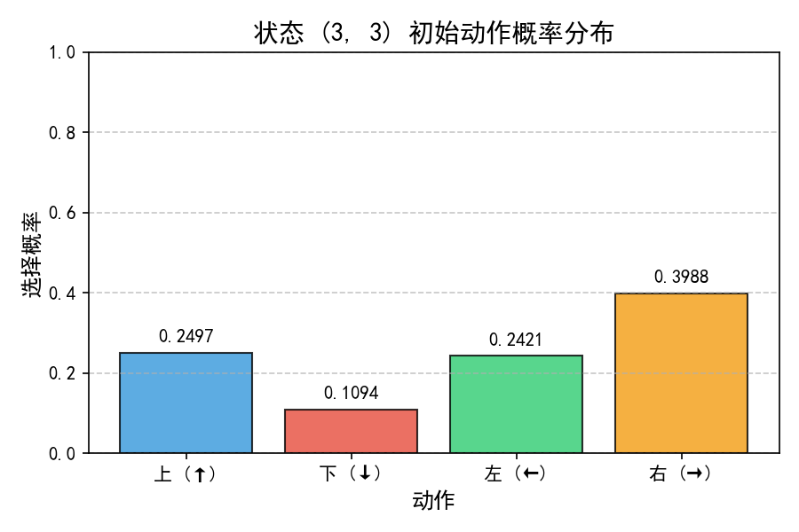
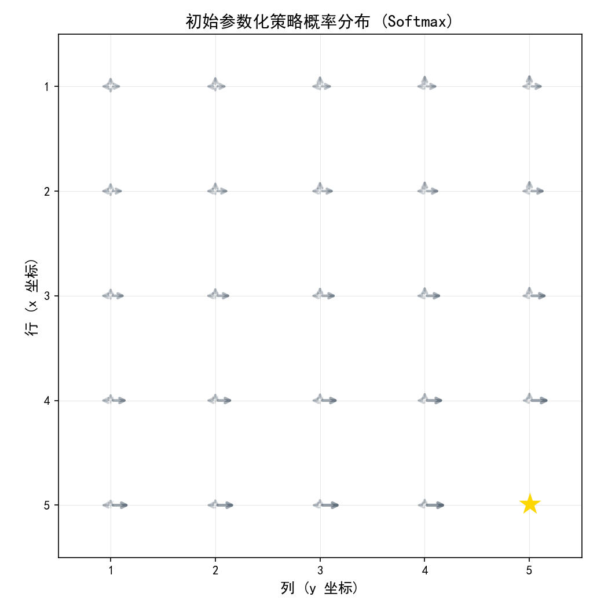
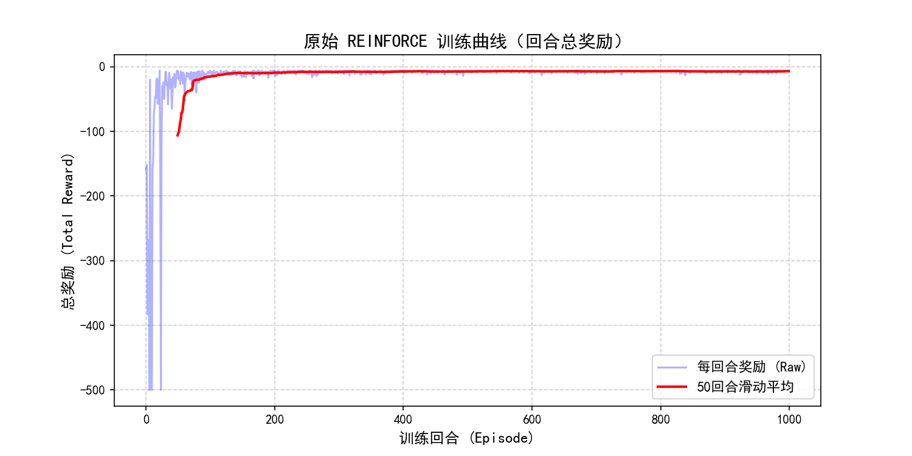
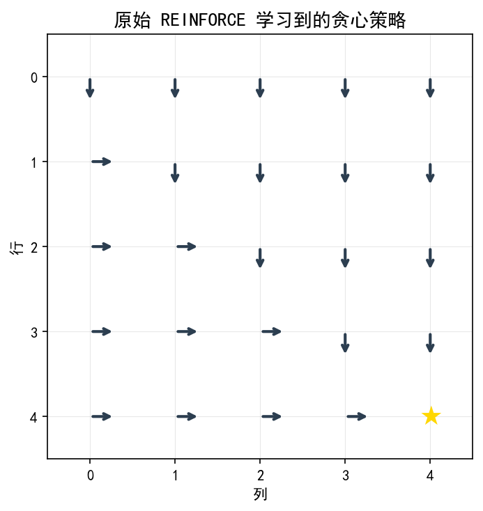
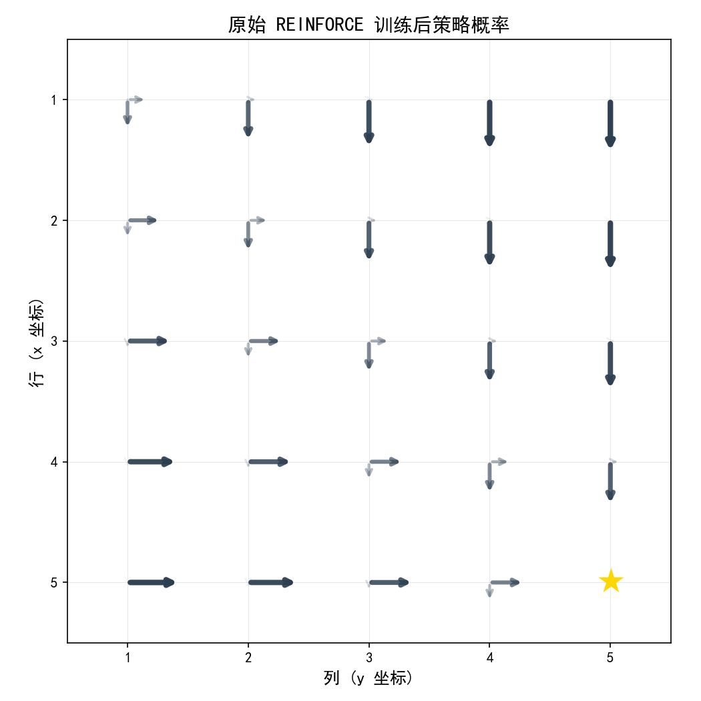
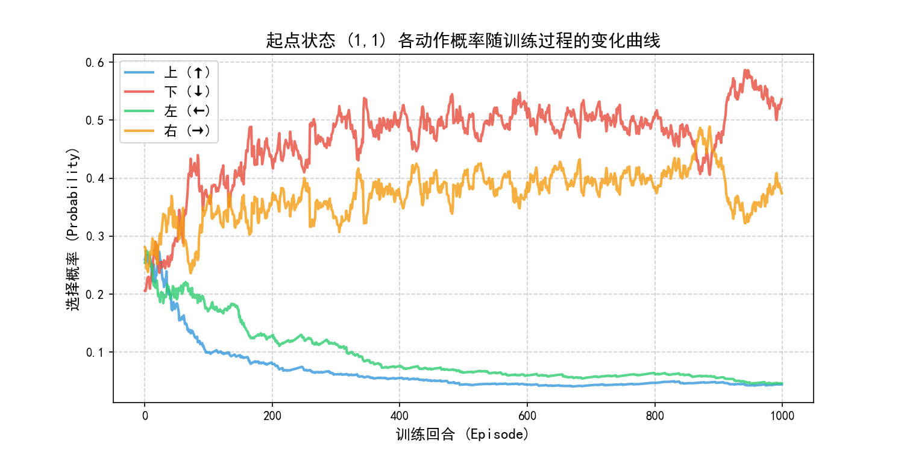

# 实验六：策略函数近似 实验报告

## 一、实验目的与要求

1. **理解策略梯度方法的核心思想**：掌握从值函数方法（基于值估计和 $\epsilon$-greedy 隐式策略）到策略梯度方法（直接对策略参数化并进行优化）的转变，明确策略参数化的基本原理及其与表格型策略的区别。
2. **理解并推导策略梯度定理**：掌握最优策略评价指标（如平均状态价值或回合累积回报）的定义，以及策略梯度的数学表达式。
3. **实现 REINFORCE 算法**：能够使用蒙特卡洛采样来估计动作价值 $q_t(s_t, a_t)$，并基于对数似然梯度进行策略参数 $\theta$ 的随机梯度上升更新。
4. **掌握 Softmax 策略参数化表示**：理解如何利用 Softmax 函数将连续的偏好函数值转化为动作概率分布，并分析其天然具有探索性的数学机制。
5. **分析探索与利用的权衡机制**：探究 REINFORCE 更新量中的 $\beta_t = \frac{q_t}{\pi(a_t|s_t, \theta_t)}$ 项如何同时调节探索和利用，分析负回报环境下的策略更新特点。

---

## 二、实验内容与记录

### 任务 1：策略的参数化表示

#### 1. 实验设置与特征设计
我们在 $5 \times 5$ 网格世界中实现了一个 Softmax 参数化随机策略。
- **状态空间**：共 25 个状态。坐标表示为 $(x, y) \in \{1, 2, 3, 4, 5\}$，其中 $x$ 为行坐标，$y$ 为列坐标。
- **动作空间**：上（0）、下（1）、左（2）、右（3）共 4 个方向。
- **折扣因子**：$\gamma = 0.9$。
- **特征表示**：使用线性特征表示，对于状态 $s$，定义特征向量为：
  $$\phi(s) = [1, x, y]^T$$
  其中 $x = \text{row} + 1$，$y = \text{col} + 1$。
- **偏好函数与 Softmax 策略**：
  对每个动作 $a \in \{0, 1, 2, 3\}$，定义其偏好函数为：
  $$h(s, a, \theta) = \phi(s)^T \theta_a$$
  其中 $\theta_a \in \mathbb{R}^3$ 是动作 $a$ 对应的参数向量。四个动作 of parameters 构成大小为 $4 \times 3$ 的矩阵 $\theta$。
  动作选择概率通过 Softmax 函数计算：
  $$\pi(a|s, \theta) = \frac{e^{h(s, a, \theta)}}{\sum_{b=0}^{3} e^{h(s, b, \theta)}}$$

#### 2. 初始策略分布可视化
固定随机种子（`seed=42`），随机初始化参数 $\theta \sim N(0, 0.1)$。
- **特定状态 (3,3) 的初始概率分布** 如下图所示：
  

- **初始整体策略概率分布** 如下图所示（箭头的方向和粗细/透明度代表各动作的选择概率）：
  


---

### 任务 2：REINFORCE 算法实现

#### 1. 算法更新公式与推导
REINFORCE 算法是通过随机梯度上升最大化目标 $J(\theta)$ 的算法。其目标函数是回合的期望折扣累积回报：
$$\nabla_\theta J(\theta) = \mathbb{E}_{\pi} \left[ q_t(s_t, a_t) \nabla_\theta \ln \pi(a_t|s_t, \theta) \right]$$
因此，对数似然梯度的更新公式为：
$$\theta_a \leftarrow \theta_a + \alpha q_t(s_t, a_t) \nabla_{\theta_a} \ln \pi(a_t|s_t, \theta)$$
对对数似然项求导：
$$\ln \pi(a_t|s_t, \theta) = \phi(s_t)^T \theta_{a_t} - \ln \sum_b e^{\phi(s_t)^T \theta_b}$$
对特定动作参数向量 $\theta_{a'}$ 求偏导：
$$\nabla_{\theta_{a'}} \ln \pi(a_t|s_t, \theta) = \phi(s_t) \left( \mathbb{I}(a' = a_t) - \pi(a'|s_t, \theta) \right)$$
其中 $\mathbb{I}$ 为指示函数。因此，REINFORCE 的具体更新规则为：
$$\theta_{a'} \leftarrow \theta_{a'} + \alpha q_t(s_t, a_t) \phi(s_t) \left( \mathbb{I}(a' = a_t) - \pi(a'|s_t, \theta) \right)$$

实现时按任务书公式使用 $\gamma^t q_t$ 作为每个时间步的更新权重。该折扣因子使轨迹后段的梯度权重随时间衰减，并保证代码与原始 REINFORCE 更新式一致。

#### 2. 实验超参数设置
- **学习率** $\alpha = 0.001$
- **单回合最大步数** $T_{\text{max}} = 500$
- **训练回合数** $\text{episodes} = 1000$
- **折扣因子** $\gamma = 0.9$

#### 3. 实验结果
- **收敛曲线** 如下图所示（展示了原始单回合总奖励和 50 回合的滑动平均线）：
  
  *分析*：前 100 回合平均奖励为 -60.56，最后 100 回合平均奖励为 -7.02；最终回合以 8 步到达目标。
  
- **最终学习到的贪心策略（最大概率动作）**：
  
  
- **训练后策略动作概率分布图**：
  
  *分析*：在绝大多数非终止状态上，指向目标（右下角）的动作（下和右）获得了极高的概率（箭头的长度接近 0.45，颜色深），而偏离目标的动作概率收敛至极小值。


---

### 任务 3：探索与利用分析

#### 1. 起点状态 (1,1) 动作概率演变
在训练 1000 个 episode 期间，起点状态 $(1,1)$（对应一维状态索引 0）的四个动作概率变化曲线如下图所示：


*分析*：
- 在初始阶段，各动作概率都在 $0.25$ 附近。
- 随着训练的进行，能引向目标的两个有效动作——**下 (↓)** 和 **右 (→)** 的选择概率开始稳步上升，最终稳定在 $0.48$ 左右。
- 而撞墙动作——**上 (↑)** 和 **左 (←)** 的概率迅速衰减，最终降低到接近 $0.02$ 的水平。这完美展示了策略从盲目探索到高效利用的转变过程。


---

## 三、 思考与问题回答

### 3.1 任务 1 思考题

> **问题：Softmax 函数如何保证 $\pi(a|s, \theta) > 0$？这对探索有何意义？**

**回答**：
- **数学保证**：指数函数 $e^z$ 对于任意实数 $z \in \mathbb{R}$ 都是严格大于 0 的。偏好函数 $h(s, a, \theta) = \phi(s)^T \theta_a$ 属于实数集。因此，分子项 $e^{h(s, a, \theta)} > 0$，且分母项 $\sum_b e^{h(s, b, \theta)} \ge \min_b e^{h(s, b, \theta)} > 0$。分子分母均为严格正数，从而保证了对于所有状态 $s$ 和动作 $a$，都有 $\pi(a|s, \theta) > 0$。
- **探索意义**：
  1. **避免死锁**：在训练的任何阶段，任何动作的选择概率都不会绝对归零，保证了智能体即使在策略收敛到较优后，仍保留微小的概率对其他动作进行尝试，这构成了不间断的探索机制。
  2. **可微性与平滑更新**：相比基于 $\arg\max$ 的确定性表格策略，Softmax 策略是关于参数 $\theta$ 的连续可导函数。这使得我们可以利用微积分工具求得策略关于参数的梯度，通过小步长（学习率）进行平滑更新，避免了策略变化过于剧烈导致的训练崩溃。

### 3.2 任务 2 思考题

> **问题 1：REINFORCE 是同策略算法还是异策略算法？为什么？**

**回答**：
REINFORCE 是一种典型的**同策略（On-policy）算法**。
根据策略梯度定理，策略梯度表达式的数学期望为：
$$\nabla_\theta J(\theta) = \mathbb{E}_{S \sim d^{\pi}, A \sim \pi} \left[ q_{\pi}(S, A) \nabla_\theta \ln \pi(A|S, \theta) \right]$$
该期望中的状态分布 $d^{\pi}$ 和动作分布 $\pi$ 都是基于**当前策略 $\pi_\theta$** 产生的。REINFORCE 算法在更新参数时，必须使用当前策略 $\pi_\theta$ 与环境交互采样得到的回合轨迹（包括状态、动作及其实际回报）来估计期望梯度。如果轨迹是由其他行为策略产生的，该期望估计值将是有偏的，无法代表当前策略梯度。因此它属于同策略算法。

> **问题 2：REINFORCE 中为什么使用累积回报 $q_t$ 而不是即时奖励？**

**回答**：
1. **数学一致性**：强化学习的优化目标是最大化长期的期望累积回报 $J(\theta) = \mathbb{E}[G_0]$，而非仅仅是即时的单步奖励。策略梯度定理推导出来的梯度公式中包含的就是各状态动作对的长期值函数 $q_{\pi}(s, a)$，在蒙特卡洛方法中，我们用无偏估计量即 $t$ 步之后的折扣累积回报 $q_t(s_t, a_t) = \sum_{k=t}^{T-1} \gamma^{k-t} r_{k+1}$ 来近似 $q_{\pi}(s_t, a_t)$。
2. **长效延迟影响**：如果使用即时奖励 $r_{t+1}$，智能体将只关注眼前的利益，这会导致其无法评估一个当前没有带来高奖励但能引导智能体走向高回报终点的关键过渡动作。使用累积回报能够将未来的收益（或惩罚）回溯传播到当前动作上，实现长期的序列决策优化。

> **问题 3：该算法与基于值函数的方法（如 Q-learning）在更新方式上有何本质区别？**

**回答**：
两者的本质区别体现在以下几个维度：
1. **优化对象不同**：
   - **REINFORCE** 直接参数化并优化**策略 $\pi(a|s, \theta)$**，不需要动作价值函数来指导决策。
   - **Q-learning** 则是参数化并优化**价值函数 $Q(s, a, w)$**，策略是由价值函数通过 $\epsilon$-greedy 隐式派生出来的。
2. **更新目标与原理不同**：
   - **REINFORCE** 属于**蒙特卡洛（MC）方法**，它不使用 bootstrapping，必须等待完整 episode 结束后，根据实际观测到的完整长期回报 $q_t$ 沿着策略梯度方向（对数似然梯度上升）直接更新策略参数。
   - **Q-learning** 属于**时序差分（TD）方法**，它利用单步转移 $(s, a, r, s')$，通过 bootstrapping 的方式（用下一时刻的最大估计值 $\max_{a'} Q(s', a')$ 近似未来的累积回报）来更新当前的状态-动作价值。
3. **策略性质不同**：
   - **REINFORCE** 能够直接学习并输出一个**随机策略**（例如在不确定或部分观测环境中的混合概率分布）。
   - **Q-learning** 最终学到的是一个**确定性贪心策略**。

### 3.3 任务 3 思考题

> **问题 1：$\beta_t = \frac{q_t(s_t, a_t)}{\pi(a_t|s_t, \theta_t)}$ 如何同时体现探索和利用？**

**回答**：
我们将策略参数的更新量写为：
$$\Delta \theta \propto \beta_t \nabla_\theta \pi(a_t|s_t, \theta_t)$$
项 $\beta_t = \frac{q_t(s_t, a_t)}{\pi(a_t|s_t, \theta_t)}$ 包含了两个乘积项，分别对应利用和探索：
1. **利用项（Utility / Exploitation）**：分子 $q_t(s_t, a_t)$ 代表了当前采样的动作所带来的实际长期收益。如果动作带来的累积回报很高，更新量增大，使得该动作的概率增加。这体现了对当前表现好的经验的“利用”。
2. **探索项（Exploration / Novelty）**：分母 $\frac{1}{\pi(a_t|s_t, \theta_t)}$ 代表动作概率的倒数。如果当前被选中的动作 $a_t$ 是一个概率很低的动作（即智能体很少选择、具有高度不确定性的动作），那么分母非常小，导致整个 $\beta_t$ 更新幅度被成倍放大。这意味着如果偶然尝试了一个概率低但回报还不错的动作，算法会极快地将其权重拉高。这极大地鼓励了智能体去尝试那些“冷门”的动作，体现了“探索”。

> **问题 2：当某个动作的累积回报为正时，更新如何影响该动作的概率？当回报为负时呢？**

**回答**：
以选中动作 $a_t$ 的对数梯度为例：
$$\nabla_{\theta_a} \ln \pi(a_t|s_t, \theta) = \phi(s_t) (\mathbb{I}(a = a_t) - \pi(a|s_t, \theta))$$
- **回报为正 ($q_t > 0$) 时**：
  对于选中的动作 $a_t$，$\theta_{a_t}$ 的变化方向为正（因为 $1 - \pi(a_t|s_t) > 0$），导致 $\theta_{a_t}$ 增加，进而使下一次在该状态选择 $a_t$ 的概率 $\pi(a_t|s_t)$ **上升**。而对于未选中的动作 $a' \neq a_t$，更新项为负（因为 $-\pi(a'|s_t) < 0$），其参数减小，选择概率**下降**。
- **回报为负 ($q_t < 0$) 时**：
  对于选中的动作 $a_t$，更新项为负，$\theta_{a_t}$ 减小，其选择概率 $\pi(a_t|s_t)$ **下降**（受到惩罚）。相应地，对于未选中的动作 $a' \neq a_t$，更新项为正，其参数增大，这会导致它们的概率 $\pi(a'|s_t)$ **上升**。

> **问题 3：为什么在回报为负时，低概率动作反而更容易被选中（概率相对增加）？这对探索有何帮助？**

**回答**：
- **机制分析**：在回报为负时，选中的动作 $a_t$ 受到惩罚，导致其参数偏好值 $\theta_{a_t}$ 大幅下降。根据 Softmax 函数的归一化性质，当前动作偏好降低后，其他未选中动作的分母占比相对提升，其选择概率会自动被调高。如果选中的是一个当前概率很高的“主要”动作且得到了负回报（说明原先认为很好的动作其实不好），该动作概率大跌，使得那些原先概率极低的探索性动作在后续步骤中被选中的概率大幅度**相对增加**。
- **探索帮助**：这避免了智能体陷入某种看似最优但其实有毒的局部路径中。当已知的主流路径不断产生负反馈（例如撞墙或绕远路）时，智能体对它的兴趣会迅速减退，从而将注意力（概率）重新分配给之前极少尝试的低概率动作，实现“被迫探索”，极大地增加了跳出局部最优和发现全局最优路径的概率。

> **问题 4：为什么即使最优动作概率很高，策略仍然保持一定的随机性？**

**回答**：
1. **Softmax 渐近线限制**：在 Softmax 参数化表示中，要使某个动作的概率完全达到 $1.0$（即变成完全确定性的策略），该动作与其他动作的偏好差值必须趋于无穷大：
   $$h(s, a^*, \theta) - h(s, a', \theta) \to \infty$$
   因为学习率 $\alpha$ 是有限的值，且更新次数（episodes）是有限的，参数 $\theta$ 的数值只能有限增加，不可能达到无穷大。因此，次优动作的选择概率永远大于 0。
2. **探索保护与自适应能力**：这种残留的随机性构成了策略梯度方法的天然保护机制。一旦环境发生动态改变（如目标位置漂移或障碍物发生移动），残留的随机性使得智能体能够在变化后的新环境中快速采集到新的正反馈，重新调整参数，而不会像完全确定性的贪婪策略那样因为丧失了所有探索能力而永久失效。

---

---

## 四、 核心代码分析

### 1. 特征提取与偏好函数计算
偏好函数 $h(s, a, \theta) = \phi(s)^T \theta_a$ 的实现如下，接收一维状态索引，返回大小为 4 的动作偏好数组。
```python
def get_features(self, s):
    """
    状态特征提取phi(s) = [1, x, y]^T
    x = row + 1, y = col + 1 (行列坐标均转换为1-indexed)
    """
    row, col = divmod(s, self.size)
    x = row + 1.0
    y = col + 1.0
    return np.array([1.0, x, y])

def get_preferences(self, s):
    """
    计算动作偏好 h(s, a, theta) = phi(s)^T * theta_a
    """
    phi = self.get_features(s)
    # self.theta 为 (4, 3) 偏好权重矩阵，phi 为 (3,) 特征向量
    # 点积结果为 4 维向量，代表 4 个动作的偏好
    return np.dot(self.theta, phi)
```

### 2. 策略概率与动作选择
利用 Softmax 转换偏好值为动作选择概率，并进行了减去最大值以保证数值稳定性的操作。
```python
def get_probs(self, s):
    """
    通过 Softmax 函数将偏好值转化为概率
    """
    h = self.get_preferences(s)
    h_stable = h - np.max(h)  # 减去最大值，防止指数爆炸溢出
    exp_h = np.exp(h_stable)
    probs = exp_h / np.sum(exp_h)
    return probs

def choose_action(self, s):
    """
    依据策略概率采样动作
    """
    probs = self.get_probs(s)
    return self.rng.choice(4, p=probs)
```

### 3. REINFORCE 的参数更新实现
在回合结束后，先逆向计算每个时刻的折扣回报 $q_t$，再使用 $\gamma^t q_t$ 完成策略梯度更新：
```python
def update_step(self, s, a, score):
    """
    对单个时间步进行梯度上升更新
    梯度项为：grad = phi * (I(a' == a) - pi(a'|s))
    """
    phi = self.get_features(s)
    probs = self.get_probs(s)
    for a_prime in range(4):
        indicator = 1.0 if a_prime == a else 0.0
        grad = phi * (indicator - probs[a_prime])
        self.theta[a_prime] += self.lr * score * grad

def update_trajectory(self, trajectory, gamma=0.9):
    """
    利用整条轨迹进行 REINFORCE 更新
    """
    T = len(trajectory)
    returns = np.zeros(T)
    g = 0.0
    # 逆向计算折扣回报，提升计算效率
    for t in reversed(range(T)):
        r = trajectory[t][2]
        g = r + gamma * g
        returns[t] = g

    # 沿轨迹向前，对每步的动作进行策略更新
    for t in range(T):
        s_t, a_t, _ = trajectory[t]
        score = (gamma ** t) * returns[t]
        self.update_step(s_t, a_t, score)
```

---

## 五、 总结与体会

1. **值函数方法与策略梯度方法的对比**：值函数方法（如 Q-learning）的目标是逼近动作值函数，存在逼近精度不高时策略抖动剧烈的问题。而策略函数近似能够直接对动作概率进行光滑调整，并能方便地学习到随机策略。
2. **公式实现核对**：初版实现遗漏 $\gamma^t$ 时，训练回合经常运行至 500 步上限；补全该项后，最后 100 回合平均奖励达到 -7.02。实验结果说明，实现异常应先与任务书公式逐项核对。
