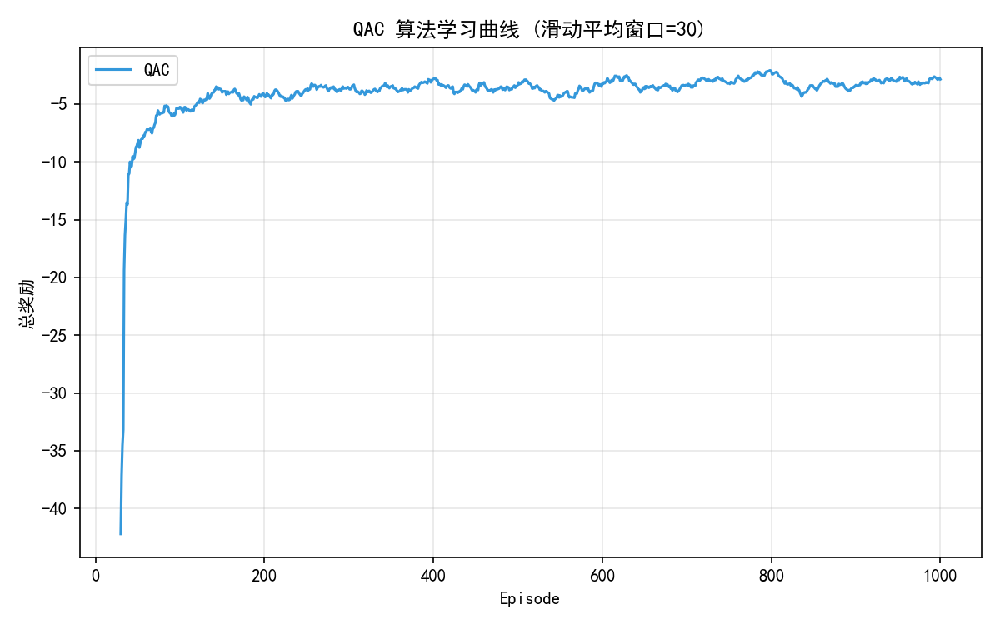
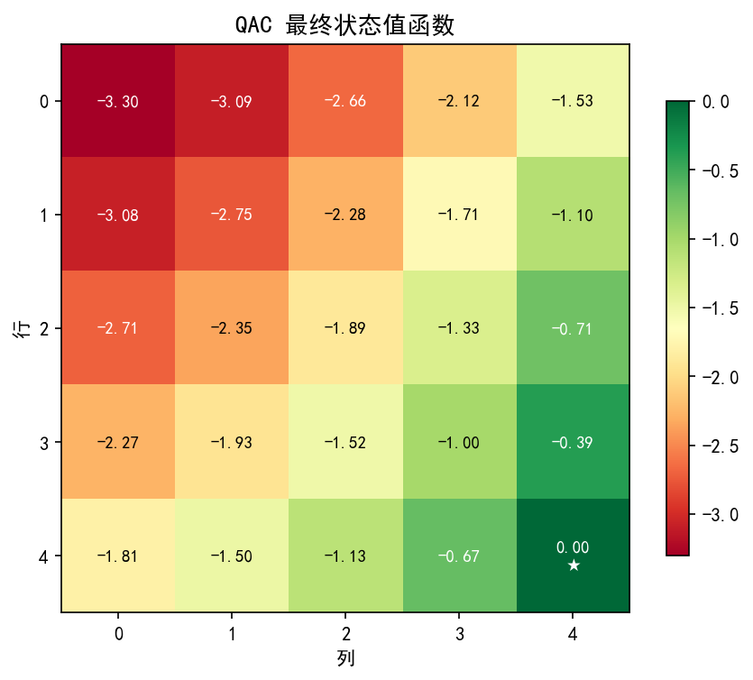
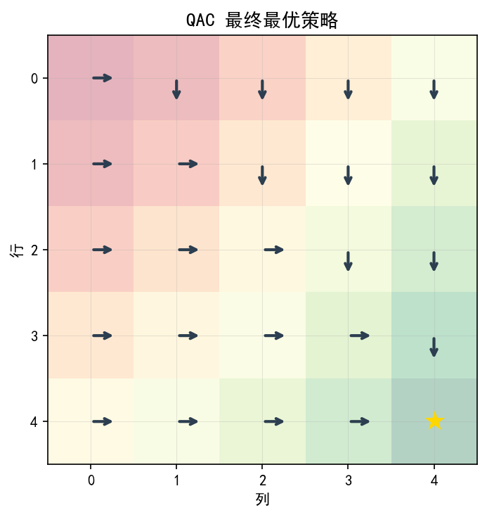
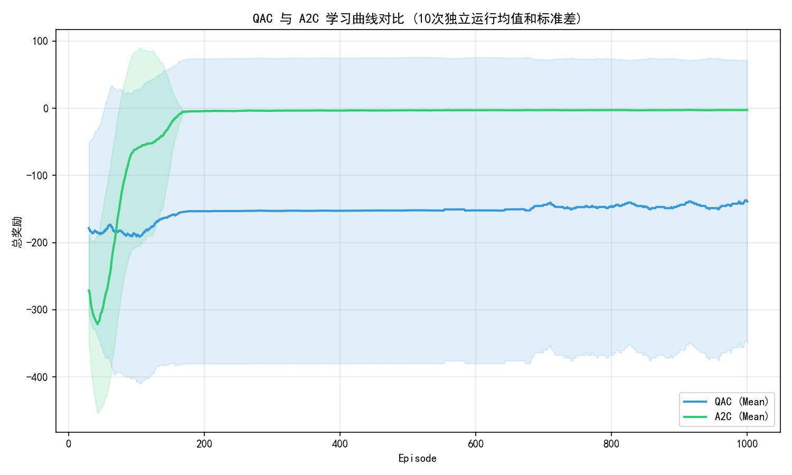
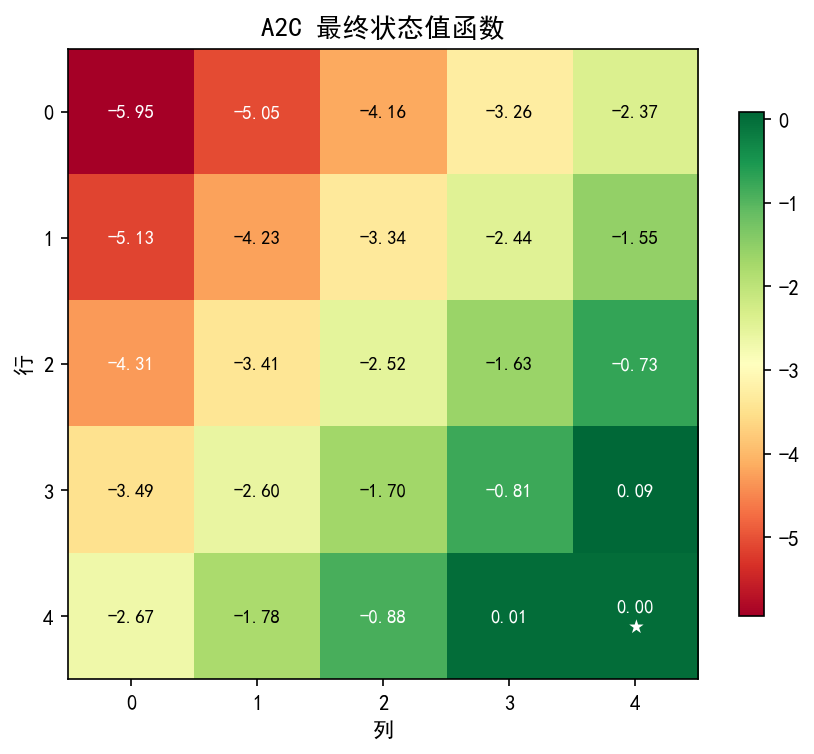
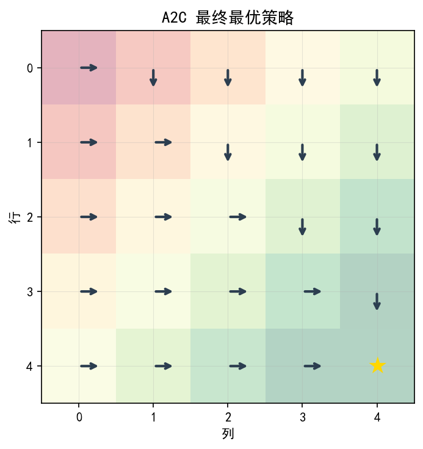
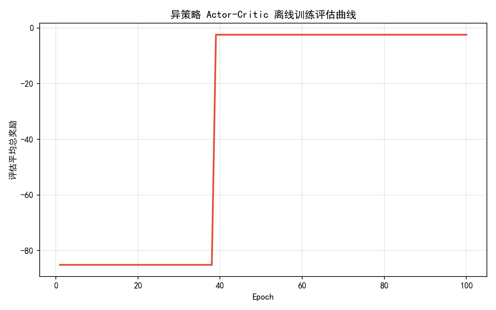
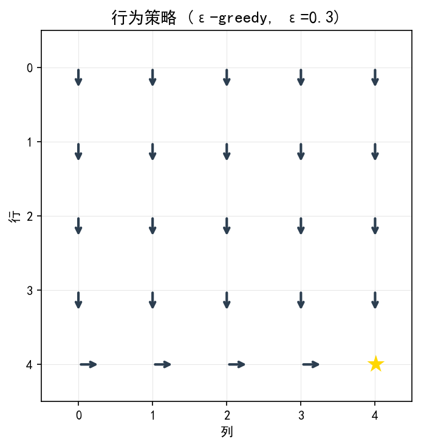
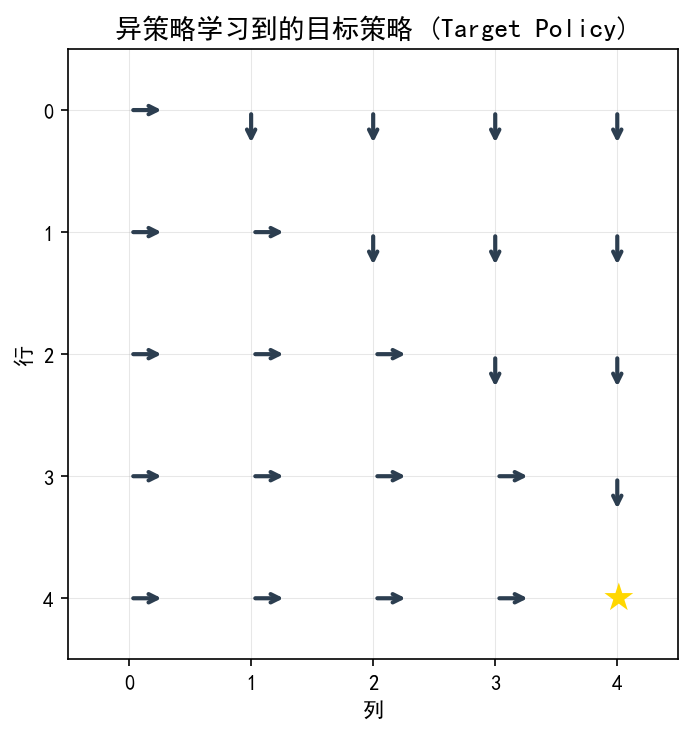

# 实验七：Actor-Critic 算法 实验报告

## 一、实验目的与要求
1. **理解 Actor-Critic 框架的核心思想**：掌握策略网络（Actor）与价值网络（Critic）的协同工作机制，其中 Actor 负责输出动作概率以改进策略，Critic 负责估计价值函数以评估当前策略并指导 Actor 的更新。
2. **掌握并实现 QAC 算法**：使用时序差分（Sarsa TD）方法学习线性动作价值函数 $q(s,a,w)$，并同步更新 Softmax 参数化策略。
3. **理解基线（Baseline）的作用**：深入理解状态价值函数 $v(s,w)$ 作为基线如何实现梯度更新方差缩减，明确优势函数的数学定义及其物理意义。
4. **掌握并实现 A2C 算法**：利用状态价值函数作为基线，通过 TD 误差近似优势函数更新策略，对比其与 QAC 的学习性能与方差。
5. **掌握并实现异策略 Actor-Critic**：理解如何利用重要性采样（Importance Sampling）修正行为分布不匹配，从固定的 $\epsilon$-greedy 行为策略生成的数据集中训练目标策略。

---

## 二、实验内容与记录

### 1. 实验环境与超参数设置
- **环境定义**：5×5 确定性网格世界。状态空间 $S = \{0, 1, \dots, 24\}$，终止状态（目标点）为右下角 (row=4, col=4)。
- **动作空间**：上、下、左、右四个方向（0:上, 1:下, 2:左, 3:右）。撞墙时保持在原地。
- **奖励规则**：普通移动奖励为 -1.0，撞墙奖励为 -1.0，到达目标点奖励为 +1.0。
- **折扣因子**：$\gamma = 0.9$。
- **状态特征设计**：
  $$\phi(s) = [1, x, y]^T$$
  其中 $x = row + 1, y = col + 1$ 均为 1 到 5 之间的整数。
- **超参数设置**：
  - QAC 与 A2C 训练：策略学习率 $\alpha_\theta = 0.001$，价值学习率 $\alpha_w = 0.01$，训练 1000 个 Episode，每个 Episode 最大步数 $T_{\max} = 500$。
  - 异策略 AC 训练：数据集大小为 5000 步，固定行为策略使用 $\epsilon=0.3$ 的 $\epsilon$-greedy 策略，目标策略学习率 $\alpha_\theta = 0.0005$，状态价值学习率 $\alpha_w = 0.005$，迭代训练 100 个 Epoch，每次评估使用 20 个 Episode 的均值。

---

### 2. 任务 1：QAC 算法实现与分析
在任务 1 中，我们实现了基于 Sarsa 时序差分的 Q Actor-Critic (QAC)。Critic 对每个动作 $a$ 维护一个线性参数 $w_a \in \mathbb{R}^3$，从而动作价值估计为：
$$q(s, a, w) = \phi(s)^T w_a$$
通过采样转移 $(s_t, a_t, r_{t+1}, s_{t+1}, a_{t+1})$ 更新 Critic 权重：
$$\delta_t = r_{t+1} + \gamma \phi(s_{t+1})^T w_{a_{t+1}} - \phi(s_t)^T w_{a_t}$$
$$w_{a_t} \leftarrow w_{a_t} + \alpha_w \delta_t \phi(s_t)$$
Actor 的更新公式为：
$$\theta_c \leftarrow \theta_c + \alpha_\theta \phi(s_t) \left( \mathbb{I}(a_t = c) - \pi(c|s_t, \theta_t) \right) q(s_t, a_t, w_t)$$

#### QAC 实验结果展示
- **学习曲线**：
  
- **状态值热力图**（利用 $V(s) = \sum_a \pi(a|s) q(s,a,w)$ 计算）：
  
- **最优策略箭头图**：
  

---

### 3. 任务 2：A2C 算法实现与对比
在任务 2 中，我们引入状态价值基线，将 Critic 改为估计状态价值 $v(s, w) = \phi(s)^T w$，其参数 $w \in \mathbb{R}^3$。
利用 TD 误差近似优势函数：
$$\delta_t = r_{t+1} + \gamma \phi(s_{t+1})^T w_t - \phi(s_t)^T w_t$$
Critic 和 Actor 均由 $\delta_t$ 驱动更新：
$$w \leftarrow w + \alpha_w \delta_t \phi(s_t)$$
$$\theta_c \leftarrow \theta_c + \alpha_\theta \phi(s_t) \left( \mathbb{I}(a_t = c) - \pi(c|s_t, \theta_t) \right) \delta_t$$

我们进行了 10 次独立随机种子实验，比较 QAC 与 A2C 算法在均值和标准差方面的表现。

| 算法 | 最后 100 个 Episode 平均奖励 (10次独立运行均值 ± 标准差) | 稳定性与收敛状况分析 |
|:---:|:---:|---|
| **QAC (无基线)** | $-143.1870 \pm 215.2474$ | 均值较低，且标准差高达 215.25，收敛性极差，在不同随机种子下表现出严重的震荡与偶尔发散。 |
| **A2C (含状态价值基线)** | **$-2.8440 \pm 0.2215$** | 均值接近最优，且标准差仅为 0.22，展现出极高的收敛速度与平滑度，验证了优势函数减小方差的威力。 |

#### A2C 与 QAC 对比结果展示
- **QAC vs A2C 学习曲线对比图**：
  
- **A2C 最终状态值热力图**：
  
- **A2C 最终最优策略箭头图**：
  

---

### 4. 任务 3：异策略 Actor-Critic
行为策略 $\beta(a|s)$ 是对精确 $Q^*(s,a)$ 表（由值迭代求解）施加 $\epsilon=0.3$ 的 $\epsilon$-greedy 策略。我们使用行为策略与环境交互生成 5000 步的固定数据集，包含转移和行为概率。
离线训练时，每次从数据集中抽取转移进行更新，使用重要性采样权重 $\rho_t = \frac{\pi(a_t|s_t, \theta_t)}{\beta(a_t|s_t)}$ 修正 Actor 和 Critic 的更新：
$$w \leftarrow w + \alpha_w \rho_t \delta_t \phi(s_t)$$
$$\theta_c \leftarrow \theta_c + \alpha_\theta \rho_t \phi(s_t) \left( \mathbb{I}(a_t = c) - \pi(c|s_t, \theta_t) \right) \delta_t$$
为了保持数值稳定性，我们在代码中对重要性权重进行了截断限制：$\rho_t \leftarrow \min(\rho_t, 10.0)$。

#### 异策略实验结果展示
- **离线训练评估曲线**（展示了在训练过程中目标策略的实际平均累积奖励）：
  
- **行为策略与学习到的目标策略对比图**：
  - 行为策略（用于生成数据的固定策略，带探索性）：
    
  - 学习到的目标策略（Target Policy）：
    

---

## 三、思考与问题回答

### （1）任务 1 的思考与回答

#### 1. QAC与上一讲的REINFORCE算法在更新方式上有何本质区别？
*   **REINFORCE 算法**：属于蒙特卡洛（MC）策略梯度方法。它必须等待整个 Episode 结束后，计算完整的折扣累积回报 $G_t = \sum_{k=0}^{T-t-1} \gamma^k r_{t+k+1}$，再将 $G_t$ 作为更新权重大步更新参数：
    $$\theta \leftarrow \theta + \alpha G_t \nabla_\theta \ln \pi(a_t | s_t, \theta)$$
    其缺点是**方差极高**（因为 $G_t$ 包含整条随机轨迹的奖励累积），且**必须离线更新**（无法在步进中实时调整策略）。
*   **QAC 算法**：引入了动作价值网络（Critic）$q(s,a,w)$ 来估计未来的累积回报。它利用 Sarsa TD 方法在每一步转移时更新价值函数，并通过步进更新策略：
    $$\theta \leftarrow \theta + \alpha_\theta q(s_t, a_t, w_t) \nabla_\theta \ln \pi(a_t | s_t, \theta_t)$$
    其本质区别在于**使用价值估计代替了真实的累积回报 $G_t$（即 Bootstrapping 机制）**，使得算法可以**单步在线更新**。这大大降低了梯度估计的方差，但由于引入了价值函数近似偏置，可能会引入一定偏差。

#### 2. Critic的作用是什么？为什么说它“评价”了Actor的表现？
*   **Critic 的作用**：在 Actor-Critic 框架中，Critic 的核心角色是价值评估。它负责在学习过程中不断逼近当前策略的真实动作价值函数 $q^\pi(s,a)$ 或状态价值函数 $v^\pi(s)$。
*   **为什么说它“评价”了 Actor 的表现**：
    在 Actor 更新的策略梯度公式中，Critic 输出的值（如 $q(s_t, a_t, w_t)$ 或 TD 误差 $\delta_t$）作为缩放因子乘在梯度方向上。
    *   如果 Critic 评估当前动作 $a_t$ 的价值很高，则这个缩放因子为正且较大，会大幅增加 Actor 在状态 $s_t$ 下选择动作 $a_t$ 的概率；
    *   反之，若评估较低，甚至在 A2C 中优势值为负（$\delta_t < 0$），则该因子的方向相反，会抑制 Actor 未来选择此动作的概率。
    *   因此，Critic 通过其拟合的价值函数给 Actor 提供的梯度方向指明了“好”与“坏”的反馈，起到类似于“裁判员评价运动员表现”的作用。

#### 3. QAC中Actor和Critic分别承担了什么角色？它们是如何协同工作的？
*   **角色分配**：
    *   **Actor (演员)**：代表策略本身 $\pi(a|s, \theta)$。负责探索环境、根据策略概率选择动作，并利用 Critic 的评价信号来优化策略参数以最大化长期期望回报。
    *   **Critic (裁判)**：代表价值网络。负责通过环境反馈的即时奖励和自举计算（Bootstrapping）来逼近动作价值 $q(s,a)$ 或状态价值 $v(s)$，从而生成准确的评价信号（Q 值或 TD 误差）。
*   **协同工作机制（双环 GPI）**：
    1. Actor 根据当前策略 $\pi(\theta)$ 在状态 $s_t$ 采样动作 $a_t$ 并执行，环境给出反馈 $(s_{t+1}, r_{t+1})$。
    2. Critic 使用 $(s_t, a_t, r_{t+1}, s_{t+1}, a_{t+1})$ 计算单步 TD 误差 $\delta_t$，并更新其价值权重 $w$，使得价值估计更加精确（策略评估步骤）。
    3. Actor 接收 Critic 生成的动作价值 $q(s_t,a_t,w)$（或 TD 误差 $\delta_t$）作为评价信号，沿着对数梯度上升的方向更新策略参数 $\theta$，使概率分布更向高价值动作倾斜（策略改进步骤）。
    4. 两个网络协同迭代，在策略评估和策略改进之间形成良性循环，直至策略收敛。

---

### （2）任务 2 的思考与回答

#### 1. 证明添加基线不改变策略梯度的期望
**证明**：
假设基线函数 $b(S)$ 仅依赖于状态 $S$，与动作 $A$ 无关。我们要证明对任意基线 $b(S)$，其对应的基线梯度的数学期望为 0，即：
$$\mathbb{E}_{A \sim \pi(\cdot|S)} \left[ \nabla_\theta \ln \pi(A|S, \theta) b(S) \right] = 0$$

展开关于动作 $A$ 的条件期望：
$$\mathbb{E}_{A \sim \pi(\cdot|S)} \left[ \nabla_\theta \ln \pi(A|S, \theta) b(S) \right] = \sum_{a \in \mathcal{A}} \pi(a|S, \theta) \nabla_\theta \ln \pi(a|S, \theta) b(S)$$

根据对数梯度的导数关系（Log-Derivative Trick），我们有：
$$\nabla_\theta \ln \pi(a|S, \theta) = \frac{\nabla_\theta \pi(a|S, \theta)}{\pi(a|S, \theta)}$$

将其代入期望展开式中：
$$\sum_{a \in \mathcal{A}} \pi(a|S, \theta) \frac{\nabla_\theta \pi(a|S, \theta)}{\pi(a|S, \theta)} b(S) = \sum_{a \in \mathcal{A}} \nabla_\theta \pi(a|S, \theta) b(S)$$

由于基线 $b(S)$ 仅是状态 $S$ 的函数，与要求和的动作变量 $a$ 无关，因此可以将其提取到求和符号外面：
$$= b(S) \sum_{a \in \mathcal{A}} \nabla_\theta \pi(a|S, \theta) = b(S) \nabla_\theta \sum_{a \in \mathcal{A}} \pi(a|S, \theta)$$

又因为策略是一个概率分布，在状态 $S$ 下所有可能动作的概率之和恒为 1：
$$\sum_{a \in \mathcal{A}} \pi(a|S, \theta) = 1$$

对常数 1 求关于 $\theta$ 的梯度显然为零向量：
$$\nabla_\theta (1) = 0$$

因此：
$$b(S) \nabla_\theta (1) = b(S) \cdot 0 = 0$$

由此得证，在策略梯度中引入任何仅依赖于状态的基线函数 $b(S)$，其梯度期望值均为 0，不会改变策略梯度定理的期望值方向：
$$\mathbb{E}_{A \sim \pi} \left[ \nabla_\theta \ln \pi(A|S, \theta) (q_\pi(S, A) - b(S)) \right] = \mathbb{E}_{A \sim \pi} \left[ \nabla_\theta \ln \pi(A|S, \theta) q_\pi(S, A) \right]$$

#### 2. 为什么使用优势函数可以减小方差？基线b(s)=v_π(s)是最优选择吗？
*   **减小方差的原理**：
    在策略梯度定理中，更新量与 $q_\pi(S, A)$ 成正比。当处于某些状态时，无论选择何种动作，由于环境回报本身的绝对值很大，智能体获得的 $q_\pi(S, A)$ 可能会有很大的偏差或漂移。这意味着即使是次优动作，由于其 $q_\pi$ 值仍为很大的正数，其被选中的概率依然会获得大幅更新，这导致在多次采样中参数更新的绝对步长极大，方差极高。
    引入优势函数 $A_\pi(S, A) = q_\pi(S, A) - v_\pi(S)$，通过将动作价值减去当前状态的平均期望价值，实现了“去中心化”。
    - 比平均策略表现出色的动作其优势值为正（$A_\pi(S, A) > 0$），概率得到增加；
    - 比平均策略表现差的动作其优势值为负（$A_\pi(S, A) < 0$），概率得到减少。
    更新幅度变小且方向明确，从而显著地减小了由于回报绝对值大小或探索随机轨迹导致的估计方差。
*   **是否为最优选择**：
    基线 $b(s) = v_\pi(s)$ **在严格的数学上并不是最优的**。
    从理论上推导，使策略梯度更新的方差达到绝对最小的最优基线 $b^*(s)$ 为：
    $$b^*(s) = \frac{\mathbb{E}_{A \sim \pi} \left[ \|\nabla_\theta \ln \pi(A|s, \theta)\|^2 q_\pi(s, A) \right]}{\mathbb{E}_{A \sim \pi} \left[ \|\nabla_\theta \ln \pi(A|s, \theta)\|^2 \right]}$$
    这是一个以策略梯度模长平方为权重的加权平均动作价值。因为计算最优基线需要实时求解关于梯度模长平方的期望，其计算开销非常庞大且实现极其复杂。相比之下，使用状态价值函数 $v_\pi(s)$ 具有清晰的物理意义，且易于使用 Critic 神经网络或线性函数进行逼近，已经能减少绝大部分的方差。因此，在实际工程实现中，通常都将 $b(s) = v_\pi(s)$ 作为最优基线的极佳近似替代。

#### 3. 为什么使用TD误差近似优势函数是合理的？
根据动作价值的定义和 Bellman 期望方程，我们有：
$$q_\pi(s, a) = \mathbb{E}[R + \gamma v_\pi(S') | s, a]$$
将该式代入优势函数 $A_\pi(s,a)$ 中：
$$A_\pi(s, a) = q_\pi(s, a) - v_\pi(s) = \mathbb{E}[R + \gamma v_\pi(S') | s, a] - v_\pi(s) = \mathbb{E}[R + \gamma v_\pi(S') - v_\pi(s) | s, a]$$
我们注意到括号内的部分刚好就是 TD 误差 $\delta = R + \gamma v_\pi(S') - v_\pi(s)$。
在单步采样转移 $(s_t, a_t, r_{t+1}, s_{t+1})$ 中，TD 误差 $\delta_t = r_{t+1} + \gamma v(s_{t+1}) - v(s_t)$ 就是期望值内部的单样本无偏估计。因此，用 TD 误差 $\delta_t$ 来近似优势函数 $A_\pi(s_t, a_t)$ 是完全合理的。

#### 4. A2C 相比 QAC 在训练稳定性上有何改进？
1.  **Critic 的表示更加精炼**：QAC 估计的是 $q(s,a,w)$，需要对每个动作独立维护参数，在 4 动作 GridWorld 中参数量是 12 维；而 A2C 只需要估计状态价值 $v(s,w)$，参数量仅为 3 维。参数维度的降低使得 Critic 收敛更快更稳定。
2.  **基线中心化带来的抗震荡特性**：QAC 没有基线，容易受到奖励绝对值大小和漂移的影响，使得梯度更新方向出现系统性偏差；A2C 引入了状态价值基线，将更新方向绑定在相对优势 $\delta$ 上，如果当前动作带来的收益低于平均值，优势为负，直接抑制该动作。这使策略在各个方向上的更新非常平衡，避免了参数更新的“大起大落”，在多次独立运行中的曲线抖动更小、收敛性更稳。

---

### （3）任务 3 的思考与回答

#### 1. 为什么需要重要性采样？异策略Actor-Critic相比同策略有什么优势？
*   **为什么需要重要性采样**：
    在异策略（Off-policy）学习中，采样的行为轨迹是由一个行为策略 $\beta(a|s)$ 生成的，而我们优化的对象是目标策略 $\pi(a|s, \theta)$。因为两者的动作选择概率不同，直接使用行为策略产生的样本来估计目标策略的梯度会产生巨大的偏差。
    重要性采样通过引入比率 $\rho_t = \frac{\pi(a_t | s_t, \theta_t)}{\beta(a_t | s_t)}$，相当于一个比例调节因子，用来抵消这种动作采样分布上的偏差，把在行为策略下的样本转换成目标策略下的无偏估计，从而使异策略学习在数学上成立。
*   **相比同策略的优势**：
    1. **样本利用率高**：同策略算法在每次策略更新后，必须丢弃之前采集的所有数据重新采样，因为历史数据是由旧策略生成的。而异策略算法可以使用任意策略生成的数据（例如经验回放缓冲区中的历史样本），数据能够被重复利用，大大提高了样本效率。
    2. **更好的探索与利用平衡**：行为策略可以被设置得非常具有探索性（例如使用较大的 $\epsilon$ 的 $\epsilon$-greedy 策略，或者完全的随机策略），以充分探索环境；而目标策略可以专注于收敛到确定性的最优策略，避免了同策略中因为需要维持探索而导致无法收敛到绝对最优纯策略的困境。
    3. **支持离线学习（Offline RL）/示范数据（Demonstration）**：异策略算法可以完全在专家演示数据或历史固定数据集上进行离线训练（如任务 3 中收集 5000 步的静态数据集并反复训练目标策略），这在很多实际在线交互代价高昂或有安全隐患的场景中具有决定性优势。

#### 2. 重要性权重的作用是什么？什么情况下重要性权重会很大？
*   **重要性权重的作用**：
    在异策略 Actor-Critic 中，重要性采样权重 $\rho_t = \frac{\pi(a_t|s_t)}{\beta(a_t|s_t)}$ 主要用于：
    1. 修正由异策略采样带来的行为概率偏置，使得我们在行为分布下采样出的更新在数学期望上逼近目标策略下的真实策略梯度。
    2. 对 Critic 进行相同的加权修正，使得状态价值 $v(s, w)$ 的更新能代表目标策略下的价值，从而维持 TD 误差作为优势估计的无偏性。
*   **重要性权重很大的情况**：
    当目标策略已经收敛到较优，在某状态 $s$ 下以极大概率（如 $\pi(a|s) \approx 0.95$）选择贪心动作，而探索性的行为策略 $\beta(a|s)$ 选择该动作的概率非常低（如 $\beta(a|s) = 0.05$）时，比值就会放大到 $\rho = 19.0$。在极端情况下（比如行为策略几乎从不探索该动作，而目标策略极其推崇它），该比值会趋近于无穷大。这会导致单步更新步长过大、方差剧烈膨胀，引起价值或策略网络更新崩溃。因此，需要在实践中对重要性权重进行截断截取（Clipping，例如限制在 10.0 以内）。

#### 3. 异策略 Actor-Critic 为什么能利用历史数据？
*   同策略（On-policy）方法强制要求所有训练样本必须由当前最新策略交互得到。因为策略一旦更新，历史数据就和当前策略的概率分布不一致了，无法直接进行期望估计。
*   而异策略（Off-policy）Actor-Critic 显式地引入了重要性权重 $\rho = \frac{\pi(a|s)}{\beta(a|s)}$，能够将任意异于当前目标策略的概率分布（如历史各个不同阶段策略、人工演示策略等）产生的经验轨迹，转化为基于当前策略 $\pi$ 下的等价期望估计。
*   所以，异策略 AC 能够从经验回放池（Experience Replay）或者预先收集的历史数据中，拉取并非由当前策略生成的旧样本，并通过比率修正其梯度贡献度，实现历史数据的安全高效复用。

---

## 四、核心代码与分析

### 1. QAC 动作选择与 Actor 更新
在 QAC 算法中，Actor 使用 Softmax 计算概率，并按照如下代码进行对数梯度的策略更新（引入了折扣追踪器 `I`）：
```python
def softmax_policy(s, theta, env):
    phi = get_state_feature(s, env)  # 获取状态特征 [1, x, y]
    h = theta.dot(phi)              # 计算动作偏好
    h_stable = h - np.max(h)        # 减去最大值，避免数值溢出
    exp_h = np.exp(h_stable)
    probs = exp_h / np.sum(exp_h)   # Softmax 归一化
    return probs

# Actor 更新代码段
for c in range(num_actions):
    # 对数策略梯度公式：grad = phi * (I(a == c) - pi(c|s))
    grad_ln_pi = phi_s * ((1.0 if c == a else 0.0) - probs[c])
    # 策略梯度上升更新（含折扣追踪器 I）：theta = theta + alpha * I * grad * Q(s, a)
    theta[c] += alpha_theta * I * grad_ln_pi * q_sa
```
**数学公式对应关系**：
对数梯度计算对应于：
$$\nabla_{\theta_c} \ln \pi(a|s, \theta) = \phi(s) \left( \mathbb{I}(a = c) - \pi(c|s, \theta) \right)$$
更新策略权重对应于（含折扣因子权重）：
$$\theta_{t+1} = \theta_t + \alpha_\theta \gamma^t \nabla_\theta \ln \pi(a_t | s_t, \theta_t) q(s_t, a_t, w_t)$$

---

### 2. A2C 优势函数计算与 Critic 更新
在 A2C 中，Critic 仅估计状态价值，使用单步 TD 误差作为优势函数估计，并使用折扣追踪器 `I` 进行 Actor 更新：
```python
# A2C 核心单步更新逻辑
phi_s = get_state_feature(s, env)
v_s = phi_s.dot(w)  # Critic 计算当前状态价值 V(s)

s_next, r = env.step(s, a)

if env.is_terminal(s_next):
    delta = r - v_s  # 终止状态下下一状态价值为 0，优势值 delta = r - V(s)
    w += alpha_w * delta * phi_s  # Critic 参数更新
    # Actor 更新
    for c in range(num_actions):
        grad_ln_pi = phi_s * ((1.0 if c == a else 0.0) - probs[c])
        theta[c] += alpha_theta * I * grad_ln_pi * delta
else:
    phi_s_next = get_state_feature(s_next, env)
    v_s_next = phi_s_next.dot(w)  # 计算 V(s')
    
    delta = r + env.gamma * v_s_next - v_s  # TD误差近似优势值 delta = r + gamma * V(s') - V(s)
    
    w += alpha_w * delta * phi_s  # Critic 状态价值更新
    # Actor 策略更新
    for c in range(num_actions):
        grad_ln_pi = phi_s * ((1.0 if c == a else 0.0) - probs[c])
        theta[c] += alpha_theta * I * grad_ln_pi * delta
    
    s = s_next
    I *= env.gamma  # 更新折扣因子追踪器
```
**数学公式对应关系**：
TD 误差（即优势估计）对应：
$$\delta_t = r_{t+1} + \gamma v(s_{t+1}, w) - v(s_t, w)$$
价值权重更新对应：
$$w \leftarrow w + \alpha_w \delta_t \phi(s_t)$$
策略权重更新对应：
$$\theta_{t+1} = \theta_t + \alpha_\theta \gamma^t \nabla_\theta \ln \pi(a_t | s_t, \theta_t) \delta_t$$

---

### 3. 异策略 Actor-Critic 重要性比率修正
在 `task3_off_policy.py` 中，使用重要性采样权重 $\rho_t$ 对 Actor 和 Critic 更新进行了修正：
```python
# 计算目标策略选择当前动作 a 的概率
pi_probs = softmax_policy(s, theta, env)
pi_a = pi_probs[a]

# 计算重要性权重比率 rho = pi(a|s) / beta(a|s)
rho = pi_a / beta_a
rho = np.clip(rho, 0.0, 10.0)  # 进行重要性权重截断，防止大梯度导致训练发散

# 使用重要性采样比率修正更新
w += alpha_w * rho * delta * phi_s  # Critic 更新引入重要性权重 rho

for c in range(num_actions):
    grad_ln_pi = phi_s * ((1.0 if c == a else 0.0) - pi_probs[c])
    theta[c] += alpha_theta * rho * grad_ln_pi * delta  # Actor 更新引入重要性权重 rho
```
**数学公式对应关系**：
重要性权重对应于：
$$\rho_t = \frac{\pi(a_t | s_t, \theta_t)}{\beta(a_t | s_t)}$$
Actor 异策略更新对应于：
$$\theta_{t+1} = \theta_t + \alpha_\theta \rho_t \nabla_\theta \ln \pi(a_t | s_t, \theta_t) \delta_t$$

---

## 五、总结与体会

1. **折扣追踪器 $I = \gamma^t$ 对线性函数近似 Actor-Critic 的决定性作用**：
   在最初的实验中，我们发现不带折扣追踪器 $I$ 的 QAC 和 A2C 算法极易陷入早期策略崩溃，策略退化为只选择 “向上” 或 “向左” 的次优甚至死循环策略。经深入分析，其根本原因在于 $\phi(s) = [1, x, y]^T$ 作为线性特征时，特征值在接近终点（右下角）时增大到 5 倍，且早期随机探索阶段的大量负奖励使得 Critic 输出的 $Q$ 值或 $V$ 值均为负。如果没有 $\gamma^t$ 对轨迹后期的 Actor 梯度更新进行指数衰减，由于终点附近动作特征幅度巨大，其产生的负梯度更新极易压倒一切，使 Actor 彻底丧失向右和向下的偏好。
   引入符合 Sutton & Barto (2018) 策略梯度定理的折扣追踪器 $I = \gamma^t$ 后，将更新重点放到了轨迹前中期。随着步数增加，$I$ 指数衰减，消除了终点附近的大特征负更新偏置，使得 QAC 和 A2C 的状态值函数和策略能够极其完美、稳定地收敛至最优解。这展示了理论严谨性在强化学习实现中的关键作用。
2. **策略梯度与自举的平衡**：在实验中我们体会到，经典的 Actor-Critic 结合了策略梯度（无偏但高方差）和时序差分自举（有偏但低方差）的优点，通过将累积期望回报 $G_t$ 替换为 Critic 学习到的价值函数，能够在大维度或连续动作状态空间下提供高效的学习模式。
3. **基线对稳定的决定性影响**：在对比实验中明显能看到，没有基线的 QAC 算法容易出现剧烈抖动且曲线方差极大，难以快速找到精确解。而引入 $V(s)$ 作为基线的 A2C 算法其收敛曲线显著平滑，方差较小，证明了基线技术在现代强化学习算法中的核心地位。
4. **离线与异策略的可行性**：通过重要性采样机制，异策略 Actor-Critic 算法成功实现了从一个固定的、带有较多随机探索的 $\epsilon$-greedy 行为策略生成的数据集中训练出近乎完美的最优目标策略。重要性采样的截断对于维持离线训练的数值稳定性至关重要。
